# Container - Docker


## What is Docker/Container?

Docker is a set of coupled software-as-a-service and platform-as-a-service products that use operating-system-level virtualization to develop and deliver software in packages called containers. The software that hosts the containers is called Docker Engine. It was first started in 2013 and is developed by Docker, Inc

## VM vs Container

| VMs        | Containers           | 
| ------------- |:-------------:| 
| Heavyweight      | Lightweight | 
| Limited performance      | [Native performance | 
| Hardware-level virtualization      | OS virtualization     | 
| Startup time in minutes | Startup time in milliseconds      | 
| Allocates required memory | Requires less memory space      | 
| Fully isolated and hence more secure | Process-level isolation, possibly less secure      |

Playground URL - https://labs.play-with-docker.com/

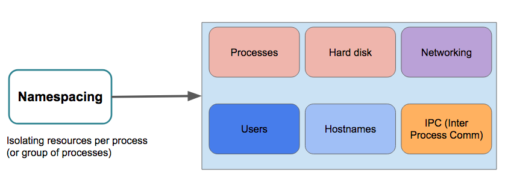

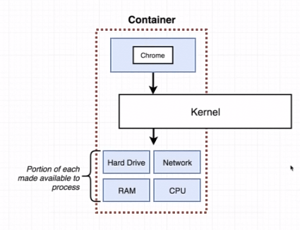

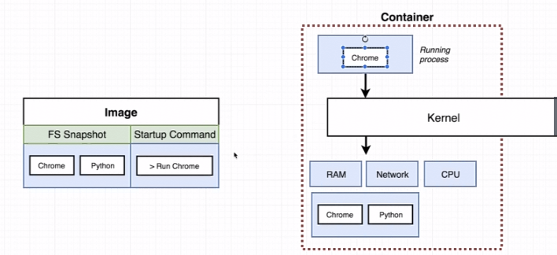

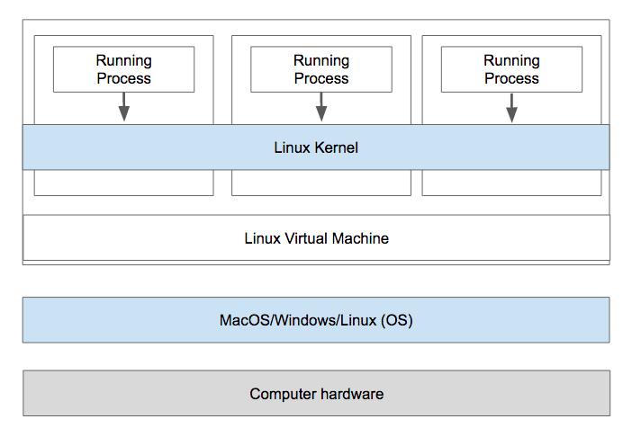

## Install Docker on Google Cloud Engine/AWS

1. Update Ubuntu/Debian package manager's index

```
sudo apt-get update
```

2. Install packages to allow apt to use a repository over HTTPS:

```
sudo apt-get install \
    apt-transport-https \
    ca-certificates \
    curl \
    gnupg-agent \
    software-properties-common
```

3. Add Docker’s official GPG key:

```
curl -fsSL https://download.docker.com/linux/ubuntu/gpg | sudo apt-key add -
```

4. Verify the fingerprint

```
$ sudo apt-key fingerprint 0EBFCD88
pub   rsa4096 2017-02-22 [SCEA]
      9DC8 5822 9FC7 DD38 854A  E2D8 8D81 803C 0EBF CD88
uid           [ unknown] Docker Release (CE deb) <docker@docker.com>
sub   rsa4096 2017-02-22 [S]
```

5. Use the following command to set up the stable repository. To add the nightly or test repository, add the word nightly or test (or both) after the word stable in the commands below.

```
sudo add-apt-repository \
   "deb [arch=amd64] https://download.docker.com/linux/ubuntu \
   $(lsb_release -cs) \
   stable"
```

6. Update package index

```
 sudo apt-get update
```

7.  Install the latest version of Docker CE and containerd, or go to the next step to install a specific version:

```
sudo apt-get install docker-ce docker-ce-cli containerd.io
```


8.  Test hello world

```
sudo docker run hello-world
```

## Installing Docker Compose

Unlike the Mac and Windows Docker Desktop versions, we must manually install Docker Compose. See the instructions for the installation steps (Click on the link below for Linux)

https://docs.docker.com/compose/install/#install-compose

After completing, test your installation:

```
docker-compose -v
```

This should print the version and build numbers to your console.

## Run without Sudo

Follow these instructions to run Docker commands without sudo:

https://docs.docker.com/install/linux/linux-postinstall/#manage-docker-as-a-non-root-user

The docker group will likely already be created, but you still need to add your user to this group.

## Start on Boot

Follow these instructions so that Docker and its services start automatically on boot:

https://docs.docker.com/install/linux/linux-postinstall/#configure-docker-to-start-on-boot

You may need to restart your system before starting the course material.

## Using Docker Client

### Check version

```
bunnyppl@instance-1:~$ sudo docker version
Client:
 Version:           18.09.5
 API version:       1.39
 Go version:        go1.10.8
 Git commit:        e8ff056
 Built:             Thu Apr 11 04:43:57 2019
 OS/Arch:           linux/amd64
 Experimental:      false

Server: Docker Engine - Community
 Engine:
  Version:          18.09.5
  API version:      1.39 (minimum version 1.12)
  Go version:       go1.10.8
  Git commit:       e8ff056
  Built:            Thu Apr 11 04:10:53 2019
  OS/Arch:          linux/amd64
  Experimental:     false
```

### Override defaults command parameters

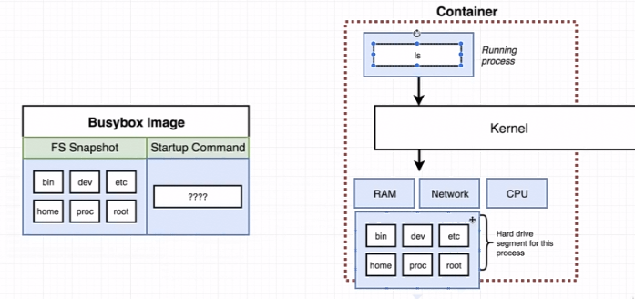


```
sudo docker run busybox echo are you ok?
```

```
sudo docker run busybox ls
```

### Not all images the same

```
bunnyppl@instance-1:~$ sudo docker run hello-world ls

```

```
docker: Error response from daemon: OCI runtime create failed: container_linux.go:345: starting container process caused "exec: \"ls\": executable file not found in $PATH": unknown.
```

### List all the images on Docker Engine

```
docker images
```

### List all the container on Docker Engine

```
docker ps
```

```
CONTAINER ID        IMAGE               COMMAND             CREATED             STATUS              PORTS               NAMES
```

Get the running Ids of the container

```
bunnyppl@instance-1:~$ sudo docker ps --all
```

```
CONTAINER ID        IMAGE               COMMAND                 CREATED              STATUS                      PORTS               NAMES
0c2fe1b63420        busybox             "ping www.google.com"   About a minute ago   Up About a minute                               competent_dewdney
d7e1ad5b1704        hello-world         "ls"                    4 minutes ago        Created                                         naughty_lewin
128b93e9e590        hello-world         "/hello"                4 minutes ago        Exited (0) 4 minutes ago                        adoring_matsumoto
351db5e94033        hello-world         "ls"                    5 minutes ago        Created                                         suspicious_liskov
9dbc66f69040        busybox             "ls"                    6 minutes ago        Exited (0) 6 minutes ago                        heuristic_wozniak
b92236efc4f0        busybox             "ls"                    6 minutes ago        Exited (0) 6 minutes ago                        distracted_cohen
b2f71fe813bb        busybox             "echo are you ok?"      6 minutes ago        Exited (0) 6 minutes ago                        affectionate_ellis
fbf18801c90b        hello-world         "/hello"                17 minutes ago       Exited (0) 17 minutes ago                       quizzical_goldberg
c8ae6686b9a4        hello-world         "/hello"                26 minutes ago       Exited (0) 26 minutes ago                       jovial_swanson
```

## Container Lifecycle


Create docker image

```
sudo docker create hello-world
```

```
e6e4746d1a831508ab3dd838e734b2ed8f641f3545a7f41758d1f503e8c32aec
```

Run the docker image as container, -a watch output coming from container print on the host

```
sudo docker start -a e6e4746d1a831508ab3dd838e734b2ed8f641f3545a7f41758d1f503e8c32aec
```

Check docker exist with status

```
sudo docker ps --all
```

Re-run the historical exit docker container

```
sudo docker start -a 7eb505e0966e
```

Not allow to run mutiple same container at once

```
sudo docker start -a 7eb505e0966e echo hi there
```

```
you cannot start and attach multiple containers at once
```

Clean up container from docker

```
sudo docker system prune
```

```
WARNING! This will remove:
        - all stopped containers
        - all networks not used by at least one container
        - all dangling images
        - all dangling build cache
Are you sure you want to continue? [y/N] y
Deleted Containers:
7eb505e0966ef628b6c946efc313468abee3217e3bce7bd9bcd585f0faddc1f4
e6e4746d1a831508ab3dd838e734b2ed8f641f3545a7f41758d1f503e8c32aec
0c2fe1b634204ce020bec8dfdc59472dfc5984c8149c78607e769ab92613ae42
d7e1ad5b1704481442ac13e2298580f7dc25a11392933ea2d301f853501db63c
128b93e9e590a7e4b0914622982366e87ea2696f8151adf756150d77d7cd3d9e
351db5e94033f75e9280518e99954afc7975772e5234f1e06c8263da86670030
9dbc66f690402a5073f394e4e506d588ed95a62dffba1e33209a91ece9f112f4
b92236efc4f0c967ffb3990e15be570f63d00b6829f616a138ea1f6e5615c2b4
b2f71fe813bbddf935534733700de89f00363221dd911c56b78802d8e9b5b71d
fbf18801c90b36b22ab3aa774433ac4b45ed284c85011d04d97e4ea981c58d72
c8ae6686b9a4d47e9d317a0ec50cc868d44788de5634635b53dcba082545caac

Total reclaimed space: 0B
```

### Retrieving all output logs without -a

There is not restart on the container

```
bunnyppl@instance-1:~$ sudo docker create busybox echo hi there
a1f8bcd83040df5cfd6f1e7389d89104761f33eb153ec4765faba7d34b953bb0
```

```
bunnyppl@instance-1:~$ sudo docker start a1f8bcd83040df5cfd6f1e7389d89104761f33eb153ec4765faba7d34b953bb0
a1f8bcd83040df5cfd6f1e7389d89104761f33eb153ec4765faba7d34b953bb0
```

```
bunnyppl@instance-1:~$ sudo docker logs a1f8bcd83040df5cfd6f1e7389d89104761f33eb153ec4765faba7d34b953bb0
hi there
```

### Stopping vs Killing container

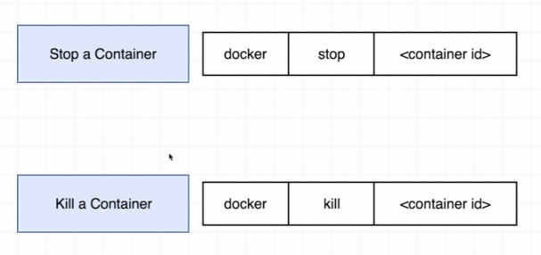


10 seconds to shutdown with stop then it will fallback to kill

```
sudo docker create busybox ping www.google.com
```

f48779733ad71b0c4b66458b1de00afea30ac6bdce02276a6e57b6f4bf92540e

```
bunnyppl@instance-1:~$ sudo docker start f48779733ad71b0c4b66458b1de00afea30ac6bdce02276a6e57b6f4bf92540e
f48779733ad71b0c4b66458b1de00afea30ac6bdce02276a6e57b6f4bf92540e
```

```
bunnyppl@instance-1:~$ sudo docker logs f48779733ad71b0c4b66458b1de00afea30ac6bdce02276a6e57b6f4bf92540e
PING www.google.com (74.125.24.147): 56 data bytes
64 bytes from 74.125.24.147: seq=0 ttl=51 time=0.859 ms
64 bytes from 74.125.24.147: seq=1 ttl=51 time=0.720 ms
64 bytes from 74.125.24.147: seq=2 ttl=51 time=0.375 ms
64 bytes from 74.125.24.147: seq=3 ttl=51 time=0.353 ms
64 bytes from 74.125.24.147: seq=4 ttl=51 time=0.438 ms
64 bytes from 74.125.24.147: seq=5 ttl=51 time=0.472 ms
```

```
bunnyppl@instance-1:~$ sudo docker ps --all
```

```
CONTAINER ID        IMAGE               COMMAND                 CREATED             STATUS                     PORTS               NAMES
f48779733ad7        busybox             "ping www.google.com"   27 seconds ago      Up 16 seconds                                  competent_heisenberg
a1f8bcd83040        busybox             "echo hi there"         2 minutes ago       Exited (0) 2 minutes ago                       brave_varahamihira
```

```
bunnyppl@instance-1:~$ sudo docker stop f48779733ad7
f48779733ad7
```

Let's restart the docker again with the container id

```
sudo docker start f48779733ad7
```

No grace period

```
bunnyppl@instance-1:~$ sudo docker kill f48779733ad7
f48779733ad7
```

### Multiple-Command Containers

```
sudo apt update
sudo apt install redis-server
```

```
sudo nano /etc/redis/redis.conf
```

```
. . .

# If you run Redis from upstart or systemd, Redis can interact with your
# supervision tree. Options:
#   supervised no      - no supervision interaction
#   supervised upstart - signal upstart by putting Redis into SIGSTOP mode
#   supervised systemd - signal systemd by writing READY=1 to $NOTIFY_SOCKET
#   supervised auto    - detect upstart or systemd method based on
#                        UPSTART_JOB or NOTIFY_SOCKET environment variables
# Note: these supervision methods only signal "process is ready."
#       They do not enable continuous liveness pings back to your supervisor.
supervised systemd

. . .
```

```
sudo systemctl restart redis.service
```

Run redis server inside the container

```
sudo docker run redis
```

it - allow us to provide input to the container

```
bunnyppl@instance-1:~$ sudo docker exec -it 3e00723f6add redis-cli

127.0.0.1:6379> set myvalue 4
OK
127.0.0.1:6379> get myvalue
"4"
127.0.0.1:6379>
```

Without it argument

```
bunnyppl@instance-1:~$ sudo docker exec 3e00723f6add redis-cli
bunnyppl@instance-1:~$
```

How to launch a shell without keep using exec / debugging inside the container

```
sudo docker exec -it 3e00723f6add sh
```

## What is a sh ?

Shell prompt command processor.

Container do not automatically share each others file system

### First terminal

```
sudo docker run -it busybox sh
```

### Second terminal

```
sudo docker run -it busybox sh
```

On the first terminal

```
touch nusiss.txt
vi nusiss.txt
Kennet is here !
```

On the second terminal, the nusiss.txt won't appear on the second instance

```
ls -lrt
```

## Create our own custom image, start our own custom container

1. Create a working directory

```
mkdir redis-image
```

2. Change to the working directory

```
cd redis-image
```

3. Create a Dockerfile

```
# Use an existing docker image as a base
FROM alpine
# Download and install all the dependencies
RUN apk add --update redis
# Tell the image what to do when it start as a container
CMD ["redis-server"]
```

4. Build the docker image

```
sudo docker build .
```

```
Step 1/3 : FROM alpine
latest: Pulling from library/alpine
bdf0201b3a05: Pull complete
Digest: sha256:28ef97b8686a0b5399129e9b763d5b7e5ff03576aa5580d6f4182a49c5f
e1913
Status: Downloaded newer image for alpine:latest
 ---> cdf98d1859c1
Step 2/3 : RUN apk add --update redis
 ---> Running in b24d1d4ac4d4
fetch http://dl-cdn.alpinelinux.org/alpine/v3.9/main/x86_64/APKINDEX.tar.g
z
fetch http://dl-cdn.alpinelinux.org/alpine/v3.9/community/x86_64/APKINDEX.
tar.gz
(1/1) Installing redis (4.0.12-r0)
Executing redis-4.0.12-r0.pre-install
Executing redis-4.0.12-r0.post-install
Executing busybox-1.29.3-r10.trigger
OK: 7 MiB in 15 packages
Removing intermediate container b24d1d4ac4d4
 ---> 4c10182a4a9d
Step 3/3 : CMD ["redis-server"]
 ---> Running in 260af2f27436
Removing intermediate container 260af2f27436
 ---> aaca4a7419f6
Successfully built aaca4a7419f6
```

5. Run the custom image as container

```
sudo docker run aaca4a7419f6
```

6. Explain the Dockerfile line by line

## Rebuild with Cache

New image id is generated everytime

```
# Use an existing docker image as a base
FROM alpine
# Download and install all the dependencies
RUN apk add --update redis
RUN apk add --update gcc
# Tell the image what to do when it start as a container
CMD ["redis-server"]
```

```
# Use an existing docker image as a base
FROM alpine
# Download and install all the dependencies
RUN apk add --update gcc
RUN apk add --update redis

# Tell the image what to do when it start as a container
CMD ["redis-server"]
```

## Tagging an Image

Naming convention for tagging an image dockerId/project-name/version

```
sudo docker build -t kenken64/redis/latest .
```

## Manual create and image using commit

```
sudo docker run -it alpine sh
apk add --update redis
sudo docker ps
sudo docker commit -c 'CMD ["redis-server"]' aaca4a7419f6
sudo docker run aaca4a7419f4
```

## Dockerize your Real World Project

1. Create a Dockerfile on the NodeJS application

```
# small and compact as possible
from node:alpine

RUN npm install

CMD ["npm", "start"]
```

2. rebuild the docker image

```
sudo docker build .
```

```
npm WARN saveError ENOENT: no such file or directory, open '/package.json'
npm notice created a lockfile as package-lock.json. You should commit this file.
npm WARN enoent ENOENT: no such file or directory, open '/package.json'
npm WARN !invalid#2 No description
npm WARN !invalid#2 No repository field.
npm WARN !invalid#2 No README data
npm WARN !invalid#2 No license field.
```

3. Inside the container , npm not finding the package.json

```
# small and compact as possible
from node:alpine
COPY ./ ./
RUN npm install

CMD ["npm", "start"]
```

4. Rebuild the image with tag

```
sudo docker build -t kenken64/backend .
```

5.  Run the tagged image

```
sudo docker run kenken64/backend
```

## Container port forwarding and specify working directory

1. Forward outside host port to the container

```
sudo docker run -p 8080:3000 kenken64/backend
```

2. We can export the container port and map a different port number from
   the host server

```
# small and compact as possible
from node:alpine

WORKDIR /usr/app

COPY ./ ./
RUN npm install
EXPOSE 3000/tcp
CMD ["npm", "start"]
```

3. rebuild the image

```
sudo docker build -t kenken64/backend .
```

4. Start the newly build image

```
sudo docker run -p 8080:3000/tcp kenken64/backend
```

## Optimize for unnecessary rebuild

Mapping volume from the container to the outside file system

```
sudo docker run -p 8080:3000 -v /usr/app/node_modules -v $(pwd):/usr/app kenken64/backend
```

## Multiple container setup

1. Download the visits project
2. cd visits project
3. Create a dockefile on the visits project

```
FROM node:alpine

WORKDIR '/app'

COPY package.json .
run npm install
COPY . .

CMD ["npm", "start"]
```

4. Build a docker image

```
sudo docker build -t kenken64/visits:latest .
```

5. Start a separate container running redis server

```
sudo docker run redis
```

6. Run the docker image as container

```
sudo docker run -p 8081:8081/tcp kenken64/visits:latest
```

## Deep dive with docker compose

1. Create a docker-compose.yml , spawn two separate containers

```
version: '3'
services:
  redis-server:
    image: 'redis'
  node-app:
    build: .
    ports:
      - "4001:8081"
```

2. Just define docker-compose , docker engine automatically put two container on the same network

An argument -d is sent to background

```
docker-compose up -d
```

3. Shutdown the docker compose containers

```
docker-compose down
```

## Automatic container restart after crashes

1. Simulate crash on the index.js of the visits project

```
const express = require('express');
const redis = require('redis');
const process = require('process');

const app = express();
const client = redis.createClient({
  host: 'redis-server',
  port: 6379
});
client.set('visits', 0);

app.get('/', (req, res) => {
  // simulate crash
  process.exit(0);
  client.get('visits', (err, visits) => {
    res.send('Number of visits is ' + visits);
    client.set('visits', parseInt(visits) + 1);
  });
});

app.listen(8081, () => {
  console.log('Listening on port 8081');
});
```

2. Startup and rebuild the docker compose

```
docker-compose up --build
```

3. Launch web browser, access the web app via http://localhost:4001. Notice the logs indicated process crashed.

4. Check the current process of the container

```
docker ps
```

5. Amend your docker-compose yml to have the policy restart always

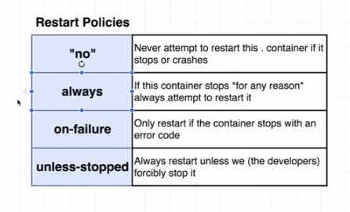

```
version: '3'
services:
  redis-server:
    image: 'redis'
  node-app:
    restart: always
    build: .
    ports:
      - "4001:8081"
```

6. Re-startup the container and acess the app on the web browser

```
docker-compose up
```

7. Change the policy of the docker compose to on

```
version: '3'
services:
  redis-server:
    image: 'redis'
  node-app:
    restart: on-failure
    build: .
    ports:
      - "4001:8081"
```

8. What is unless-stopped is forceful by developer on the command prompt

## How to check the docker compose status

Different is only show containers for the current project yml file.

```
docker-compose ps
```

## Publish your own Docker Image to the DockerHub repo

1. Login to docker hub through the CLI

```
bunnyppl@instance-1:~/NUSISS-DevOpsEng/container/subsdevices$ sudo docker login
```

```
Login with your Docker ID to push and pull images from Docker Hub. If you don't have a Docker ID, head over to https://hub.docker.com to create one.
Username: kenken64
Password:
WARNING! Your password will be stored unencrypted in /home/bunnyppl/.docker/config.json.
Configure a credential helper to remove this warning. See
https://docs.docker.com/engine/reference/commandline/login/#credentials-store

Login Succeeded
```

2. Retrieve the docker Id from cli

```
sudo docker images
```

3. Tag the image

```
sudo docker tag d8b928587243 kenken64/subsdevices:v1
```

4. Push the tagged image to the docker hub

```
sudo docker push kenken64/subsdevices:v1
```

```
The push refers to repository [docker.io/kenken64/subsdevices]
82674fe9a8e6: Pushed
6f5e00ced6e0: Pushed
86865100bc00: Pushed
7e93be41b55d: Pushed
1c07e18a989b: Mounted from library/node
b92d384cdf06: Mounted from library/node
a464c54f93a9: Mounted from library/node
v1: digest: sha256:cac661266d1cf19ae4e72f8294e332275a4761a9f5bebe1fd663b1bc3a3c1d9a size: 1788
```

## WORKSHOP - Deploy docker container via CDCI to AWS Elastic Beanstalk

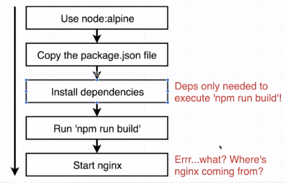

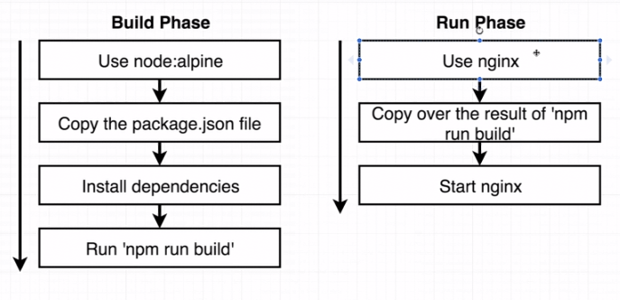

1. Create a Dockerfile.dev under the React App (subsdevices)

```
FROM node:alpine

WORKDIR '/app'

COPY package.json .
RUN npm install

COPY . .

CMD ["npm", "run", "start"]
```

2. Build the docker image

```
sudo docker build -f Dockerfile.dev -t kenken64/react-app
```

3. Run the docker image as container with port forward and volume mounting

```
sudo docker run -p 3000:3000 -v /app/node_modules -v $(pwd):/app kenken64/react-app
```

4. Download ngrok since the react app doesn't have SSL installed

```
chmod +x ngrok
./ngrok authtoken KuTKRosrawrDMAgX1ayq_7AAmsVSom4E6GtT18S1pn
./ngrok http 3000
```

5. Use web browser to access the generated ngrok address from the terminal

6. Create a docker-compose.yml

```
version: '3'
services:
    web:
      build:
        context: .
        dockerfile: Dockerfile.dev
      ports:
        - "3000:3000"
      volumes:
        - /app/node_modules
        - .:/app
```

7. Start the docker container using docker-compose

```
sudo docker-compose up --build
```

8. Implement test on separate container

```
sudo docker exec -it 87b898a5cc64 npm run test
```

- Add test service in the docker compose yml file

```
version: '3'
services:
    web:
      build:
        context: .
        dockerfile: Dockerfile.dev
      ports:
        - "3000:3000"
      volumes:
        - /app/node_modules
        - .:/app
    test:
      build:
        context: .
        dockerfile: Dockerfile.dev
      volumes:
          - /app/node_modules
          - .:/app
      command: ["npm", "run", "test"]
```

9. Start the docker container using docker-compose

```
sudo docker-compose up --build
```

10. Multi step build process, different base images

```
# builder phase
FROM node:alpine as builder

WORKDIR '/app'

COPY package.json .
RUN npm install
COPY . .
RUN npm run build

FROM nginx
EXPOSE 80
COPY --from=builder /app/build /usr/share/nginx/html
```

11. Build the multi phase container setup

```
sudo docker build .
```

12. Start the multi phase container setup and expose the port

```
sudo docker run -p 8080:80 936ca285e822
```

13. Use ngrok to tunnel due to we do not have domain name, take the generated domain name and test it on the web browser

```
./ngrok http 8080
```

14. Let's integrate with the travis CI with AWS elastic beanstalk, create a .travis.yml

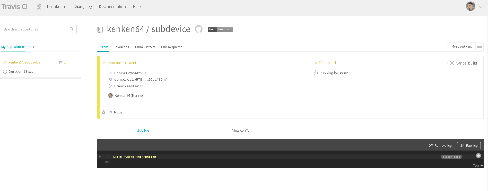
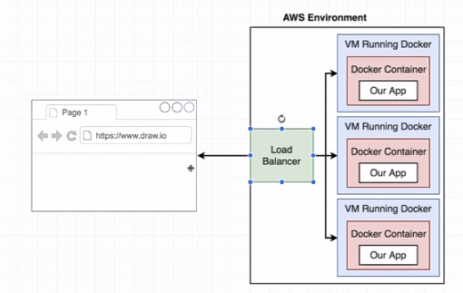

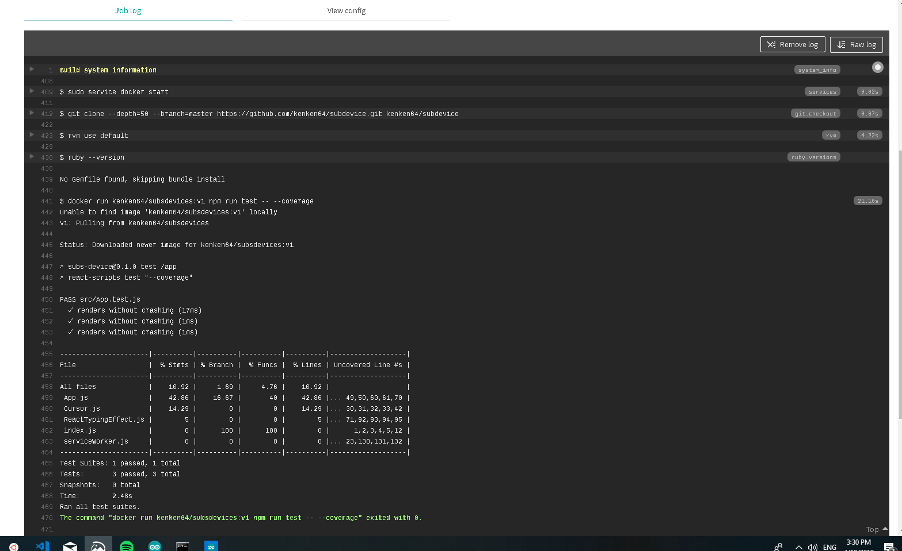

```
sudo: required
services:
  - docker

before install:
  - docker build -t kenken64/subsdevices:v1 -f Dockerfile.dev .

script:
  - docker run kenken64/subsdevices:v1 npm run test -- --coverage
```

15. Login into travis CI dashboard and monitor the successful build

16. Login into AWS account and create a elastic beanstalk instance.
    Watch the below step by step walkthorugh youtube videos:-

| Video URL                    |                    Description                     |
| ---------------------------- | :------------------------------------------------: |
| https://youtu.be/L01gk757pq4 |           AWS - Create Elastic BeanStalk           |
| https://youtu.be/vJG-4J2cp0s |       AWS - Create Elastic BeanStalk Part 2        |
| https://youtu.be/vz2Y8LvcdHw | Configure IAM for Travis CI with Elastic Beanstalk |
| https://youtu.be/XUfBsttJnbA |         Configure env variable @ Travis CI         |

- Make sure the AWS region is always set to <b>Singapore</b>
- Deployment type is choosen as Docker
- Source code is Sample application given in this tutorial
- The configuration and setup takes a few minutes to finish.

17. Amend the .travis.yml with additional deployment

```
sudo: required
services:
  - docker

before install:
  - docker build -t kenken64/subsdevices:v1 -f Dockerfile.dev .

script:
  - docker run kenken64/subsdevices:v1 npm run test -- --coverage

deploy:
  provider: elasticbeanstalk
  region: "ap-southeast-1"
  app: "docker-subdevices"
  env: "DockerSubdevices-env"
  bucket_name: "elasticbeanstalk-ap-southeast-1-200097394821"
  bucket_path: "docker-subdevices"
  on:
    branch: master
  access_key_id: $AWS_ACCESS_KEY
  secret_access_key:
    secure: "$AWS_SECRET_KEY"
```

18. Git add, commit and push to the github repo that is configure with travis CI

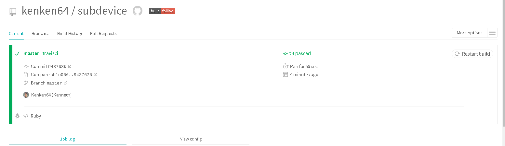
<br>
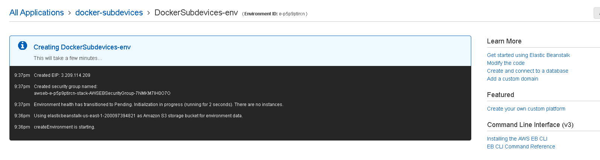
<br>
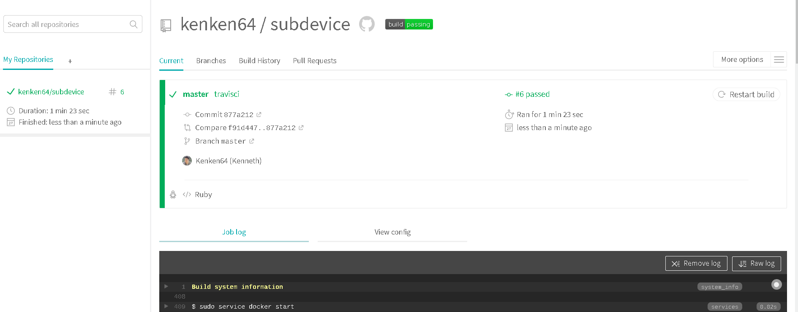


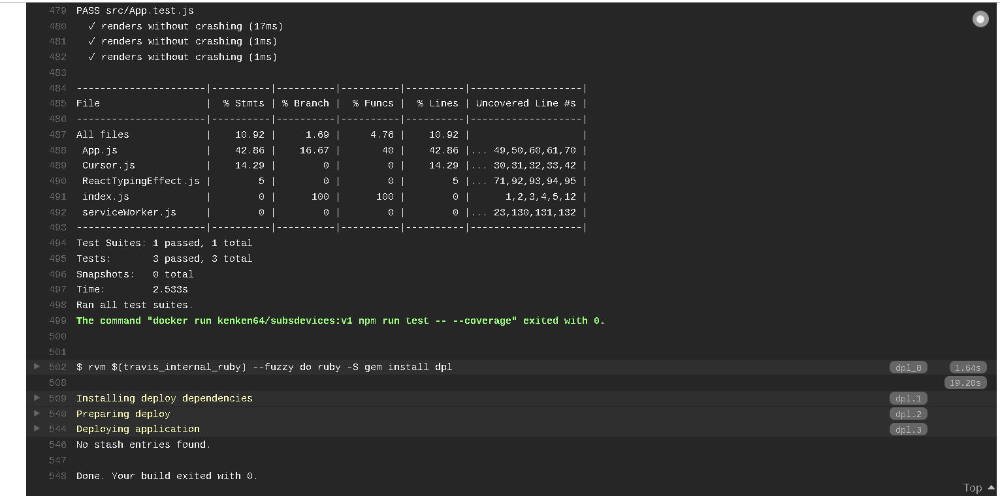

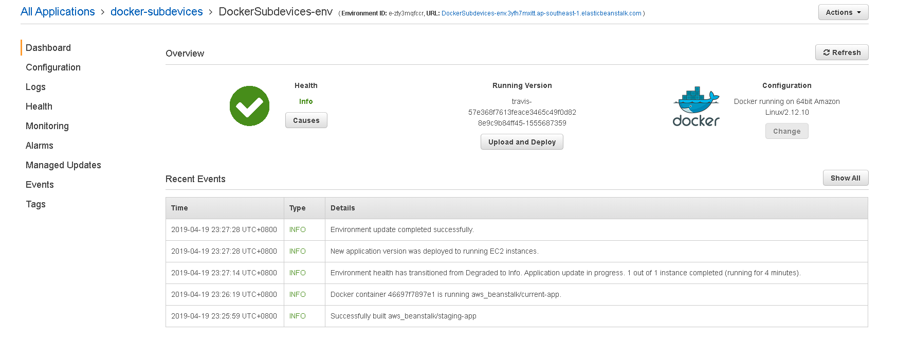

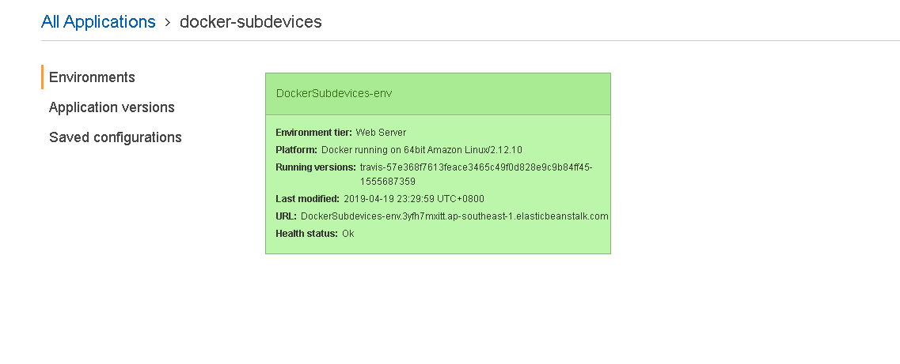
