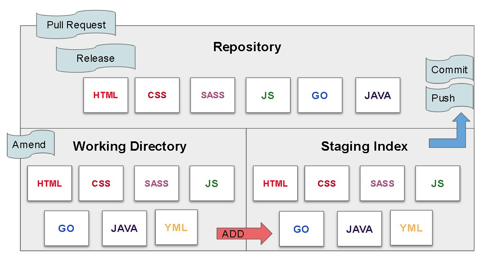
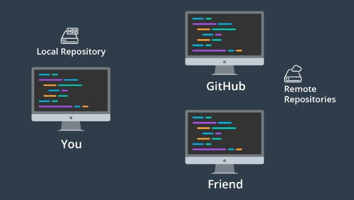
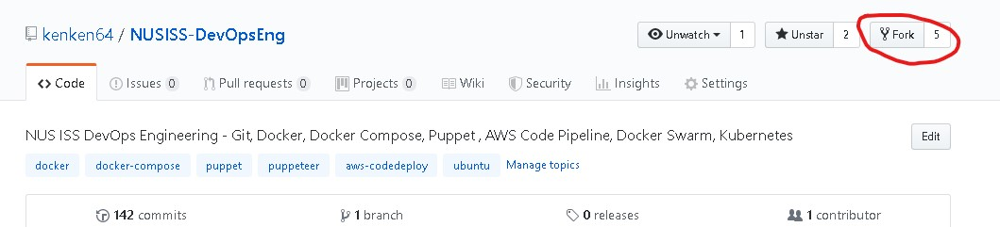
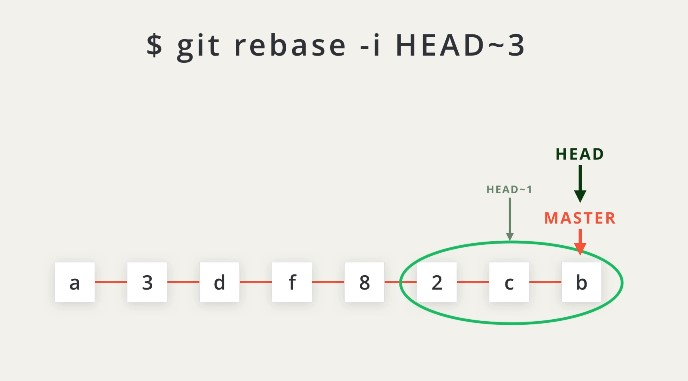
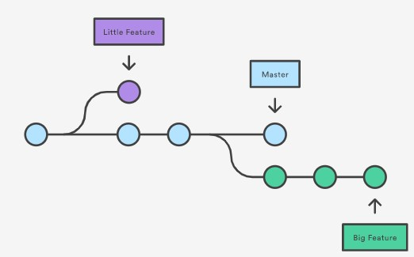

# Git Terminology
## Version Control System / Source Code Manager
A version control system (abbreviated as VCS) is a tool that manages different versions of source code. A source code manager (abbreviated as SCM) is another name for a version control system.

Git is an SCM (and therefore a VCS!). The URL for the Git website is https://git-scm.com/ (see how it has "SCM" directly in its domain!).

## Commit
Git thinks of its data like a set of snapshots of a mini filesystem. Every time you commit (save the state of your project in Git), it basically takes a picture of what all your files look like at that moment and stores a reference to that snapshot. You can think of it as a save point in a game - it saves your project's files and any information about them.

Everything you do in Git is to help you make commits, so a commit is the fundamental unit in Git.

## Repository / repo
A repository is a directory which contains your project work, as well as a few files (hidden by default on Mac OS X) which are used to communicate with Git. Repositories can exist either locally on your computer or as a remote copy on another computer. A repository is made up of commits.

## Working Directory
The Working Directory is the files that you see in your computer's file system. When you open your project files up on a code editor, you're working with files in the Working Directory.

This is in contrast to the files that have been saved (in commits!) in the repository.

When working with Git, the Working Directory is also different from the command line's concept of the current working directory which is the directory that your shell is "looking at" right now.

## Checkout
A checkout is when content in the repository has been copied to the Working Directory.

## Staging Area / Staging Index / Index
A file in the Git directory that stores information about what will go into your next commit. You can think of the staging area as a prep table where Git will take the next commit. Files on the Staging Index are poised to be added to the repository.

## SHA
A SHA is basically an ID number for each commit. Here's what a commit's SHA might look like: e2adf8ae3e2e4ed40add75cc44cf9d0a869afeb6.

It is a 40-character string composed of characters (0–9 and a–f) and calculated based on the contents of a file or directory structure in Git. "SHA" is shorthand for "Secure Hash Algorithm". If you're interested in learning about hashes, check out our Intro to Computer Science course.

## Branch
A branch is when a new line of development is created that diverges from the main line of development. This alternative line of development can continue without altering the main line.

Going back to the example of save point in a game, you can think of a branch as where you make a save point in your game and then decide to try out a risky move in the game. If the risky move doesn't pan out, then you can just go back to the save point. The key thing that makes branches incredibly powerful is that you can make save points on one branch, and then switch to a different branch and make save points there, too.

With this terminology in mind, let's take a high-level look at how we'll be using Git by looking at the typical workflow when working with version control.

# Windows Setup

Installing Git
To download Git:

* go to https://git-scm.com/downloads
* download the software for Windows
* install Git choosing all of the default options
Once everything is installed, you should be able to run git on the command line. If it displays the usage information, then you're good to go!

If you run into any issues, please remember to take advantage of Knowledge and the community in your Study Group.

Configuring the Command Prompt on Windows
We're about to configure the Command Prompt to display helpful information when in a directory that's under version control. This is an optional step! You do not need to re-configure your Command Prompt for Git to work. You can complete the entire course without reconfiguring it. However, reconfiguring the Command Prompt makes it significantly easier to use.

If you choose to configure your Command Prompt, here's what it should look like when you're finished.

# Mac & Linux Setup

Installing Git
Git is actually installed on MacOS, but we'll be reinstalling it so that we'll have the newest version:

go to https://git-scm.com/downloads
download the software for Mac
install Git choosing all of the default options
Once everything is installed, you should be able to run git on the command line. If it displays the usage information, then you're good to go!

If you run into any issues, please remember to take advantage of Knowledge and the community in your Student Hub.

Configuring Mac's Terminal
We're about to configure the Terminal to display helpful information when in a directory that's under version control. This is an optional step! You do not need to re-configure your terminal for Git to work. You can complete the entire course without reconfiguring it. However, reconfiguring the Terminal makes it significantly easier to use.

# First Time Git Configuration
Before you can start using Git, you need to configure it. Run each of the following lines on the command line to make sure everything is set up.

```
# sets up Git with your name
git config --global user.name "<Your-Full-Name>"

# sets up Git with your email
git config --global user.email "<your-email-address>"

# makes sure that Git output is colored
git config --global color.ui auto

# displays the original state in a conflict
git config --global merge.conflictstyle diff3

git config --list
```

# Git & Code Editor
The last step of configuration is to get Git working with your code editor. Below are three of the most popular code editors. If you use a different editor, then do a quick search on Google for "associate X text editor with Git" (replace the X with the name of your code editor).

## Atom Editor Setup
```
git config --global core.editor "atom --wait"
```
## Sublime Text Setup
```
git config --global core.editor "'/Applications/Sublime Text 2.app/Contents/SharedSupport/bin/subl' -n -w"
```

## VSCode Setup
```
git config --global core.editor "code --wait"
```

# Workshop

## Create A repo from Scratch
Required Commands
Heads up! We'll be using the following terminal commands in this lesson:

* ls - used to list files and directories
* mkdir - used to create a new directory
* cd - used to change directories
* rm - used to remove fil

```
mkdir -p devops-git-course/new-git-project && cd $_
```

### Git Init
Fantastic work - we're all set up and ready to start using the git init command!

```
git init
```
This is one of the easiest commands to run. All you have to do is run git init on the terminal. That's it! Go ahead, why not give it a try right now!

## Git Init's Effect
Running the git init command sets up all of the necessary files and directories that Git will use to keep track of everything. All of these files are stored in a directory called .git (notice the . at the beginning - that means it'll be a hidden directory on Mac/Linux). This .git directory is the "repo"! This is where git records all of the commits and keeps track of everything!

Let's take a brief look at the contents of the .git directory.

WARNING: Don't directly edit any files inside the .git directory. This is the heart of the repository. If you change file names and/or file content, git will probably lose track of the files that you're keeping in the repo, and you could lose a lot of work! It's okay to look at those files though, but don't edit or delete them.


## .Git Directory Contents
We're about to take a look at the .git directory...it's not vital for this course, though, so don't worry about memorizing anything, it's here if you want to dig a little deeper into how Git works under the hood.

Here's a brief synopsis on each of the items in the .git directory:

config file - where all project specific configuration settings are stored.
From the Git Book:

Git looks for configuration values in the configuration file in the Git directory (.git/config) of whatever repository you’re currently using. These values are specific to that single repository.

For example, let's say you set that the global configuration for Git uses your personal email address. If you want your work email to be used for a specific project rather than your personal email, that change would be added to this file.

description file - this file is only used by the GitWeb program, so we can ignore it
hooks directory - this is where we could place client-side or server-side scripts that we can use to hook into Git's different lifecycle events
info directory - contains the global excludes file
objects directory - this directory will store all of the commits we make

# Clone An Existing REpo

Why Clone?
First, what is cloning?

to make an identical copy

What's the value of creating an identical copy of something, and how does this relate to Git and version control?

Why would you want to create an identical copy? Well, when I work on a new web project, I do the same set of steps:

* create an index.html file
* create a js directory
* create a css directory
* create an img directory
* create app.css in the css directory
* create app.js in the js directory
* add starter HTML code in index.html
* add configuration files for linting (validating code syntax)
    * HTML linting
    * CSS linting
    * JavaScript linting
* configure my code editor

```
git clone https://github.com/kenken64/NUSISS-DevOpsEng.git
```

# Determine A repo's status

The git status is our key to the mind of Git. It will tell us what Git is thinking and the state of our repository as Git sees it. When you're first starting out, you should be using the git status command all of the time! Seriously. You should get into the habit of running it after any other command. This will help you learn how Git works and it'll help you from making (possibly) incorrect assumptions about the state of your files/repository.

```
git status
```

# Review repo history commits
The Git Log Command
Finding the answers to these questions is exactly what git log can do for us! Instead of explaining everything that it can do for us, let's experience it! Go ahead and run the git log command in the terminal:

```
git log
```

Navigating The Log
If you're not used to a pager on the command line, navigating in Less can be a bit odd. Here are some helpful keys:

* to scroll down, press
    * j or ↓ to move down one line at a time
    * d to move by half the page screen
    * f to move by a whole page screen
* to scroll up, press
    * k or ↑ to move _up_ one line at a time
    * u to move by half the page screen
    * b to move by a whole page screen
* press q to quit out of the log (returns to the regular command prompt)

The git log command has a flag that can be used to alter how it displays the repository's information. That flag is --oneline:
```
git log --oneline
```

The git log command has a flag that can be used to display the files that have been changed in the commit, as well as the number of lines that have been added or deleted. The flag is --stat ("stat" is short for "statistics"):

```
git log --stat
```

The git log command has a flag that can be used to display the actual changes made to a file. The flag is --patch which can be shortened to just -p:

```
$ git log -p
```

## What does git show do?
The git show command will show only one commit. So don't get alarmed when you can't find any other commits - it only shows one. The output of the git show command is exactly the same as the git log -p command. So by default, git show displays:

* the commit
* the author
* the date
* the commit message
* the patch information

However, git show can be combined with most of the other flags we've looked at:

* --stat - to show the how many files were changed and the number of lines that were added/removed
* -p or --patch - this the default, but if --stat is used, the patch won't display, so pass -p to add it again
* -w - to ignore changes to whitespace

```
git show
```

```
git show fdf5493
```

## What is a Remote Repository?
Git is a distributed version control system which means there is not one main repository of information. Each developer has a copy of the repository. So you can have a copy of the repository (which includes the published commits and version history) and your friend can also have a copy of the same repository. Each repository has the exact same information that the other ones have, there's no one repository that's the main one.

Up until this point, you have probably been only working locally on a local repository. A remote repository is the same Git repository like yours but it exists somewhere else.
<br>


<br>

```
git remote
```

```
git remote -v
```


## Why Multiple Remotes?
Why would you want to have multiple remote repositories? We'll look at this later but briefly, if you are working with multiple developers then you might want to get changes they're working on in their branch(es) into your project before they merge them into the master branch. You might want to do this if you want to test out their change before you decide to implement your changes.

Another example is if you have a project whose code is hosted on Github but deploys via Git to Heroku. You would have one remote for the master and one for the deployment.

## Add A Remote Repository

* Create a repo on the github, do not initialize the README.md on the remote repo.
* Create project files with simple html, css, js
* Associate the repo with your local project

```
git remote add origin https://github.com/kenken64/example1.git
```

## Add and commit files to the Remote Repo

Sending Commits
To send local commits to a remote repository you need to use the git push command. You provide the remote short name and then you supply the name of the branch that contains the commits you want to push:

```
git add .
git commit -m "new version"
git push origin master
```

GitHub also displays a lot of details about our Repository. Right now it's showing that there are:

* three commits
* one branch
* one contributor

```
git log --oneline --graph --decorate --all
```

## Pulling changes from A remote 

Try to make changes to the files , commit and push those changes accordingly.

```
git pull origin master
```

## Pull vs Fetch
Git fetch is used to retrieve commits from a remote repository's branch but it does not automatically merge the local branch with the remote tracking branch after those commits have been received.

When git fetch is run, the following things happen:

the commit(s) on the remote branch are copied to the local repository
the local tracking branch (e.g. origin/master) is moved to point to the most recent commit
The important thing to note is that the local branch does not change at all.

You can think of git fetch as half of a git pull. The other half of git pull is the merging aspect.

One main point when you want to use git fetch rather than git pull is if your remote branch and your local branch both have changes that neither of the other ones has. In this case, you want to fetch the remote changes to get them in your local branch and then perform a merge manually. Then you can push that new merge commit back to the remote.

```
git fetch origin master
```

## Fork
This concept of "forking" is also different from "cloning". When you clone a repository, you get an identical copy of the repository. But cloning happens on your local machine and you clone a remote repository. When you fork a repository, a new duplicate copy of the remote repository is created. This new copy is also a remote repository, but it now belongs to you.

Forking is not done on the command line; there is no git fork command. Go ahead, try running the following command:


<br>

## Group By Commit Author
This is not a massive project, but it does have well over 1,000 commits. A quick way that we can see how many commits each contributor has added to the repository is to use the git shortlog command:

```
git shortlog
```

we can add a couple of flags: -s to show just the number of commits (rather than each commit's message) and -n to sort them numerically (rather than alphabetically by author name).
```
git shortlog -s -n
```

## Filter By Author
Another way that we can display all of the commits by an author is to use the regular git log command but include the --author flag to filter the commits to the provided author.

```
git log --author=kenken64
```

## Filter Commits By Search
Before going through this section on filtering by searching, I feel like I need to stress how important it is to write good, descriptive commit messages. If you write a descriptive commit message, then it's so much easier to search through the commit messages, later, to find exactly what you're looking for.

And remember, if the commit message is not enough for you to explain what the commit is for, you can provide a detailed description of exactly why the commit is needed in the description area.

Let see an example of extra details in a commit in the lighthouse project by looking at commit 5966b66:

```
git show 5966b66
```

## Filter with Keyword on commit messages

if you are working with a huge team with a lot of commit messages then you would like to filter by a specific messages.

```
git log --grep="unit tests"
```

## Best Practices
### Write Descriptive Commit Messages
While we're talking about naming branches clearly that describe what changes the branch contains, I need to throw in another reminder about how critical it is to write clear, descriptive, commit messages. The more descriptive your branch name and commit messages are the more likely it is that the project's maintainer will not have to ask you questions about the purpose of your code or have dig into the code themselves. The less work the maintainer has to do, the faster they'll include your changes into the project.

### Create Small, Focused Commits
This has been stressed numerous times before but make sure when you are committing changes to the project that you make smaller commits. Don't make massive commits that record 10+ file changes and changes to hundreds of lines of code. You want to make smaller, more frequent commits that record just a handful of file changes with a smaller number of line changes.

Think about it this way: if the developer does not like a portion of the changes you're adding to a massive commit, there's no way for them to say, "I like commit A, but just not the part where you change the sidebar's background color." A commit can't be broken down into smaller chunks, so make sure your commits are in small enough chunks and that each commit is focused on altering just one thing. This way the maintainer can say I like commits A, B, C, D, and F but not commit E.

### Update The README
And lastly if any of the code changes that you're adding drastically changes the project you should update the README file to instruct others about this change.

### Recap
Before you start doing any work, make sure to look for the project's CONTRIBUTING.md file.

Next, it's a good idea to look at the GitHub issues for the project

* look at the existing issues to see if one is similar to the change you want to contribute
* if necessary create a new issue
* communicate the changes you'd like to make to the project maintainer in the issue
When you start developing, commit all of your work on a topic branch:

* do not work on the master branch
* make sure to give the topic branch clear, descriptive name
As a general best practice for writing commits:

* make frequent, smaller commits
* use clear and descriptive commit messages
* update the README file, if necessary

## Squash commit

To squash commits together, we're going to use the extremely powerful git rebase command. This is one of my favorite commands, but it did take me quite a while to become comfortable with it. At first, it was somewhat challenging for me to get a handle on how it works, and then (after reading countless warnings online) I was scared to actually use it for fear of irreparably damaging my project's Git history.


<br>

Merge last 3 commits into one
```
git rebase -i HEAD~3
git push -f
```

## Git Branch


<br>

A branch represents an independent line of development. Branches serve as an abstraction for the edit/stage/commit process. You can think of them as a way to request a brand new working directory, staging area, and project history. New commits are recorded in the history for the current branch, which results in a fork in the history of the project.

The git branch command lets you create, list, rename, and delete branches. It doesn’t let you switch between branches or put a forked history back together again. For this reason, git branch is tightly integrated with the git checkout and git merge commands.

Common Options
```
git branch
```

List all of the branches in your repository. This is synonymous with git branch --list.

```
git branch <branch>
```

Create a new branch called <branch>. This does not check out the new branch.

```
git branch -d <branch>
```

Delete the specified branch. This is a “safe” operation in that Git prevents you from deleting the branch if it has unmerged changes.

```
git branch -D <branch>
```

Force delete the specified branch, even if it has unmerged changes. This is the command to use if you want to permanently throw away all of the commits associated with a particular line of development.

```
git branch -m <branch>
```

Rename the current branch to <branch>.

```
git branch -a
```

List all remote branches. 

How to commit to a specific branch
```
git add .
git commit -m "adding feature 1"
git push origin <branch_name>
```


## Git checkout

Git checkout works hand-in-hand with git branch. The git branch command can be used to create a new branch. When you want to start a new feature, you create a new branch off master using git branch new_branch. Once created you can then use git checkout new_branch to switch to that branch. Additionally, The git checkout command accepts a -b argument that acts as a convenience method which will create the new branch and immediately switch to it. You can work on multiple features in a single repository by switching between them with git checkout.

```
git checkout -b <new-branch>
```

The above example simultaneously creates and checks out <new-branch>. The -b option is a convenience flag that tells Git to run git branch <new-branch> before running git checkout <new-branch>.

```
git checkout -b <new-branch> <existing-branch>
```

By default git checkout -b will base the new-branch off the current HEAD. An optional additional branch parameter can be passed to git checkout. In the above example, <existing-branch> is passed which then bases new-branch off of existing-branch instead of the current HEAD.

### Switching Branches
Switching branches is a straightforward operation. Executing the following will point HEAD to the tip of <branchname>.

```
git checkout <branchname>
```
Git tracks a history of checkout operations in the reflog. You can execute git reflog to view the history.

### How to resolve conflict

To see the beginning of the merge conflict in your file, search the file for the conflict marker <<<<<<<. When you open the file in your text editor, you'll see the changes from the HEAD or base branch after the line <<<<<<< HEAD. Next, you'll see =======, which divides your changes from the changes in the other branch, followed by >>>>>>> BRANCH-NAME. In this example, one person wrote "open an issue" in the base or HEAD branch and another person wrote "ask your question in IRC" in the compare branch or branch-a.

```
If you have questions, please
<<<<<<< HEAD
open an issue
=======
ask your question in IRC.
>>>>>>> branch-a
```