## Prepare 3 AWS/Google cloud instances for this workshop

1. Label one instance as master the rest of the node instance as slave/node

2. Change all the hostname accordingly
    master - nusiss.puppetmaster.edu.sg
    slave 1 - nusiss.puppetslave1.edu.sg  
    slave 2 - nusiss.puppetslave2.edu.sg  

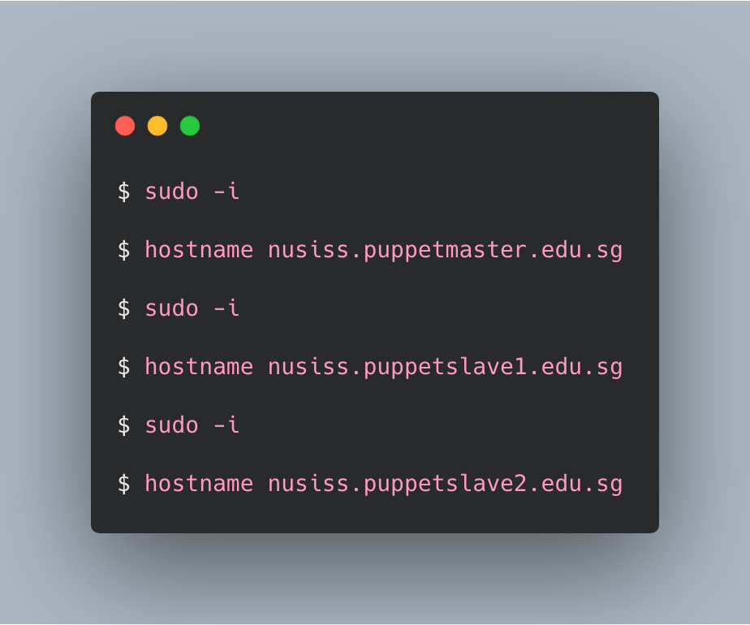

3. Exit and logout the system after changing hostname of all the 3 instances

4. Lets fixed all the master and slave servers with their ip and hostname on the host file

## Master

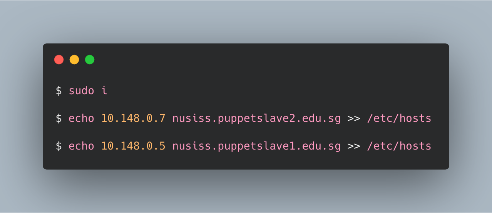

## Slave 1

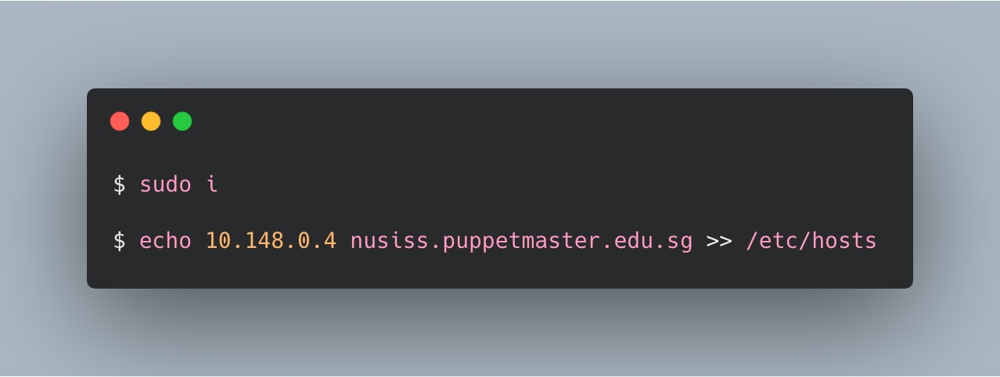

## Slave 2

5. Make sure all the instances about to ping each other

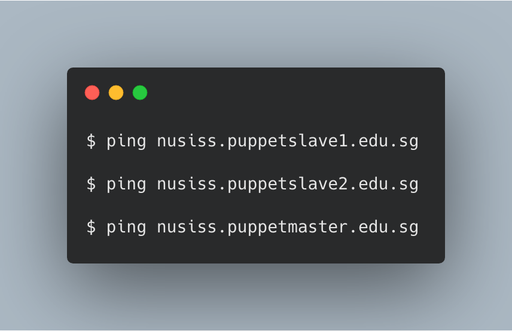

6. Make sure all the packages within the Ubuntu is up to date

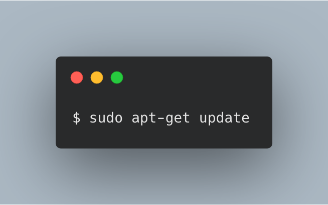

7. On the puppet master host install the master software

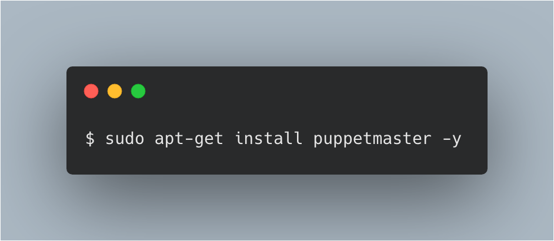

8. On both the slave install the puppet agent software, puppetslave1 and puppetslave2

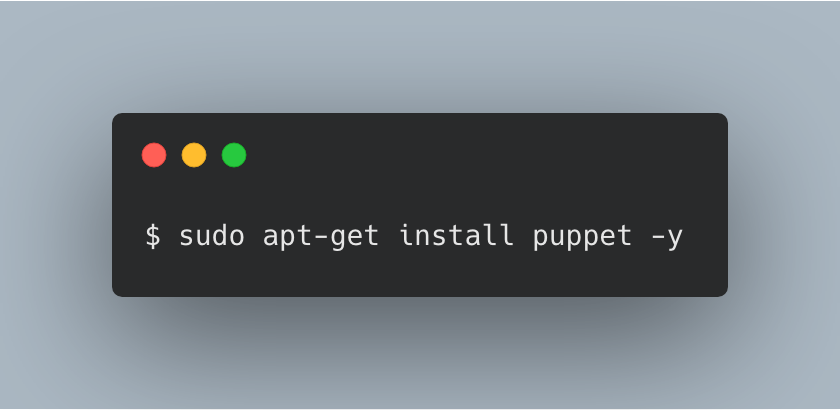

9. Check whether the puppet master service is up
nusiss.puppetmaster.edu.sg

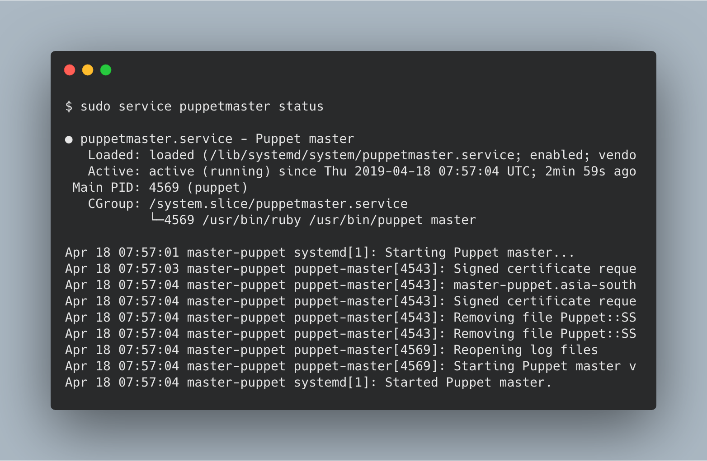

10. On the slave instance, check both the service of the agent is up

11. Configure both agent to be aware of the master node

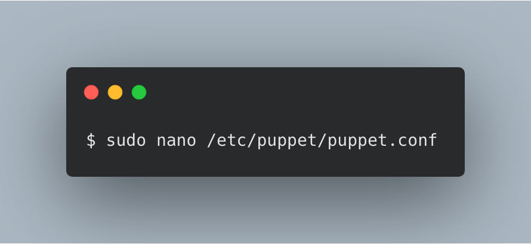

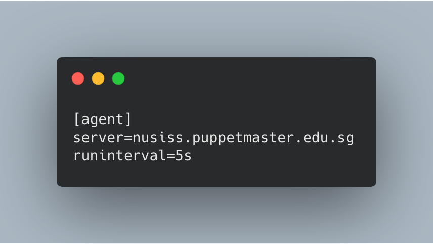

## Restart both the puppet agents

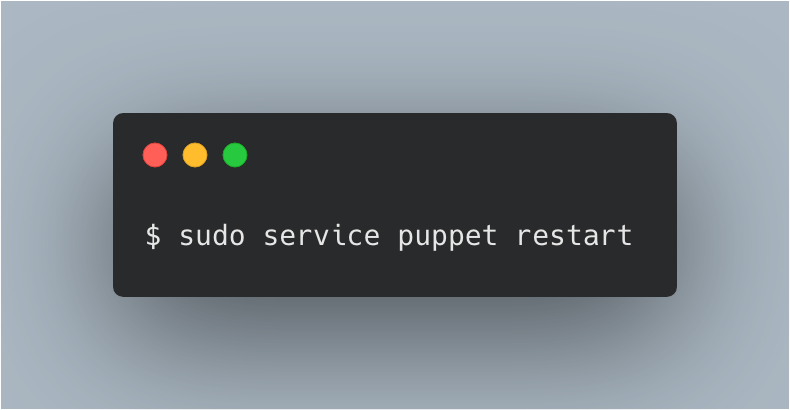

12. Send certificate from agent to the master 

 

## Agent 

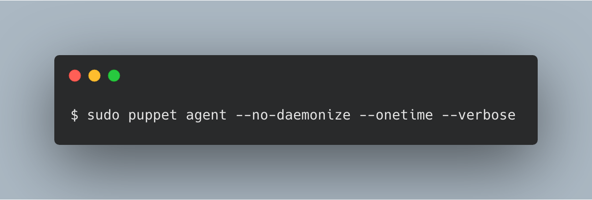

Over the master side sign the request certificate

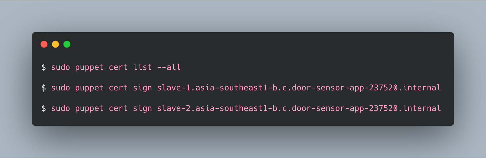

 

## Agent 
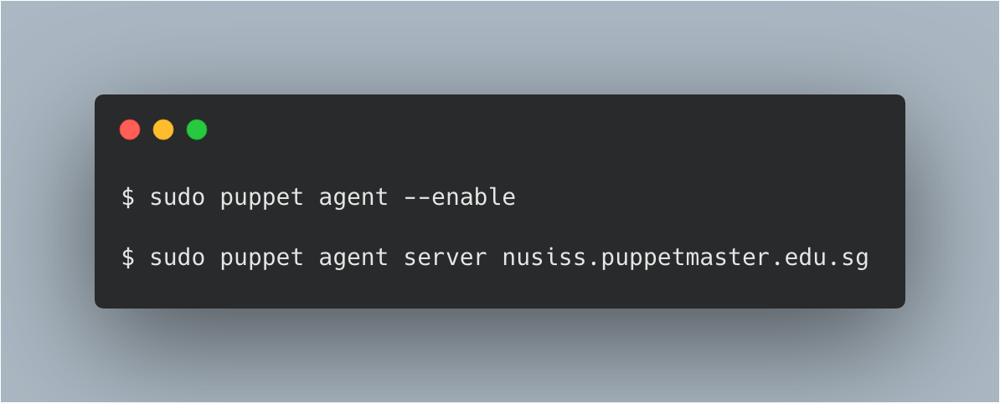

13 Preapre and validate manifest for the installation of software that do not happens to be available on the agent instances

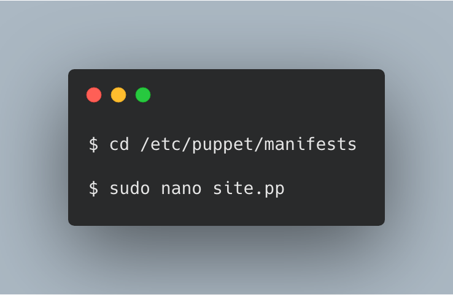
 
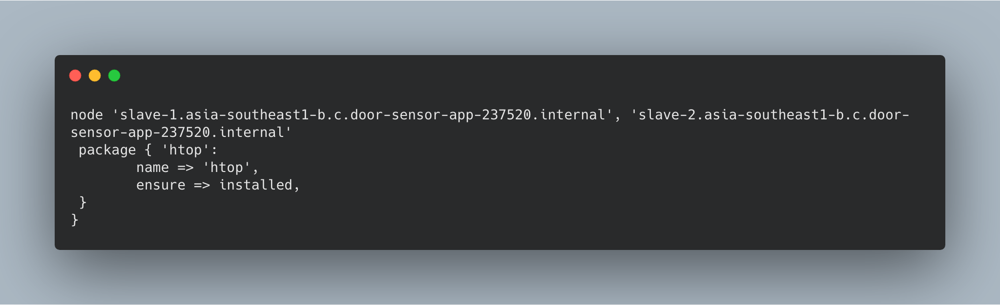
 
Validate the pp configuration file

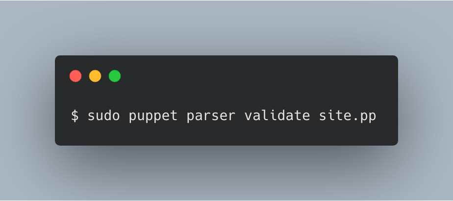

14. To force the update on the agent side 

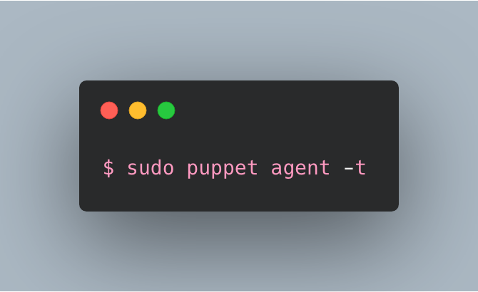

15. By right all agents are configured with update interval of 5 secs.

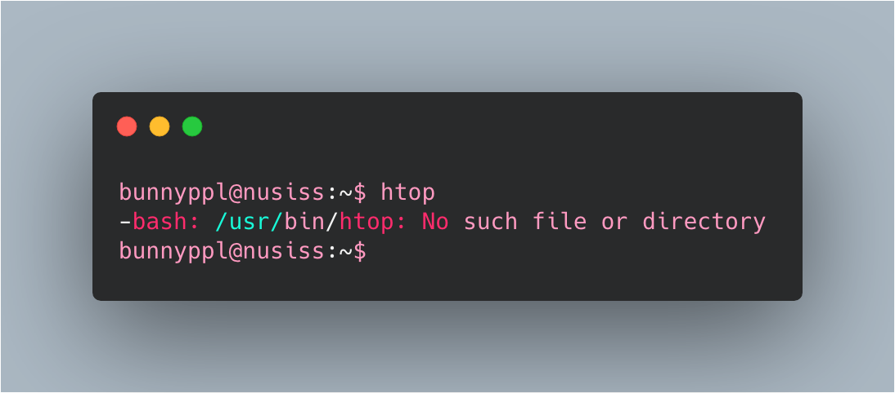
