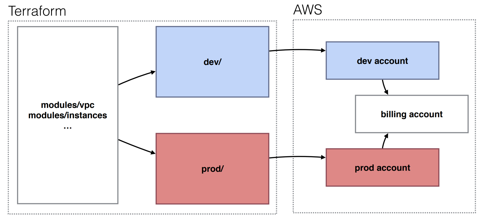

## Terraform

<br>

<br>

## Terraform
* Infrastructure as code
* Automation of your infrastructure
* Keep your infrastructure in a certain state (compliant) e.g. 2 web instances with 2 volumes, and 1 load balancer
* Make your infrastructure auditable
* You can keep your infrastructure change history in a version control
system like GIT
* Ansible, Chef, Puppet, Saltstack have a focus on automating the
installation and configuration of software
* Keeping the machines in compliance, in a certain state
* Terraform can automate provisioning of the infrastructure itself
* eg. Using the AWS, DigitalOcean, Azure API, GCP
* Works well with automation software like ansible to install software after the infrastructure is provisioned


### Show infra plan
```
$ terraform plan
...
+ aws_instance.example
 ami: "ami-0d729a60"
 availability_zone: "<computed>"
 ebs_block_device.#: "<computed>"
 ephemeral_block_device.#: "<computed>"
 instance_state: "<computed>"
 instance_type: "t2.micro"
 key_name: "<computed>"
 placement_group: "<computed>"
 private_dns: "<computed>"
 private_ip: "<computed>"
 public_dns: "<computed>"
 public_ip: "<computed>"
 root_block_device.#: "<computed>"
 security_groups.#: "<computed>"
 source_dest_check: "true"
 subnet_id: "<computed>"
 tenancy: "<computed>"
 vpc_security_group_ids.#: "<computed>"
```

## Apply execution

```
$ terraform apply
aws_instance.example: Creating...
 ami: "" => "ami-0d729a60"
 instance_type: "" => "t2.micro"
 [...]
aws_instance.example: Creation complete
Apply complete! Resources: 1 added, 0 changed, 0 destroyed.
```

## Keep the changes in an out file
```
$ terraform plan -out changes.terraform
```

```
$ terraform apply changes.terraform
...
$ rm changes.terraform
```

## AWS Code Build

```
# code build
resource "aws_codebuild_project" "demo" {
  name           = "demo-docker-build"
  description    = "demo docker build"
  build_timeout  = "30"
  service_role   = aws_iam_role.demo-codebuild.arn
  encryption_key = aws_kms_alias.demo-artifacts.arn

  artifacts {
    type = "CODEPIPELINE"
  }

  #cache {
  #  type     = "S3"
  #  location = aws_s3_bucket.codebuild-cache.bucket
  #}

  environment {
    compute_type    = "BUILD_GENERAL1_SMALL"
    image           = "aws/codebuild/docker:18.09.0"
    type            = "LINUX_CONTAINER"
    privileged_mode = true

    environment_variable {
      name  = "AWS_DEFAULT_REGION"
      value = var.AWS_REGION
    }
    environment_variable {
      name  = "AWS_ACCOUNT_ID"
      value = data.aws_caller_identity.current.account_id
    }
    environment_variable {
      name  = "IMAGE_REPO_NAME"
      value = aws_ecr_repository.demo.name
    }
  }

  source {
    type      = "CODEPIPELINE"
    buildspec = "buildspec.yml"
  }

  #depends_on      = [aws_s3_bucket.codebuild-cache]
}

```

## AWS Code Commit

```
resource "aws_codecommit_repository" "demo" {
  repository_name = "demo"
  description     = "This is the demo repository"
}
```

## AWS CodeDeploy

```
resource "aws_codedeploy_app" "demo" {
  compute_platform = "ECS"
  name             = "demo"
}

resource "aws_codedeploy_deployment_group" "demo" {
  app_name               = aws_codedeploy_app.demo.name
  deployment_config_name = "CodeDeployDefault.ECSAllAtOnce"
  deployment_group_name  = "demo"
  service_role_arn       = aws_iam_role.demo-codedeploy.arn

  auto_rollback_configuration {
    enabled = true
    events  = ["DEPLOYMENT_FAILURE"]
  }

  blue_green_deployment_config {
    deployment_ready_option {
      action_on_timeout = "CONTINUE_DEPLOYMENT"
    }

    terminate_blue_instances_on_deployment_success {
      action                           = "TERMINATE"
      termination_wait_time_in_minutes = 5
    }
  }

  deployment_style {
    deployment_option = "WITH_TRAFFIC_CONTROL"
    deployment_type   = "BLUE_GREEN"
  }

  ecs_service {
    cluster_name = aws_ecs_cluster.demo.name
    service_name = aws_ecs_service.demo.name
  }

  load_balancer_info {
    target_group_pair_info {
      prod_traffic_route {
        listener_arns = [aws_lb_listener.demo.arn]
      }

      target_group {
        name = aws_lb_target_group.demo-blue.name
      }

      target_group {
        name = aws_lb_target_group.demo-green.name
      }
    }
  }
}

```

```
#
# codepipeline - demo
#
resource "aws_codepipeline" "demo" {
  name     = "demo-docker-pipeline"
  role_arn = aws_iam_role.demo-codepipeline.arn

  artifact_store {
    location = aws_s3_bucket.demo-artifacts.bucket
    type     = "S3"
    encryption_key {
      id   = aws_kms_alias.demo-artifacts.arn
      type = "KMS"
    }
  }

  stage {
    name = "Source"

    action {
      name             = "Source"
      category         = "Source"
      owner            = "AWS"
      provider         = "CodeCommit"
      version          = "1"
      output_artifacts = ["demo-docker-source"]

      configuration = {
        RepositoryName = aws_codecommit_repository.demo.repository_name
        BranchName     = "master"
      }
    }
  }

  stage {
    name = "Build"

    action {
      name             = "Build"
      category         = "Build"
      owner            = "AWS"
      provider         = "CodeBuild"
      input_artifacts  = ["demo-docker-source"]
      output_artifacts = ["demo-docker-build"]
      version          = "1"

      configuration = {
        ProjectName = aws_codebuild_project.demo.name
      }
    }
  }

  stage {
    name = "Deploy"

    action {
      name            = "DeployToECS"
      category        = "Deploy"
      owner           = "AWS"
      provider        = "CodeDeployToECS"
      input_artifacts = ["demo-docker-build"]
      version         = "1"

      configuration = {
        ApplicationName                = aws_codedeploy_app.demo.name
        DeploymentGroupName            = aws_codedeploy_deployment_group.demo.deployment_group_name
        TaskDefinitionTemplateArtifact = "demo-docker-build"
        AppSpecTemplateArtifact        = "demo-docker-build"
      }
    }
  }
}

```

## AWS ECR
```
resource "aws_ecr_repository" "demo" {
  name = "demo"
}

```

## AWS ECS
```
resource "aws_ecs_cluster" "demo" {
  name = "demo"
}
```

## AWS Fargate
```
resource "aws_ecs_task_definition" "demo" {
  family             = "demo"
  execution_role_arn = aws_iam_role.ecs-task-execution-role.arn
  task_role_arn      = aws_iam_role.ecs-demo-task-role.arn
  cpu                = 256
  memory             = 512
  network_mode       = "awsvpc"
  requires_compatibilities = [
    "FARGATE"
  ]

  container_definitions = <<DEFINITION
[
  {
    "essential": true,
    "image": "${aws_ecr_repository.demo.repository_url}",
    "name": "demo",
    "logConfiguration": {
            "logDriver": "awslogs",
            "options": {
               "awslogs-group" : "demo",
               "awslogs-region": "${var.AWS_REGION}",
               "awslogs-stream-prefix": "ecs"
            }
     },
     "secrets": [],
     "environment": [],
     "healthCheck": {
       "command": [ "CMD-SHELL", "curl -f http://localhost:3000/ || exit 1" ],
       "interval": 30,
       "retries": 3,
       "timeout": 5
     }, 
     "portMappings": [
        {
           "containerPort": 3000,
           "hostPort": 3000,
           "protocol": "tcp"
        }
     ]
  }
]
DEFINITION

}

resource "aws_ecs_service" "demo" {
  name            = "demo"
  cluster         = aws_ecs_cluster.demo.id
  desired_count   = 1
  task_definition = aws_ecs_task_definition.demo.arn
  launch_type     = "FARGATE"
  depends_on      = [aws_lb_listener.demo]

  deployment_controller {
    type = "CODE_DEPLOY"
  }

  network_configuration {
    subnets          = slice(module.vpc.public_subnets, 1, 2)
    security_groups  = [aws_security_group.ecs-demo.id]
    assign_public_ip = true
  }

  load_balancer {
    target_group_arn = aws_lb_target_group.demo-blue.id
    container_name   = "demo"
    container_port   = "3000"
  }
  lifecycle {
    ignore_changes = [
      task_definition,
      load_balancer
    ]
  }
}

# security group
resource "aws_security_group" "ecs-demo" {
  name        = "ECS demo"
  vpc_id      = module.vpc.vpc_id
  description = "ECS demo"

  ingress {
    from_port   = 3000
    to_port     = 3000
    protocol    = "tcp"
    cidr_blocks = ["0.0.0.0/0"]
  }

  egress {
    from_port = 0
    to_port   = 0
    protocol  = "-1"
    cidr_blocks = [
      "0.0.0.0/0"
    ]
  }
}

# logs
resource "aws_cloudwatch_log_group" "demo" {
  name = "demo"
}
```

## AWS IAM Roles
```
#
# iam roles
#
resource "aws_iam_role" "demo-codebuild" {
  name = "demo-codebuild"

  assume_role_policy = <<EOF
{
  "Version": "2012-10-17",
  "Statement": [
    {
      "Effect": "Allow",
      "Principal": {
        "Service": "codebuild.amazonaws.com"
      },
      "Action": "sts:AssumeRole"
    }
  ]
}
EOF

}

resource "aws_iam_role_policy" "demo-codebuild" {
  role = aws_iam_role.demo-codebuild.name

  policy = <<POLICY
{
  "Version": "2012-10-17",
  "Statement": [
    {
      "Effect": "Allow",
      "Resource": [
        "*"
      ],
      "Action": [
        "logs:CreateLogGroup",
        "logs:CreateLogStream",
        "logs:PutLogEvents"
      ]
    },
    {
      "Sid": "CodeCommitPolicy",
      "Effect": "Allow",
      "Action": [
        "codecommit:GitPull"
      ],
      "Resource": [
        "*"
      ]
    },
    {
      "Effect": "Allow",
      "Action": [
        "ec2:CreateNetworkInterface",
        "ec2:DescribeDhcpOptions",
        "ec2:DescribeNetworkInterfaces",
        "ec2:DeleteNetworkInterface",
        "ec2:DescribeSubnets",
        "ec2:DescribeSecurityGroups",
        "ec2:DescribeVpcs"
      ],
      "Resource": "*"
    },
    {
      "Effect": "Allow",
      "Action": [
        "s3:*"
      ],
      "Resource": [
        "${aws_s3_bucket.codebuild-cache.arn}",
        "${aws_s3_bucket.codebuild-cache.arn}/*"
      ]
    },
    {
      "Effect":"Allow",
      "Action": [
        "s3:List*",
        "s3:Put*",
        "s3:Get*"
      ],
      "Resource": [
        "${aws_s3_bucket.demo-artifacts.arn}",
        "${aws_s3_bucket.demo-artifacts.arn}/*"
      ]
    },
    {
      "Sid": "ECRPushPolicy",
      "Effect": "Allow",
      "Action": [
        "ecr:BatchCheckLayerAvailability",
        "ecr:GetDownloadUrlForLayer",
        "ecr:GetRepositoryPolicy",
        "ecr:DescribeRepositories",
        "ecr:ListImages",
        "ecr:DescribeImages",
        "ecr:BatchGetImage",
        "ecr:InitiateLayerUpload",
        "ecr:UploadLayerPart",
        "ecr:CompleteLayerUpload",
        "ecr:PutImage"
      ],
      "Resource": [
        "*"
      ]
    },
    {
      "Sid": "ECRAuthPolicy",
      "Effect": "Allow",
      "Action": [
        "ecr:GetAuthorizationToken"
      ],
      "Resource": [
        "*"
      ]
    }, 
    {
      "Sid": "ECS",
      "Effect": "Allow",
      "Action": [
        "ecs:List*",
        "ecs:Describe*"
      ],
      "Resource": [
        "*"
      ]
    }, 
    {
      "Effect": "Allow",
      "Action": [
         "kms:DescribeKey",
         "kms:GenerateDataKey*",
         "kms:Encrypt",
         "kms:ReEncrypt*",
         "kms:Decrypt"
        ],
      "Resource": [
         "${aws_kms_key.demo-artifacts.arn}"
        ]
    }
  ]
}
POLICY

}

```

```
resource "aws_iam_role" "demo-codedeploy" {
  name = "demo-codedeploy"

  assume_role_policy = <<EOF
{
  "Version": "2012-10-17",
  "Statement": [
    {
      "Effect": "Allow",
      "Principal": {
        "Service": "codedeploy.amazonaws.com"
      },
      "Action": "sts:AssumeRole"
    }
  ]
}
EOF

}

data "aws_iam_policy_document" "demo-codedeploy-role-policy" {
  statement {
    effect = "Allow"
    actions = [
      "ecs:DescribeServices",
      "ecs:CreateTaskSet",
      "ecs:UpdateServicePrimaryTaskSet",
      "ecs:DeleteTaskSet",
      "elasticloadbalancing:DescribeTargetGroups",
      "elasticloadbalancing:DescribeListeners",
      "elasticloadbalancing:ModifyListener",
      "elasticloadbalancing:DescribeRules",
      "elasticloadbalancing:ModifyRule",
      "lambda:InvokeFunction",
      "cloudwatch:DescribeAlarms",
      "sns:Publish",
      "s3:GetObject",
      "s3:GetObjectVersion"
    ]
    resources = [
      "*",
    ]
  }
  statement {
    effect = "Allow"
    actions = [
      "s3:Get*",
    ]
    resources = [
      "${aws_s3_bucket.demo-artifacts.arn}/*",
    ]
  }
  statement {
    effect = "Allow"
    actions = [
      "kms:DescribeKey",
      "kms:Decrypt",
    ]
    resources = [
      aws_kms_key.demo-artifacts.arn
    ]
  }
  statement {
    effect = "Allow"
    actions = [
      "iam:PassRole"
    ]
    resources = [
      aws_iam_role.ecs-task-execution-role.arn,
      aws_iam_role.ecs-demo-task-role.arn,
    ]
    condition {
      test     = "StringLike"
      variable = "iam:PassedToService"
      values   = ["ecs-tasks.amazonaws.com"]
    }
  }
}

resource "aws_iam_role_policy" "demo-codedeploy" {
  name   = "codedeploy-policy"
  role   = aws_iam_role.demo-codedeploy.id
  policy = data.aws_iam_policy_document.demo-codedeploy-role-policy.json
}

```

```
resource "aws_iam_role" "demo-codepipeline" {
  name = "demo-codepipeline"

  assume_role_policy = <<EOF
{
  "Version": "2012-10-17",
  "Statement": [
    {
      "Effect": "Allow",
      "Principal": {
        "Service": "codepipeline.amazonaws.com"
      },
      "Action": "sts:AssumeRole"
    }
  ]
}
EOF

}

data "aws_iam_policy_document" "demo-codepipeline-role-policy" {
  statement {
    effect = "Allow"
    actions = [
      "s3:*",
    ]
    resources = [
      aws_s3_bucket.demo-artifacts.arn,
      "${aws_s3_bucket.demo-artifacts.arn}/*",
    ]
  }
  statement {
    effect = "Allow"
    actions = [
      "codebuild:BatchGetBuilds",
      "codebuild:StartBuild",
    ]
    resources = [
      "*",
    ]
  }
  statement {
    effect = "Allow"
    actions = [
      "sts:AssumeRole",
    ]
    resources = [
      "arn:aws:iam::${data.aws_caller_identity.current.account_id}:role/demo-codepipeline",
    ]
  }
  statement {
    effect = "Allow"
    actions = [
      "kms:DescribeKey",
      "kms:GenerateDataKey*",
      "kms:Encrypt",
      "kms:ReEncrypt*",
      "kms:Decrypt",
    ]
    resources = [
      aws_kms_key.demo-artifacts.arn,
    ]
  }
  statement {
    effect = "Allow"
    actions = [
      "codecommit:UploadArchive",
      "codecommit:Get*",
      "codecommit:BatchGet*",
      "codecommit:Describe*",
      "codecommit:BatchDescribe*",
      "codecommit:GitPull",
    ]
    resources = [
      aws_codecommit_repository.demo.arn,
    ]
  }
  statement {
    effect = "Allow"
    actions = [
      "codedeploy:*",
      "ecs:*",
    ]
    resources = [
      "*",
    ]
  }
  statement {
    effect = "Allow"
    actions = [
      "iam:PassRole"
    ]
    resources = [
      aws_iam_role.ecs-task-execution-role.arn,
      aws_iam_role.ecs-demo-task-role.arn,
    ]
    condition {
      test     = "StringLike"
      variable = "iam:PassedToService"
      values   = ["ecs-tasks.amazonaws.com"]
    }
  }
}

resource "aws_iam_role_policy" "demo-codepipeline" {
  name   = "codepipeline-policy"
  role   = aws_iam_role.demo-codepipeline.id
  policy = data.aws_iam_policy_document.demo-codepipeline-role-policy.json
}
```

```
resource "aws_iam_role" "ecs-task-execution-role" {
  name = "ecs-task-execution-role"

  assume_role_policy = <<EOF
{
  "Version": "2012-10-17",
  "Statement": [
    {
      "Sid": "",
      "Effect": "Allow",
      "Principal": {
        "Service": "ecs-tasks.amazonaws.com"
      },
      "Action": "sts:AssumeRole"
    }
  ]
}
EOF

}

resource "aws_iam_role_policy" "ecs-task-execution-role" {
  name = "ecs-task-execution-role"
  role = aws_iam_role.ecs-task-execution-role.id

  policy = <<EOF
{
  "Version": "2012-10-17",
  "Statement": [
    {
      "Effect": "Allow",
      "Action": [
        "ecr:GetAuthorizationToken",
        "ecr:BatchCheckLayerAvailability",
        "ecr:GetDownloadUrlForLayer",
        "ecr:BatchGetImage",
        "logs:CreateLogStream",
        "logs:PutLogEvents",
        "ssm:GetParameters",
        "ssm:GetParameter"
      ],
      "Resource": "*"
    }
  ]
}
EOF

}

resource "aws_iam_role" "ecs-demo-task-role" {
  name = "ecs-demo-task-role"

  assume_role_policy = <<EOF
{
  "Version": "2012-10-17",
  "Statement": [
    {
      "Sid": "",
      "Effect": "Allow",
      "Principal": {
        "Service": "ecs-tasks.amazonaws.com"
      },
      "Action": "sts:AssumeRole"
    }
  ]
}
EOF


}

```

## Key Management
```
#
# kms
#
data "aws_iam_policy_document" "demo-artifacts-kms-policy" {
  policy_id = "key-default-1"
  statement {
    sid    = "Enable IAM User Permissions"
    effect = "Allow"
    principals {
      type        = "AWS"
      identifiers = ["arn:aws:iam::${data.aws_caller_identity.current.account_id}:root"]
    }
    actions = [
      "kms:*",
    ]
    resources = [
      "*",
    ]
  }
}

resource "aws_kms_key" "demo-artifacts" {
  description = "kms key for demo artifacts"
  policy      = data.aws_iam_policy_document.demo-artifacts-kms-policy.json
}

resource "aws_kms_alias" "demo-artifacts" {
  name          = "alias/demo-artifacts"
  target_key_id = aws_kms_key.demo-artifacts.key_id
}


```

## AWS Load Balancer

resource "aws_lb" "demo" {
  name                             = "demo"
  subnets                          = module.vpc.public_subnets
  load_balancer_type               = "network"
  enable_cross_zone_load_balancing = true
}

resource "aws_lb_listener" "demo" {
  load_balancer_arn = aws_lb.demo.arn
  port              = "80"
  protocol          = "TCP"

  default_action {
    target_group_arn = aws_lb_target_group.demo-blue.id
    type             = "forward"
  }
  lifecycle {
    ignore_changes = [
      default_action,
    ]
  }
}

resource "aws_lb_target_group" "demo-blue" {
  name                 = "demo-http-blue"
  port                 = "3000"
  protocol             = "TCP"
  target_type          = "ip"
  vpc_id               = module.vpc.vpc_id
  deregistration_delay = "30"

  health_check {
    healthy_threshold   = 2
    unhealthy_threshold = 2
    protocol            = "TCP"
    interval            = 30
  }
}
resource "aws_lb_target_group" "demo-green" {
  name                 = "demo-http-green"
  port                 = "3000"
  protocol             = "TCP"
  target_type          = "ip"
  vpc_id               = module.vpc.vpc_id
  deregistration_delay = "30"

  health_check {
    healthy_threshold   = 2
    unhealthy_threshold = 2
    protocol            = "TCP"
    interval            = 30
  }
}


## Provider 
```
provider "aws" {
  region = var.AWS_REGION
}

data "aws_availability_zones" "available" {
}

data "aws_caller_identity" "current" {
}

```

## S3 Configuration

```
#
# cache s3 bucket
#
resource "aws_s3_bucket" "codebuild-cache" {
  bucket = "demo-codebuild-cache-${random_string.random.result}"
  acl    = "private"
}

resource "aws_s3_bucket" "demo-artifacts" {
  bucket = "demo-artifacts-${random_string.random.result}"
  acl    = "private"

  lifecycle_rule {
    id      = "clean-up"
    enabled = "true"

    expiration {
      days = 30
    }
  }
}

resource "random_string" "random" {
  length  = 8
  special = false
  upper   = false
}


```

## Vars

```
variable "AWS_REGION" {
  default = "ap-southeast-1"
}

```

## Define VPCs

```
module "vpc" {
  source  = "terraform-aws-modules/vpc/aws"
  version = "2.59.0"

  name = "vpc-module-demo"
  cidr = "10.0.0.0/16"

  azs             = slice(data.aws_availability_zones.available.names, 0, 3)
  private_subnets = ["10.0.1.0/24", "10.0.2.0/24", "10.0.3.0/24"]
  public_subnets  = ["10.0.101.0/24", "10.0.102.0/24", "10.0.103.0/24"]

  enable_nat_gateway = false
  enable_vpn_gateway = false

  tags = {
    "Name" = "terraform-cloudpipeline-demo"
  }
}

```