# S-DOEA - Workshop - Jenkins Installation

## Pre-requisites for Cloud installation
* AWS account
* Download & Install Putty and PuttyGen https://www.chiark.greenend.org.uk/~sgtatham/putty/latest.html


### Step by step installation
1. Navigate to the AWS services link top left corner beside the AWS logo
<br>
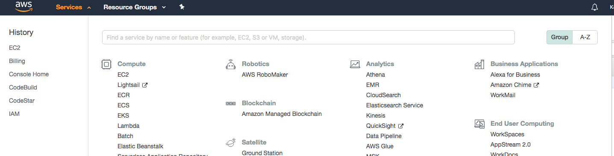
<br>

2. Search/Select EC2 under the compute category
3. Launch a new instance, search 'bitnami jenkins' on the marketplace 
<br>

<br>

4. Search 'bitnami jenkins' on AWS marketplace click on Select to create the instance
<br>
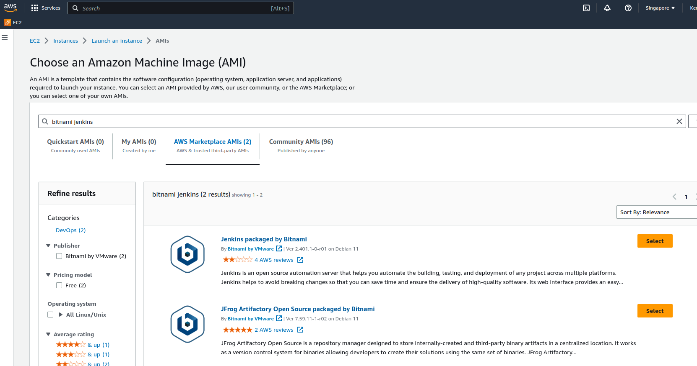

5. On the next page a pricing details page will be shown. Click continue
<br>
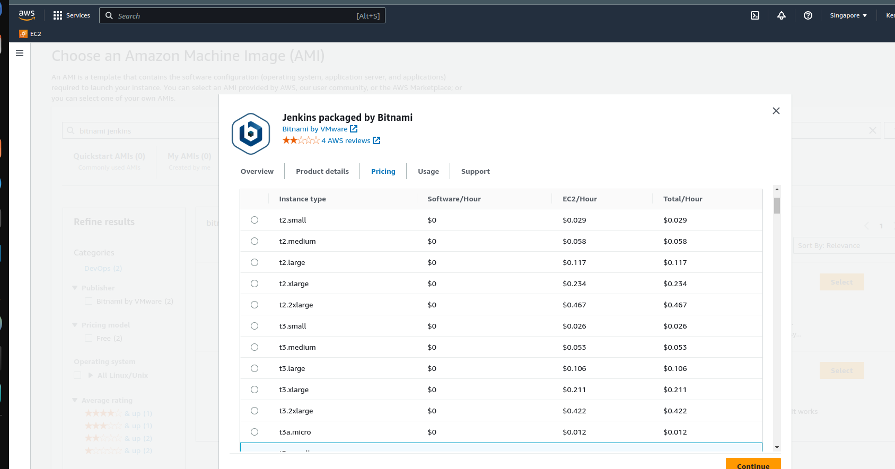
<br>

6. Choose an instance type which is  t2 micro (free tier). Click Next Configure Instance details
<br>
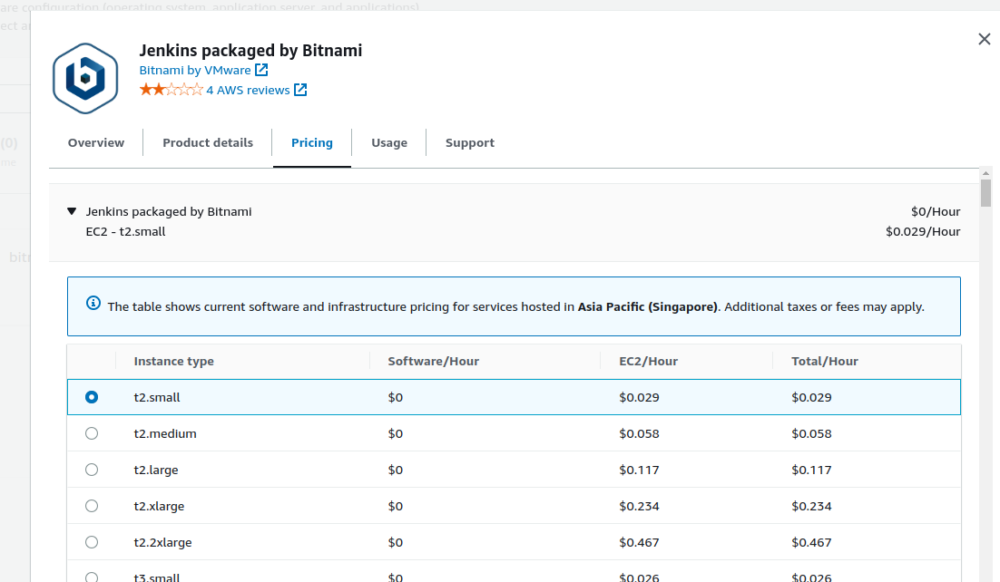
<br>

7. Landed on a configure instance details page and by default nothing is require to be configure on this page. Click Add Storage
<br>
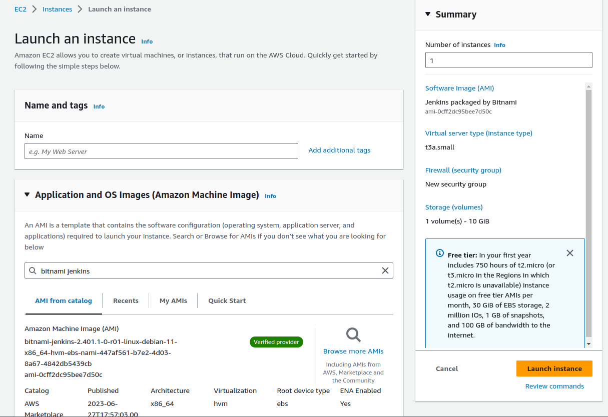
<br>

8. On the configure storage page change 10GB to 15GB. Try not add more mount point overall AWS only give 30GB per instance on free tier.
<br>

<br>

9. Define a tag for your jenkins server click add tag on the key field specify 'server_name' and value as 'project_name_ubuntu_jenkins'. Click Next
<br>
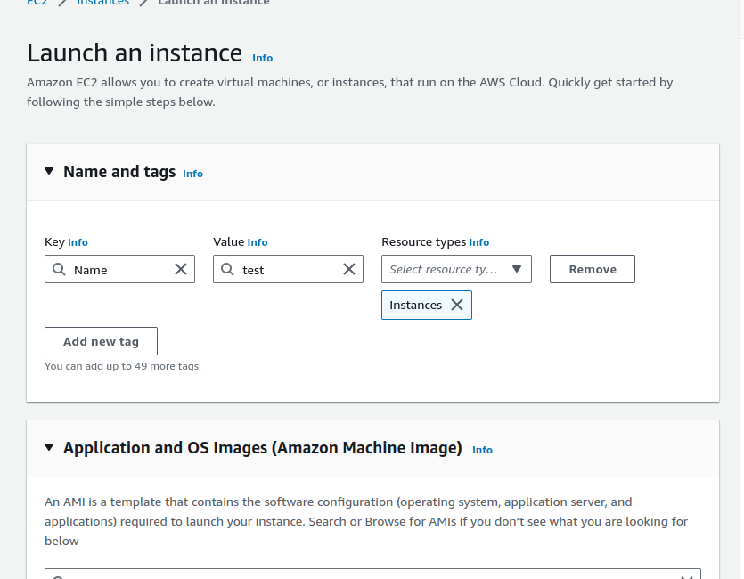
<br>

10.  Configure security group as default no addition configuration is needed on this page
<br>
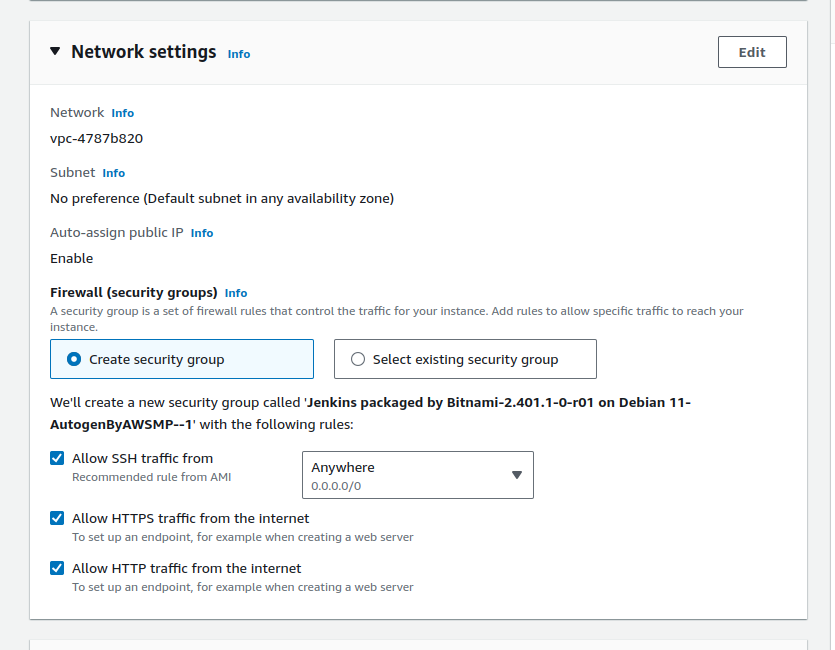
<br>

11. Review all the configuration and click on Launch
<br>
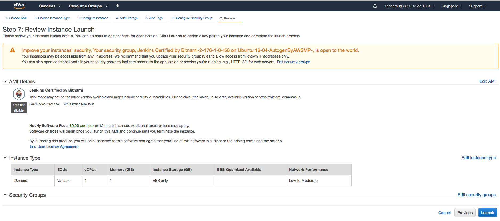
<br>
<br>
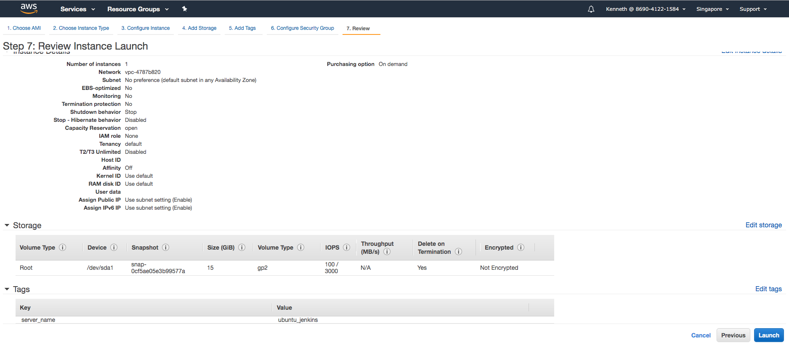
<br>

12. Upon launching the instance AWS require us to create a new pair of private key to be use to access the instance.
<br>
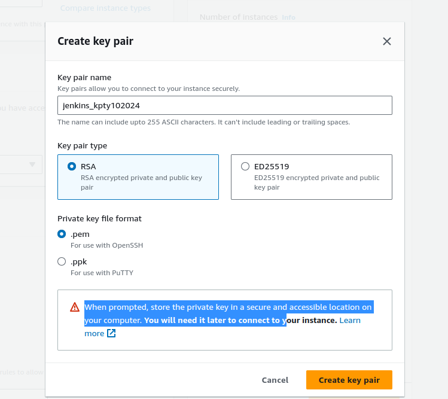
<br>

13. After creating the private key, a new instance will be launch. Kindly wait for a few minutes. Upon successful creation of the instance your instance is now ready to be use
<br>
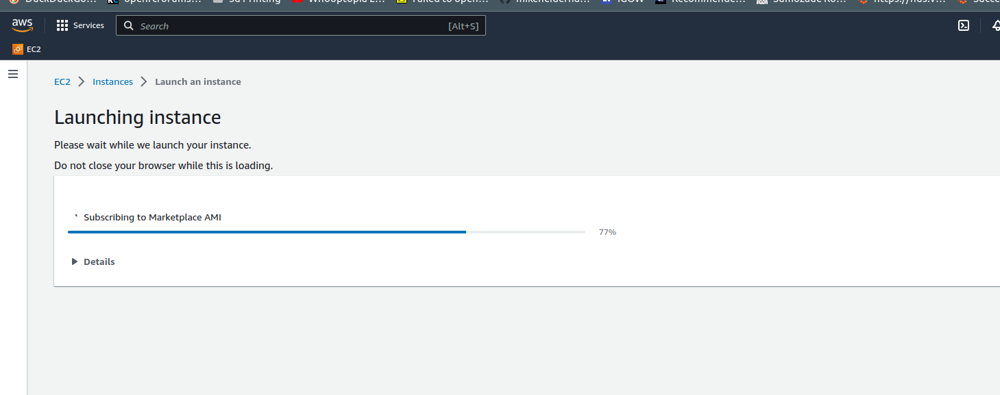
<br>

14. Click on the instance id, the look out for instance status where it is running.
<br>
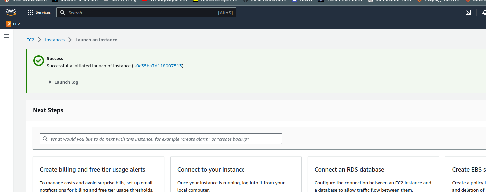
<br>

15. For Windows user please follow the instructions https://docs.aws.amazon.com/AWSEC2/latest/UserGuide/putty.html to use Putty to login into the AWS EC2 instance. For Mac/Linux user the OS itself have built in ssh tools. Just type the below command will do. Upon logging into the EC2 instance, change directory to /home/bitnami


```
$ ssh -i <pem filename> ubuntu@<aws ec2 hostname>

$ cd /home/bitnami 
```

16. Server will prompt client to accept fingerprint signature before the terminal is allow to logon. Type 'Yes' and press enter

```
The authenticity of host '52.221.182.172 (52.221.182.172)' can't be established.
ECDSA key fingerprint is SHA256:XHAuxI+mgND3yKJosxgTGXRskXCOehc5kCkA+KztOI4.
Are you sure you want to continue connecting (yes/no)? yes
Warning: Permanently added '52.221.182.172' (ECDSA) to the list of known hosts.
Welcome to Ubuntu 16.04.6 LTS (GNU/Linux 4.4.0-1085-aws x86_64)
       ___ _ _                   _
      | _ |_) |_ _ _  __ _ _ __ (_)
      | _ \ |  _| ' \/ _` | '  \| |
      |___/_|\__|_|_|\__,_|_|_|_|_|

  *** Welcome to the Bitnami Jenkins 2.176.1-0 ***
  *** Documentation:  https://docs.bitnami.com/aws/apps/jenkins/ ***
  ***                 https://docs.bitnami.com/aws/ ***
  *** Bitnami Forums: https://community.bitnami.com/ ***
```

17. Look for the username and password under the bitnami_credentials file. View the bitnami_credentials file with the following command

```
more bitnami_credentials
```
As result the more command will show the default username and password on your terminal screen

```
Welcome to the Bitnami Jenkins Stack

******************************************************************************
The default username and password is 'user' and 'Dh9b6mi4AQOF'.
******************************************************************************

You can also use this password to access the databases and any other component the stack in
cludes.

Please refer to https://docs.bitnami.com/ for more details.
```

18. Retrieve ip4 public IP address or the DNS name from the AWS jenkins instance console panel
<br>
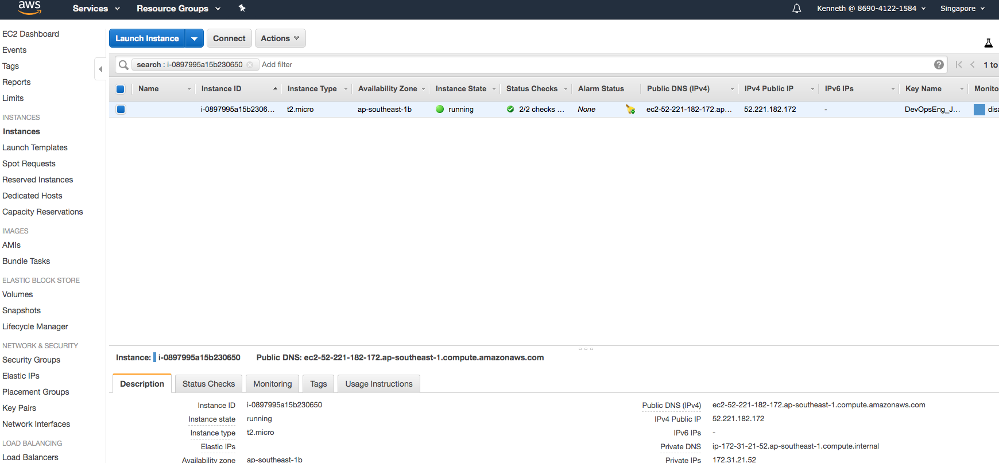
<br>

19. Launch the web browser then access the jenkins web admin app.
<br>
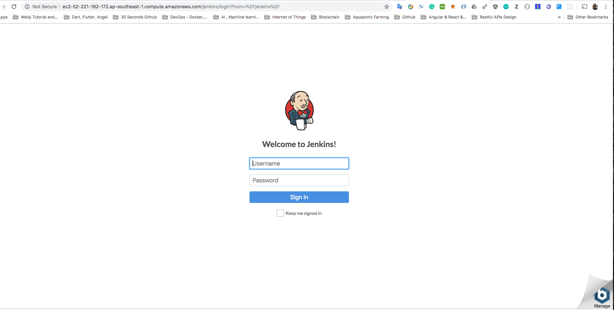
<br>

20. Login to Jenkins with the username and password retrieve from the bitnami credentials flat file
<br>
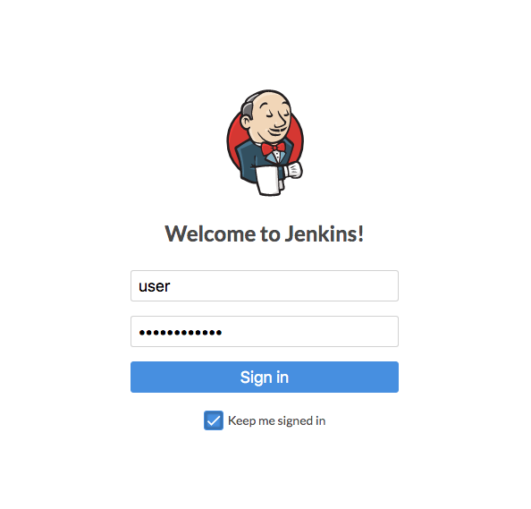
<br>

21. Landed on a customize jenkins page, double click on the canvas stating Install suggested plugins.
<br>
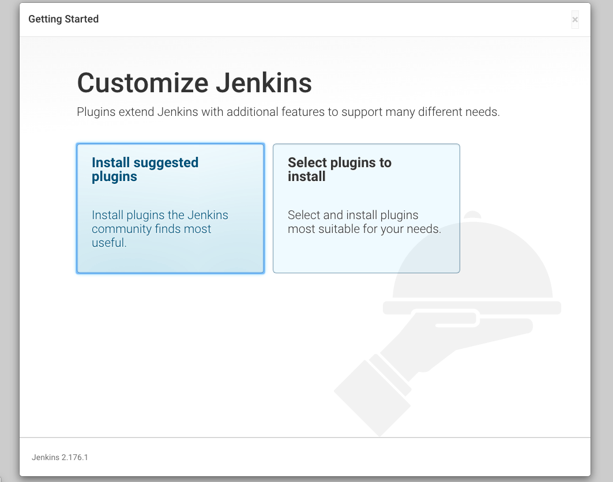
<br>

22. Wait for a few minutes for all the plugins to be install on the current jenkins instance
<br>
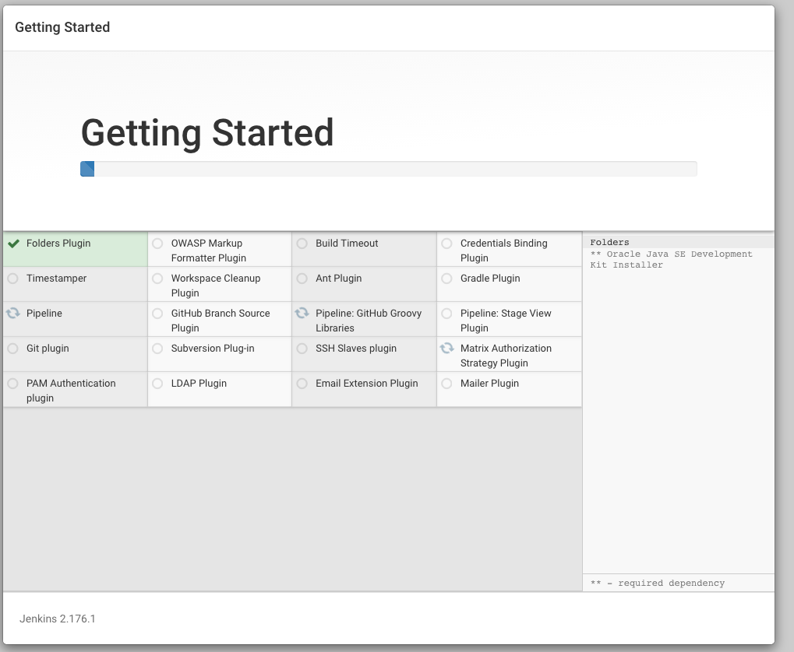
<br>

23. Upon completion of the plugins instalation, finalize the steps by clicking on 'Save and Finish' button
<br>
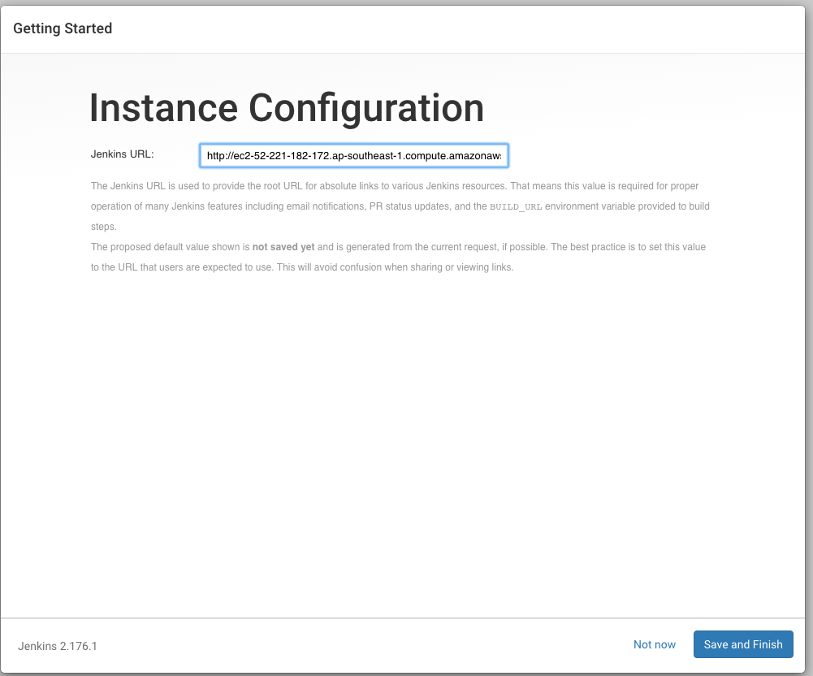
<br>

24. A restart on the jenkins server is required, press the restart button

25. In order to verify all the respective plugins are installed properly. Navigate to Manage Jenkins then Manage Plugins.
<br>
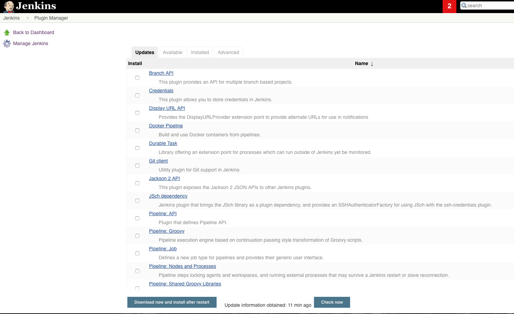
<br>

26. Update to the latest plugins is required at this point. Scroll down select All the updates and click on the 'Download now and install after restart' button

27. Progress page will show right after the download button is triggered. Once everything is updated scroll down tick the checkbox to restart jenkins
<br>
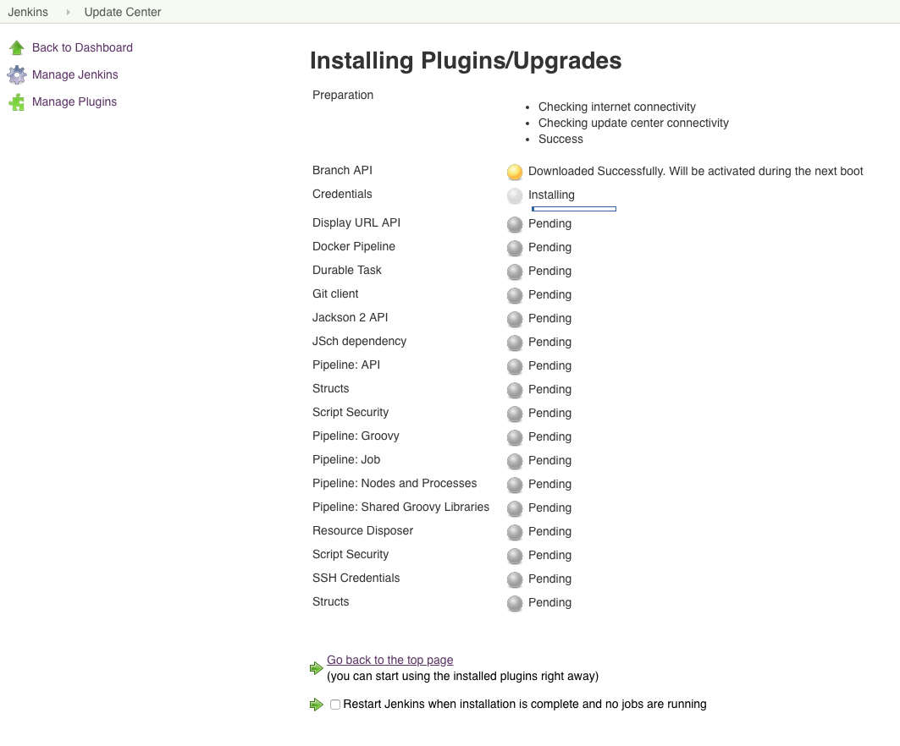
<br>

28. Navigate back to the plugin manager via Manage Jenkins. Go to the available plugin tab filter by Text Finder, eventually two plugins will show up Text Finder and Run Condition. Select both of this plugins and install it along with a restart. The reason we are installing this plugin is required for the next CI workshop 
<br>
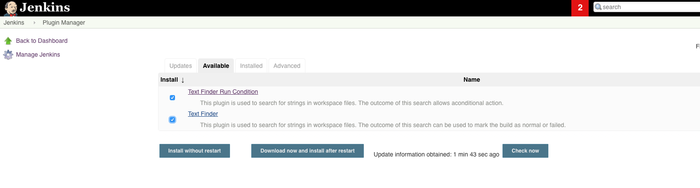
<br>
<br>
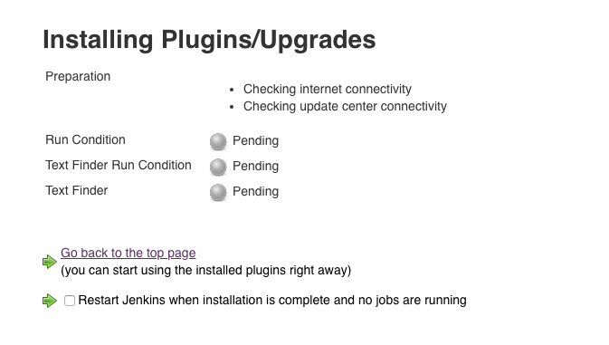
<br>


## Pre-requisites for local workstation installation
* Java JDK 9 or higher

### Step by step installation
Navigate the Jenkins official website. Download the WAR file from the LTS link. By default, the latest release and the Long-Term support release will be available for download. The past releases are also available for download. Click the Long-Term Support Release tab in the download section. 


<br>

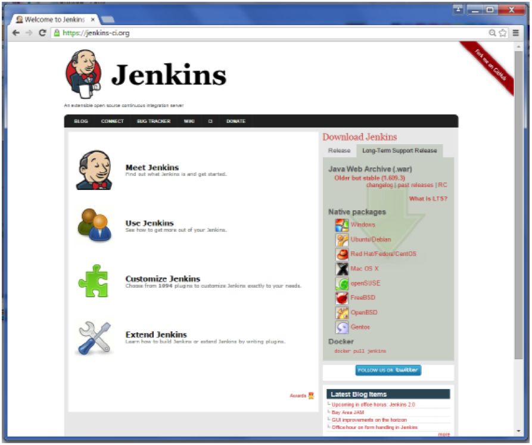

Open the terminal/command prompt. From the command prompt browse to the directory where the jenkins.war is saved. Run the following command

```
$ java -jar jenkins.war
```

After the command is run, various tasks will run, one of which is the extraction of the war file which is done by an embedded webserver called winstone.

```
java –jar Jenkins.war
Running from: D:\jenkins.war
Webroot: $user.home/ .jenkins
Sep 29, 2015 4:10:46 PM winstone.Logger logInternal
INFO: Beginning extraction from war file
```

Once the processing is complete without major errors, the following line will come in the output of the command prompt.

```
INFO: Jenkins is fully up and running
```

Stop the process by pressing Ctrl + C

### Accessing Jenkins
Once Jenkins is up and running, one can access Jenkins from the link − http://localhost:8080
This link will bring up the Jenkins dashboard.

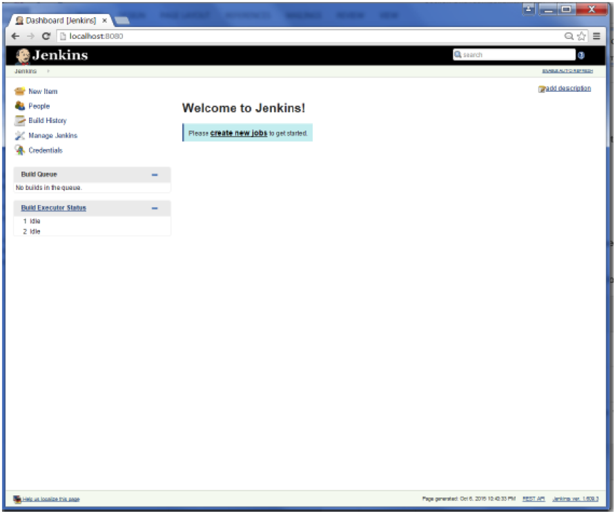
 
 
##  Jenkins - Git Setup
For this exercise, you have to ensure that Internet connectivity is present from the machine on which Jenkins is installed. In your Jenkins Dashboard (Home screen), click the Manage Jenkins option on the left hand side.
 
In the next screen, click the ‘Manage Plugins’ option.
 
In the next screen, click the Available tab. This tab will give a list of plugins which are available for downloading. In the ‘Filter’ tab type ‘Git plugin’
 
The list will then be filtered. Check the Git Plugin option and click on the button ‘Install without restart’
 
The installation will then begin and the screen will be refreshed to show the status of the download.
 
Once all installations are complete, restart Jenkins by issue the following command in the browser. http://localhost:8080/jenkins/restart
After Jenkins is restarted, Git will be available as an option whilst configuring jobs. To verify, click on New Item in the menu options for Jenkins. Then enter a name for a job, in the following case, the name entered is ‘Demo’. Select ‘Freestyle project’ as the item type. Click the Ok button.
 
In the next screen, if you browse to the Source code Management section, you will now see ‘Git’ as an option.
 
## Jenkins – Maven Setup
1. Downloading and Setting Up Maven
The official website for maven is Apache Maven. If you click the given link, you can get the home page of the maven official website as shown below.
 
2. While browsing to the site, go to the Files section and download the link to the Binary.zip file.
 
3. Once the file is downloaded, extract the files to the relevant application folder. For this purpose, the maven files will be placed in E:\Apps\apache-maven-3.3.3.

4. Setting up Jenkins and Maven
In the Jenkins dashboard (Home screen), click Manage Jenkins from the left-hand side menu.
 
5. Then, click on ‘Configure Global Configuration' from the right hand side.
  
6. In the Configure system screen, scroll down till you see the Maven section and then click on the ‘Add Maven’ button.
 
7. Uncheck the ‘Install automatically’ option.

8. Add any name for the setting and the location of the MAVEN_HOME.
Then, click on the ‘Save’ button at the end of the screen.
 
9. You can now create a job with the ‘Maven project’ option. In the Jenkins dashboard, click the New Item option.
  
## Jenkins - Configuration

You probably would have seen a couple of times in the previous exercises wherein we had to configure options within Jenkins. The following shows the various configuration options in Jenkins.
So one can get the various configuration options for Jenkins by clicking the ‘Manage Jenkins’ option from the left hand menu side.
 
You will then be presented with the following screen −
 
Click on Configure system. Discussed below are some of the Jenkins configuration settings which can be carried out.
Jenkins Home Directory
Jenkins needs some disk space to perform builds and keep archives. One can check this location from the configuration screen of Jenkins. By default, this is set to ~/.jenkins, and this location will initially be stored within your user profile location. In a proper environment, you need to change this location to an adequate location to store all relevant builds and archives. 
Once can do this in the following ways

*	Set "JENKINS_HOME" environment variable to the new home directory before launching the servlet container.

*	Set "JENKINS_HOME" system property to the servlet container.
*	Set JNDI environment entry "JENKINS_HOME" to the new directory.
The following example will use the first option of setting the "JENKINS_HOME" environment variable.
First create a new folder E:\Apps\Jenkins. Copy all the contents from the existing ~/.jenkins to this new directory.

Set the JENKINS_HOME environment variable to point to the base directory location where Java is installed on your machine. For example,

| OS        | Output           | 
| ------------- |:-------------:| 
| Windows | Set Environmental variable JENKINS_HOME to you’re the location you desire. As an example you can set it to E:\Apps\Jenkins | 
| Linux | export JENKINS_HOME =/usr/local/Jenkins or the location you desire. | 

In the Jenkins dashboard, click Manage Jenkins from the left hand side menu. Then click on ‘Configure System’ from the right hand side.
In the Home directory, you will now see the new directory which has been configured.
 
## No. of executors
This refers to the total number of concurrent job executions that can take place on the Jenkins machine. This can be changed based on requirements. Sometimes the recommendation is to keep this number the same as the number of CPU on the machines for better performance.

## Environment Variables

This is used to add custom environment variables which will apply to all the jobs. These are key-value pairs and can be accessed and used in Builds wherever required.

## Jenkins URL

By default, the Jenkins URL points to localhost. If you have a domain name setup for your machine, set this to the domain name else overwrite localhost with IP of machine. This will help in setting up slaves and while sending out links using the email as you can directly access the Jenkins URL using the environment variable JENKINS_URL which can be accessed as ${JENKINS_URL}.

## Email Notification

In the email Notification area, you can configure the SMTP settings for sending out emails. This is required for Jenkins to connect to the SMTP mail server and send out emails to the recipient list.

## Jenkins - Management

To manage Jenkins, click on the ‘Manage Jenkins’ option from the left hand menu side.
So one can get the various configuration options for Jenkins by clicking the ‘Manage Jenkins’ option from the left hand menu side.
 
You will then be presented with the following screen −
 
Some of the management options are as follows −

## Configure System

This is where one can manage paths to the various tools to use in builds, such as the JDKs, the versions of Ant and Maven, as well as security options, email servers, and other system-wide configuration details. When plugins are installed. Jenkins will add the required configuration fields dynamically after the plugins are installed.

## Reload Configuration from Disk

Jenkins stores all its system and build job configuration details as XML files which is stored in the Jenkins home directory. Here also all of the build history is stored. If you are migrating build jobs from one Jenkins instance to another, or archiving old build jobs, you will need to add or remove the corresponding build job directories to Jenkins’s builds directory. You don’t need to take Jenkins offline to do this—you can simply use the “Reload Configuration from Disk” option to reload the Jenkins system and build job configurations directly.

## Manage Plugin

Here one can install a wide variety of third-party plugins right from different Source code management tools such as Git, Mercurial or ClearCase, to code quality and code coverage metrics reporting. Plugins can be installed, updated and removed through the Manage Plugins screen.
 
## System Information

This screen displays a list of all the current Java system properties and system environment variables. Here one can check exactly what version of Java Jenkins is running in, what user it is running under, and so forth.
The following screenshot shows some of the name-value information available in this section.
 
## System Log

The System Log screen is a convenient way to view the Jenkins log files in real time. Again, the main use of this screen is for troubleshooting.


## Load Statistics

This pages displays graphical data on how busy the Jenkins instance is in terms of the number of concurrent builds and the length of the build queue which gives an idea of how long your builds need to wait before being executed. These statistics can give a good idea of whether extra capacity or extra build nodes is required from an infrastructure perspective.

## Script Console
This screen lets you run Groovy scripts on the server. It is useful for advanced troubleshooting since it requires a strong knowledge of the internal Jenkins architecture.

## Manage nodes

Jenkins is capable of handling parallel and distributed builds. In this screen, you can configure how many builds you want. Jenkins runs simultaneously, and, if you are using distributed builds, set up build nodes. A build node is another machine that Jenkins can use to execute its builds.

## Prepare for Shutdown

If there is a need to shut down Jenkins, or the server Jenkins is running on, it is best not to do so when a build is being executed. To shut down Jenkins cleanly, you can use the Prepare for Shutdown link, which prevents any new builds from being started. Eventually, when all of the current builds have finished, one will be able to shut down Jenkins cleanly.
