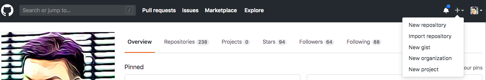
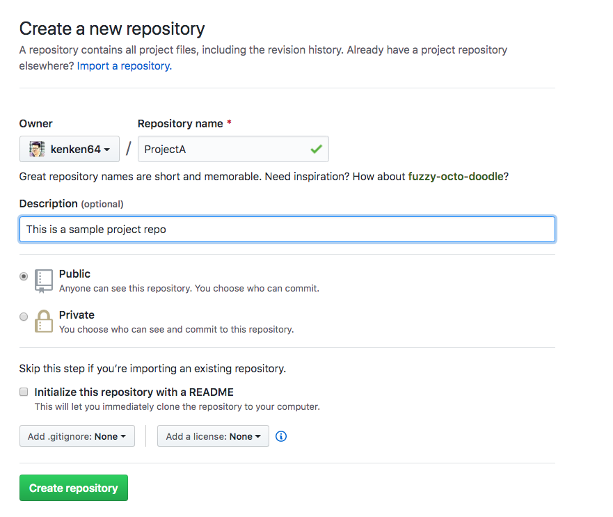
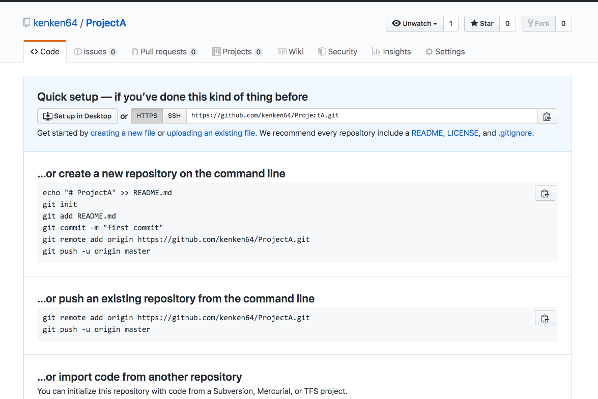
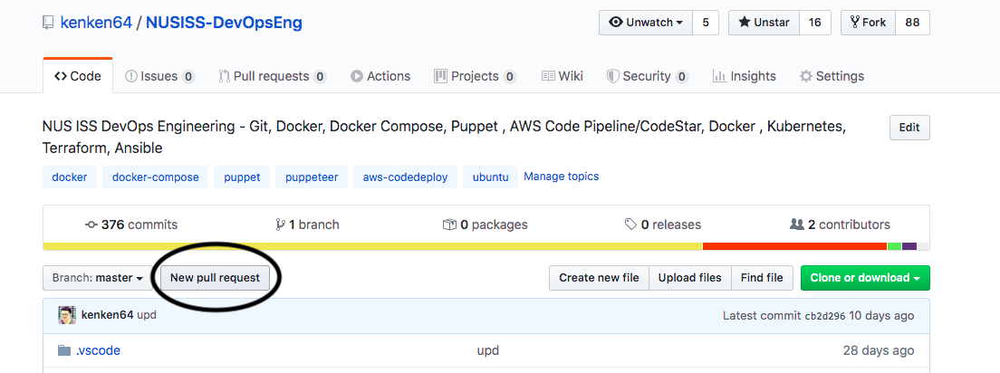
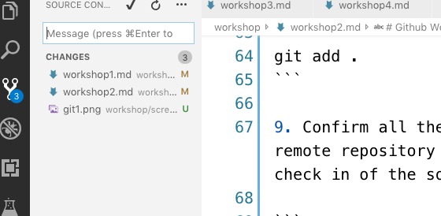

# S-DOEA - Workshop 1 - Github Workshop

## Pre-requisites 
* Individual workshop
* [Github](https://github.com/)/[Gitlab](https://about.gitlab.com/) account
* Download & Install Git for Windows https://git-scm.com/download/win

### For mac users please use brew 

Homebrew (http://brew.sh/) is another alternative to install Git. If you have Homebrew installed, install Git via

```
brew install git
```

## Instructions

1. Create/Sign up for a Github account
<br>

<br>

2. Create a working directory on your machine

```
mkdir Projects

cd Projects

mkdir ProjectA

cd ProjectA

```
3. Initialize the working directory as git enable project

```
git init
```

4. Go to the Gitlab dashboard, add a new repository
<br>

<br>


5. Create a repo on Github, do not initialize README.md
<br>

<br>

6. Associate the local working directory with the remote repository

```
git remote add origin https://github.com/<your github username>/ProjectA.git
```

<br>

<br>

7. Issue the following command to to verify the association is correct

```
git remote -v

origin	https://github.com/<your github username>/ProjectA.git (fetch)
origin	https://github.com/<your github username>/ProjectA.git (push)
```

8. Create a README.md documentation as the initial file for your newly created repository

```
echo "# ProjectA" >> README.md
```

9. Create a html file index.html file with following content place on the project A directory

```
<!DOCTYPE html>
<html>
<body>

<h1>My First Heading</h1>
<p>My first paragraph.</p>

</body>
</html>
```

10. Add the files to the staging index

```
git add .
```

11. Confirm all the changes made to the working directory and ready to commit to the remote repository by issuing the following command. argument -m is comment to every check in of the source codes.

```
git commit -m "new"
```

12. Check in the changes to the remote repository

```
git push origin master

Counting objects: 7, done.
Delta compression using up to 4 threads.
Compressing objects: 100% (7/7), done.
Writing objects: 100% (7/7), 510.18 KiB | 17.59 MiB/s, done.
Total 7 (delta 4), reused 0 (delta 0)
remote: Resolving deltas: 100% (4/4), completed with 4 local objects.
To https://github.com/<your github username>/ProjectA.git
   84e356d..b6c5251  master -> master
```

13. Verify all the files are pushed to the github repo after the above steps. Use your browser navigate to the https://github.com/kenken64/ProjectA.git (replace the github userid with yours)

14. Next on your terminal/command prompt let us create a branch in git.

```
git checkout -b enhancementA
```

15. In order to check the current branch run the below command, the terminal should see * pointed to the newly created branch name

```
git branch
```

16. Create a new file for this this newly created branch, index2.html

```
<!DOCTYPE html>
<html>
<body>

<h1>My First Heading</h1>
<p>My first paragraph.</p>

</body>
</html>
```

17. Add the new file created for the new branch to the remote repository

```
git add .
```

```
git commit -m "new enhancement"
```

```
git push origin enhancementA -u
```

18. Navigate to the project A github url https://github.com/kenken64/ProjectA.git check the branch is created. (Replace the github userid with yours)

19. Create a pull request for your newly created branch



20. Merge your newly created branch with your master branch.


** Whenever there is new files created or any changes to the current codebase if the developer would like to check in their codes please run step 8,9,10 again. For those of you not very comfortable with command line there are many IDE Git integration software out there. See below screen capture for Visual Studio Code Git Plugin. Also Git GUI Standalone software by Atlassian https://www.sourcetreeapp.com/

<br>

<br>


For branching, tagging and etc please visit the following link https://github.com/kenken64/NUSISS-DevOpsEng/blob/master/git/README.md


## Reference
* Software sourcetree - https://www.sourcetreeapp.com/
* Eclipse with Git - https://www.vogella.com/tutorials/EclipseGit/article.html
* Visual Studio Code - https://scotch.io/tutorials/git-integration-in-visual-studio-code
