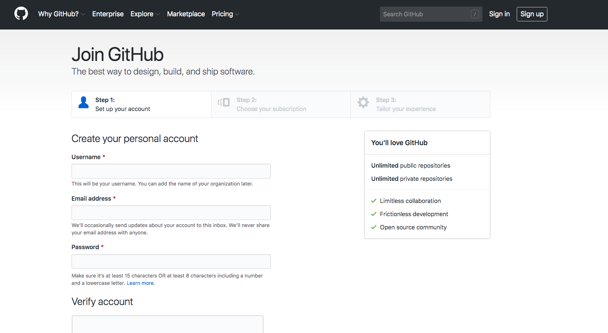

# Github Workshop

## Pre-requisites 
* [Github](https://github.com/)/[Gitlab](https://about.gitlab.com/) account
* Download & Install Git for Windows https://git-scm.com/download/win

### For mac users please use brew 

Homebrew (http://brew.sh/) is another alternative to install Git. If you have Homebrew installed, install Git via

```
brew install git
```

## Instructions

1. Create/Sign up for a Github account
<br>

<br>

2. Create a working directory on your machine

```
mkdir Projects

cd Projects

mkdir ProjectA

```
3. Initialize the working directory as git enable project

```
git init
```

4. Create a repo on Github, do not initialize README.md

5. Associate the local working directory with the remote repository

```
git remote add origin https://github.com/kenken64/ProjectA.git
```

6. Issue the following command to to verify the association is correct

```
git remote -v

origin	https://github.com/kenken64/ProjectA.git (fetch)
origin	https://github.com/kenken64/ProjectA.git (push)
```

7. Create a README.md documentation as the initial file for your newly created repository

```
echo "# ProjectA" >> README.md
```

8. Add the files to the staging index

```
git add .
```

9. Confirm all the changes made to the working directory and ready to commit to the remote repository by issuing the following command. argument -m is comment to every check in of the source codes.

```
git commit -m "new"
```

10. Check in the changes to the remote repository

```
git push origin master
```

** Whenever there is new files created or any changes to the current codebase if the developer would like to check in their codes please run step 8,9,10 again. For those of you not very comfortable with command line there are many IDE git integration software out there. I'll demo how it works for Visual Studio Code.

For branching, tagging and etc please visit the following link https://github.com/kenken64/NUSISS-DevOpsEng/blob/master/git/README.md