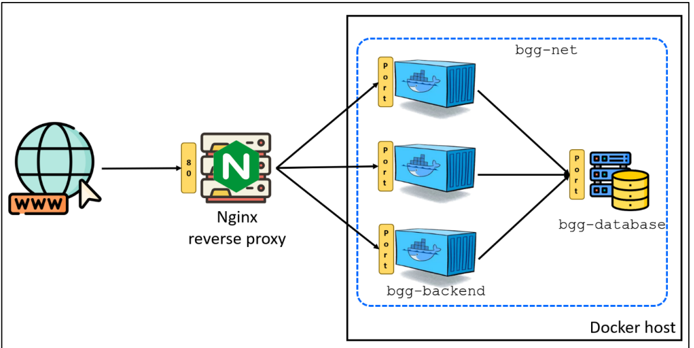
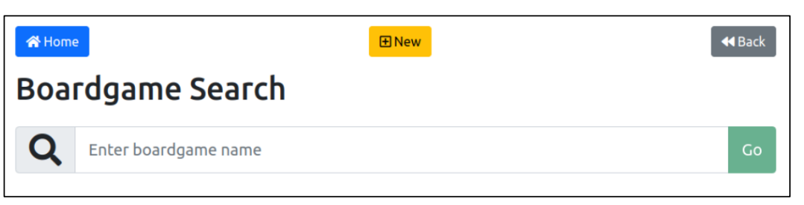
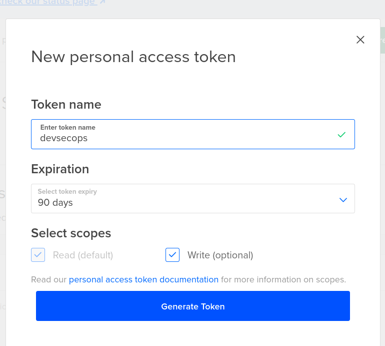
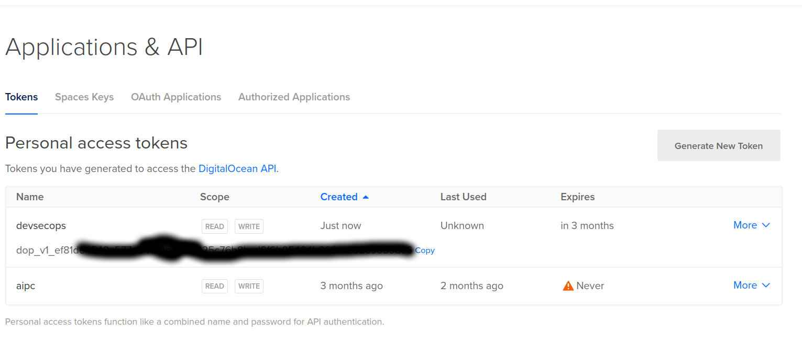
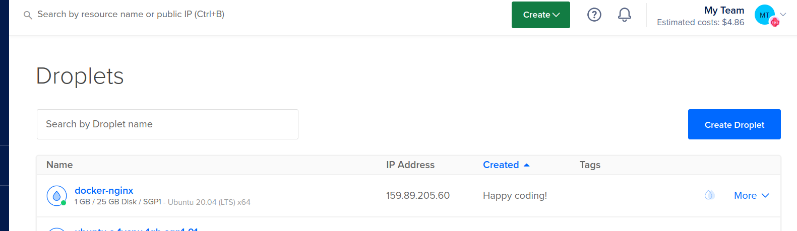
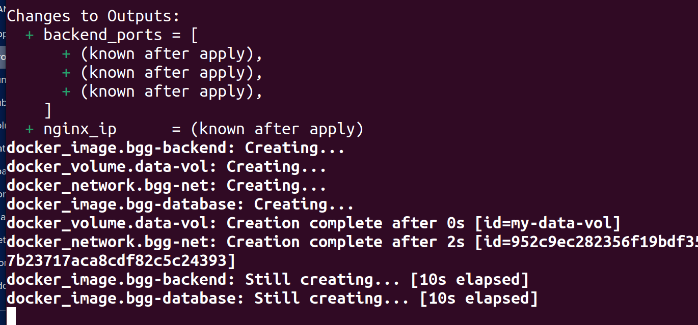

# S-DOEA - Workshop 5 - Terraform and Ansible

## Pre-requisites 
* Digital Ocean Account

## Terraform (a)

### Objective
The objective of this workshop is use Terraform’s HCL to write scripts to
provision Docker containers and a reverse proxy.

### Setup
For this workshop create a directory call workshop01 in the repository you
have create in step a. above. All the files for this workshop should be created in
workshop01 directory.


### Workshop
In this workshop you will automate the provisioning of the following
infrastructure shown in the following diagram.


<br>

<br>


The infrastructure stack consists of
1. Docker network called bgg-net
2. Container running MySQL database (bgg-database) inside bgg-net
3. A specified number of containers running a Nodejs application (bggbackend). These web applications connect to MySQL database. These
applications are also provisioned inside bgg-net
4. An instance of Nginx running on a separate server which routes traffic to
the bgg-backend instances.

The following are detail description of provisioning each of the resource in the
stack.

### Network (bgg-net)
• Create a Docker network called bgg-net. This network will be used for all
the containers in our application.

### Database (bgg-database)
• Provision a Docker volume to be used by the database.
• Use the image chukmunnlee/bgg-database:v3.1 to create the
bgg-database container
• Mount the Docker volume that you have created under
/var/lib/mysql. The database will be created in this volume rather
that inside the container
• Expose MySQL port 3306
• The database should be created inside bgg-net network

### Application (bgg-backend)
• Create 3 instances of the application using the following image:
chukmunnlee/bgg-backend:v3
• Add the following environment variables
o BGG_DB_USER set to root
o BGG_DB_PASSWORD set to changeit
o BGG_DB_HOST set to the application database resource name
• The internal port of the application is 3000. Choose a suitable external port
to port bind to

### Nginx Reverse Proxy
• Provision a Ubuntu server. Use Ubuntu 20.04 x64
• Add a SSH key to the server so you can SSH into the server
• Install Nginx and enable the service with the following commands
o /usr/bin/apt update -y
o /usr/bin/apt upgrade -y


o /usr/bin/apt install nginx -y
o /usr/bin/systemctl start nginx
o /usr/bin/systemctl enable nginx
• Create a Nginx configuration file called nginx.conf with the container
endpoints. Use the following template

```
user www-data;
worker_processes auto;
pid /run/nginx.pid;
events {
    worker_connections 768;
}
http: {
    access_log /var/log/nginx/access.log;
    error_log /var/log/nginx/error.log;
    gzip on;
    upstream apps {
        least_conn;
        # the following list the container endpoints
        # one server line for each endpoint
        # eg server <docker_host_ip>:<exposed_port>;
        server docker_host_ip:exposed_port_0;
        server docker_host_ip:exposed_port_1;
        server docker_host_ip:exposed_port_2;
    }
    server {
        listen 80;
        location / {
            proxy_pass http://apps;
        }
    }
}

```
Hint: this configuration file should be generated from the bgg-backend
external ports
• Replace the /etc/nginx/nginx.conf on the reverse proxy with your
nginx.conf.
• Signal Nginx to reload the new configuration with the following command
o /usr/sbin/nginx -s reload, or
o /usr/bin/systemctl restart nginx


### Outputs
Your Terraform script should produce the following artefacts and outputs
• Reverse proxy IP address
• List of all the container endpoint in the following format
<docker_host_ip>:<exposed_port>
• An empty file call root@<reverse_proxy_ip >

### Test
Test your deployment by browsing to http://<reverse_proxy_ip>.
You should see the following

### Submission
When you have completed this workshop, commit your work to the repository.
The instructor will clone your repository at the end

<br>

<br>


## Solution 
1. Access your Digital Ocean account.


2. Create a Ubuntu Droplet 

<br>

<br>

 * Select Singapore as region
 * Select Ubuntu as the server Image v20.04 x64

<br>

<br>

* Select cost saving server type (6 USD)

<br>

<br>

* Choose the SSH authentication method and generate a fresh SSH key pair. Click the "New SSH Key" button, then follow the instructions provided on the right-hand side. Paste the contents of the "cat" command into the Digital Ocean text area.

<br>

<br>

* Finalize the droplet

<br>

<br>

3. Access the newly created ubuntu server

```
ssh root@<public ip address>
```

<br>

<br>

4. Generate the PKI key pair on the logon server 

```
ssh-keygen
```

<br>

<br>

5. Add the public key content to the Digital Ocean account security section, name it as www-1

<br>

<br>

<br>

<br>

<br>

<br>

6. Install terraform IAC tool on the ubuntu server

```
wget -O- https://apt.releases.hashicorp.com/gpg | sudo gpg --dearmor -o /usr/share/keyrings/hashicorp-archive-keyring.gpg
```

```
echo "deb [signed-by=/usr/share/keyrings/hashicorp-archive-keyring.gpg] https://apt.releases.hashicorp.com $(lsb_release -cs) main" | sudo tee /etc/apt/sources.list.d/hashicorp.list
```

```
sudo apt update && sudo apt install terraform
```


7. Check the terraform version

```
terraform --version
```
<br>

<br>

8. Install Docker engine, given an instructions use the - Install using the Apt repository method

https://docs.docker.com/engine/install/ubuntu/#install-using-the-repository

9. Retrieve a DO API KEY from the Digital ocean platform. Set the environment variable of your DO API key to the ubuntu server using the following command

```
export DO_PAT=<replace this with the API key>
```

<br>

<br>

<br>

<br>


10. Install docker machine binary

To download and install the Docker Machine binary, type:

```
wget https://github.com/docker/machine/releases/download/v0.14.0/docker-machine-$(uname -s)-$(uname -m)

```
The name of the file should be docker-machine-Linux-x86_64. Rename it to docker-machine to make it easier to work with:

```
mv docker-machine-Linux-x86_64 docker-machine

```

Change the file permission to executable:

```
chmod +x docker-machine

```
Move or copy it to the usr/local/bin directory so that it will be available as a system command.

```
sudo mv docker-machine /usr/local/bin

```

Check the version, which will indicate that it’s properly installed:

```
docker-machine version

```

11. Create a docker machine within your DO account with following command

```
docker-machine create \
        -d digitalocean \
        --digitalocean-access-token  <do_pat_key> \
        --digitalocean-image ubuntu-20-04-x64  \
        --digitalocean-region sgp1 \
        --digitalocean-backups=false \
        --engine-install-url "https://releases.rancher.com/install-docker/19.03.9.sh" \
        docker-nginx
```

<br>

<br>

12. Create a working directory for the following terraform project. 

13. Create provider script (provider.tf) for the provisioning of the DO servers

```
terraform {
    required_providers {
        docker = {
            source = "kreuzwerker/docker"
            version = "3.0.2"
        }
        digitalocean = {
            source = "digitalocean/digitalocean"
            version = "2.26.0"
        }
        local = {
            source = "hashicorp/local"
            version = "2.4.0"
        }
    }
}

provider docker {
    # host = "unix:///var/run/docker.sock"
    host = "tcp://${var.docker_host}:2376"
    cert_path = var.docker_cert_path
}

provider digitalocean {
    token = var.do_token

}

provider local { }
```

14. Create the variable script (variables.tf)

```
variable do_token {
    type = string
    sensitive = true
}

variable docker_host {
    type = string
}

variable docker_cert_path {
    type = string
    sensitive = true
}

variable app_namespace {
    type = string 
    default = "my"
}

variable database_version {
    type = string
    default = "v3.1"
}

variable backend_version {
    type = string
    default = "v3"
}

variable backend_instance_count{
    type = number
    default = 3
}

variable do_region {
    type = string
    default = "sgp1"
}

variable do_image {
    type = string 
    default = "ubuntu-20-04-x64"
}

variable do_size {
    type = string
    default = "s-1vcpu-512mb-10gb"
}

variable do_ssh_key {
    type = string 
    default = "www-1"
}

variable ssh_private_key {
    type = string
}
```


15. Create the resources script (resources.tf)

```
# images
resource "docker_image" "bgg-database" {
    name = "chukmunnlee/bgg-database:${var.database_version}"
}

resource "docker_image" "bgg-backend" {
    name = "chukmunnlee/bgg-backend:${var.backend_version}"
}

# the stack
resource "docker_network" "bgg-net" {
    name = "${var.app_namespace}-bgg-net"
}

resource "docker_volume" "data-vol" {
    name = "${var.app_namespace}-data-vol"
}

resource "docker_container" "bgg-database" {
    name = "${var.app_namespace}-bgg-database"
    image = docker_image.bgg-database.image_id

    networks_advanced {
      name = docker_network.bgg-net.id
    }

    volumes {
      volume_name = docker_volume.data-vol.name
      container_path = "/var/lib/mysql"
    }

    ports {
        internal = 3306
        external = 3306
    }
}

resource "docker_container" "bgg-backend" {

    count = var.backend_instance_count

    name = "${var.app_namespace}-bgg-backend-${count.index}"
    image = docker_image.bgg-backend.image_id

    networks_advanced {
      name = docker_network.bgg-net.id
    }

    env = [
        "BGG_DB_USER=root",
        "BGG_DB_PASSWORD=changeit",
        "BGG_DB_HOST=${docker_container.bgg-database.name}",
    ]

    ports {
        internal = 3000
    }
}

resource "local_file" "nginx-conf" {
    filename = "nginx.conf"
    content = templatefile("sample.nginx.conf.tftpl", {
        docker_host = var.docker_host,
        ports = docker_container.bgg-backend[*].ports[0].external
    })
}

data "digitalocean_ssh_key" "www-1" {
    name = var.do_ssh_key
}

resource "digitalocean_droplet" "nginx" {
    name = "nginx"
    image = var.do_image
    region = var.do_region
    size = var.do_size

    ssh_keys = [ data.digitalocean_ssh_key.www-1.id ]

    connection {
      type = "ssh"
      user = "root"
      private_key = file(var.ssh_private_key)
      host = self.ipv4_address
    }

    provisioner "remote-exec" {
        inline = [
            "apt update -y",
            "apt install nginx -y",
        ]
    }
    provisioner "file" {
        source = local_file.nginx-conf.filename
        destination = "/etc/nginx/nginx.conf"
    }
    provisioner "remote-exec" {
        inline = [
          "systemctl restart nginx",
          "systemctl enable nginx",
        ]
    }
}

resource "local_file" "root_at_nginx" {
    filename = "root@${digitalocean_droplet.nginx.ipv4_address}"
    content = ""
    file_permission = "0444"
}

output nginx_ip {
    value = digitalocean_droplet.nginx.ipv4_address
}

output backend_ports {
    value = docker_container.bgg-backend[*].ports[0].external
}
```

16. Create the template configuration for the nginx reverse proxy server (sample.nginx.conf.tftpl)

```
user www-data;
worker_processes auto;
pid /run/nginx.pid;

events {
	worker_connections 768;
}

http {
	access_log /var/log/nginx/access.log;
	error_log /var/log/nginx/error.log;

	gzip on;

	upstream apps {
		least_conn;
		# the following list the container endpoints
		# one server line for each endpoint
		# eg server <docker_host_ip>:<exposed_port>;
		%{~ for p in ports ~}
		server ${docker_host}:${p};
		%{~ endfor ~}
	}
	server {
		listen 80;
		location / {
			proxy_pass http://apps;
		}
	}
}
```

17. Under the current working directory perform initialization on the scripts that was created previously.

```
terraform init
```

18. Take note before running the following provision command using terraform tools against DO server. The DO_PAT environment variable must be setup upfront. Replace the docker host ip with the docker-nginx public IP address.

```
export DO_PAT=<your DO personal access token>
```

```
terraform plan -var "do_token=${DO_PAT}" -var "ssh_private_key=/root/.ssh/id_rsa" -var "docker_host=<docker host ip>" -var "docker_cert_path=/root/.docker/machine/machines/docker-nginx"
```

19. Once the provision plan is done, apply the changes to the DO cloud account using the following command. Replace the docker host ip with the docker-nginx public IP address.

```
terraform apply -auto-approve -var "do_token=${DO_PAT}" -var "ssh_private_key=/root/.ssh/id_rsa" -var "docker_host=<docker host ip>" -var "docker_cert_path=/root/.docker/machine/machines/docker-nginx"
```

<br>

<br>

## Ansible (b) - Optional


The objective of this workshop is to automate the installation of Code-Server
on a server

1. Access your Digital Ocean account.


2. Create a Ubuntu Droplet 

<br>

<br>

 * Select Singapore as region
 * Select Ubuntu as the server Image v20.04 x64

<br>

<br>

* Select cost saving server type (6 USD)

<br>

<br>

* Choose the SSH authentication method and generate a fresh SSH key pair. Click the "New SSH Key" button, then follow the instructions provided on the right-hand side. Paste the contents of the "cat" command into the Digital Ocean text area.

<br>

<br>

* Finalize the droplet

<br>

<br>

3. Access the newly created ubuntu server

```
ssh root@<public ip address>
```

<br>

<br>

4. Generate the PKI key pair on the logon server 

```
ssh-keygen
```

<br>

<br>

5. Add the public key content to the Digital Ocean account security section, name it as www-1

<br>

<br>

<br>

<br>

<br>

<br>

6. Install terraform IAC tool on the ubuntu server

```
wget -O- https://apt.releases.hashicorp.com/gpg | sudo gpg --dearmor -o /usr/share/keyrings/hashicorp-archive-keyring.gpg
```

```
echo "deb [signed-by=/usr/share/keyrings/hashicorp-archive-keyring.gpg] https://apt.releases.hashicorp.com $(lsb_release -cs) main" | sudo tee /etc/apt/sources.list.d/hashicorp.list
```

```
sudo apt update && sudo apt install terraform
```


7. Check the terraform version

```
terraform --version
```
<br>

<br>

8. Install Ansible on the Ubuntu instance

```
sudo apt-add-repository ppa:ansible/ansible

sudo apt update

sudo apt install ansible
```

<br>

<br>

9. Check the ansible version

```
ansible --version
```

### Setup
a. Create a directory called workshop02 in your course repository.

b. Read Step 1 and Step 2 of the following blog
https://www.digitalocean.com/community/tutorials/how-to-set-up-the-
code-server-cloud-ide-platform-on-ubuntu-20-04.

c. Change directory into the workshop02 folder

d. Create an ansible template file for server configuration. code-server.conf.j2

```
server {
    listen 80;
    listen [::]:80;

    server_name {{codeserver_domain}} {{ansible_host}};

    location / {
        proxy_pass http://127.0.0.1:8080/;
        proxy_set_header Upgrade $http_upgrade;
        proxy_set_header Connection upgrade;
        proxy_set_header Accept-Encoding gzip;
    }
}
```
e. Create an ansible template file code-server.service.j2

```
server {
    listen 80;
    listen [::]:80;

    server_name {{codeserver_domain}} {{ansible_host}};

    location / {
        proxy_pass http://127.0.0.1:8080/;
        proxy_set_header Upgrade $http_upgrade;
        proxy_set_header Connection upgrade;
        proxy_set_header Accept-Encoding gzip;
    }
}
root@ubuntu-s-1vcpu-512mb-10gb-sgp1-01:~/workshop02# cat code-server.service.j2
[Unit]
Description=code-server
After=nginx.service

[Service]
Type=simple
Environment=PASSWORD={{codeserver_password}}
ExecStart=/usr/bin/code-server --bind-addr 127.0.0.1:8080 --user-data-dir /var/lib/code-server --auth password
Restart=always

[Install]
WantedBy=multi-user.target
```
f. Create a terraform template file inventory.yaml.tftpl

```
all:
    vars:
        ansible_connection: ssh
        ansible_user: root
        ansible_ssh_private_key: ${ssh_private_key}
    hosts:
        codeserver:
            ansible_host: ${codeserver_ip}
            codeserver_domain: ${codeserver_domain}
            codeserver_password : ${codeserver_password}
```

g. Create a provider terraform script provider.tf

```
terraform {
  required_providers {
    digitalocean = {
        source = "digitalocean/digitalocean"
        version = "2.26.0"
    }
    local = {
        source = "hashicorp/local"
        version = "2.4.0"
    }
  }
}

provider digitalocean {
    token = var.do_token
}

```

h. Create a variables terraform script variables.tf

```
variable do_token {
    type = string
    sensitive = true
}

variable do_region {
    type = string
    default = "sgp1"
}

variable do_image {
    type = string
    default = "ubuntu-20-04-x64"
}

variable do_size {
    type = string
    default = "s-1vcpu-1gb"
}

variable do_ssh_key {
    type = string
    default = "www-1"
}

variable ssh_private_key {
    type = string
}

variable codeserver_password {
    type = string
}

```

i. Create a resources terraform script resources.tf

```
#ssh key
data "digitalocean_ssh_key" "www-1" {
    name = var.do_ssh_key
}

resource "digitalocean_droplet" "codeserver" {
    name = "codeserver"
    image = var.do_image
    region = var.do_region
    size = var.do_size

    ssh_keys = [ data.digitalocean_ssh_key.www-1.id ]
}

resource "local_file" "root_at_codeserver" {
    filename = "root@${digitalocean_droplet.codeserver.ipv4_address}"
    content = ""
    file_permission = "0444"
}

resource "local_file" "inventory" {
    filename = "inventory.yaml"
    content = templatefile("inventory.yaml.tftpl",{
        codeserver_ip = digitalocean_droplet.codeserver.ipv4_address
        ssh_private_key = var.ssh_private_key
        codeserver_domain = "code-server-${digitalocean_droplet.codeserver.ipv4_address}.nip.io"
        codeserver_password = var.codeserver_password 
    })
    file_permission = "0444"
}

output codeserver_ip {
    value =  digitalocean_droplet.codeserver.ipv4_address
}

```

### Workshop
Provision a Ubuntu server for this exercise. You can use Terraform or manually
provision an instance on DigitalOcean’s console.
Once you have provisioned, note the IP address, root user and SSH keys used.
Use these information to create an inventory file, inventory.yaml.
Write a playbook that will use the inventory.yaml file to configure the
server. The playbook should perform the following tasks

• Update the /lib/systemd/system/code-server.service file
with the code server password; change the following line


```
Environment=PASSWORD=__PLACEHOLDER__
```
with the password, assuming that the password is mypassword

```
Environment=PASSWORD=”mypassword”
```

• Update the /etc/nginx/sites-available/code-server.conf
file with the domain code-<ipv4_address>.nip.io; change the line
with server_name to

```
server_name code-<ipv4_address>.nip.io;

```
• Use systemd module to restart nginx and code-server services. You
must also perform a daemon reload viz. set daemon_reload to yes.


```
terraform plan -var "do_token=${DO_PAT}" -var "ssh_private_key=/root/.ssh/id_rsa" -var "codeserver_password=password123456"
```

```
terraform apply -auto-approve -var "do_token=${DO_PAT}" -var "ssh_private_key=/root/.ssh/id_rsa" -var "codeserver_password=password123456"
```

```
ansible-playbook playbook.yaml -i inventory.yaml
```

### Test
Test your deployment by browsing to http://```<ip-address>```

### Submission
When you have completed this workshop, commit your work to the repository.
The instructor will clone your repository at the end

## Solution Repository URL

https://github.com/kenken64/aipc-jun2023/tree/main/workshop02

