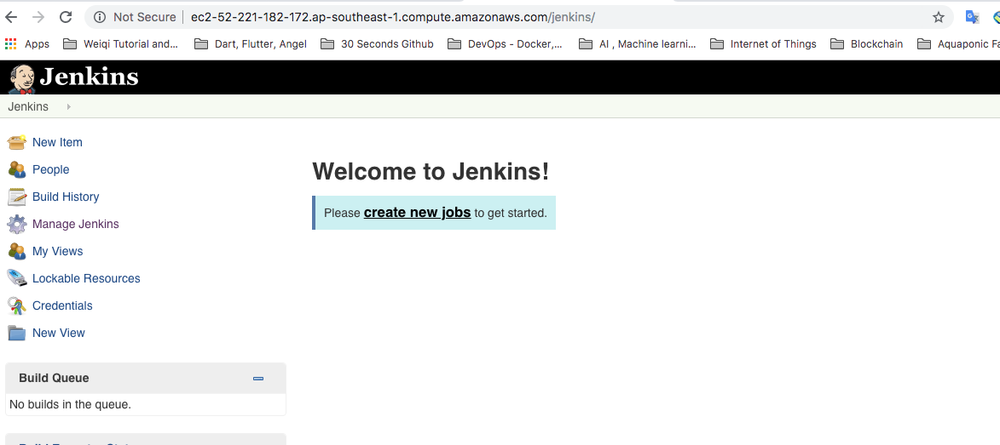

# Jenkins CI Setup

## Pre-requisite
* AWS Account 
* Oracle Account
* Github Account 

## Setup Jenkins before creating new build job

1. Launch internet browser, navigate to the <bitnami jenkins Public DNS>. Login using the credential retrieve from the credential file

<br>

<br>

2. Go to Manage Jenkins then Global Tool configuration -> Configure JDK. Input name as 'JDK', prepare with your Oracle credential to login so that the installer can download JDK From Oracle website, tick agree with the T&E. Click Save

<br>

<br>

3. Go to Manage Jenkins then Global Tool configuration -> Install & Configure Ant. 

<br>

<br>

4. Install & Configure Maven under the Global Tool configuration

<br>

<br>

5. Install & Configure Docker under the Global Tool configuration

<br>

<br>

6. Restart Jenkins, copy and paste the URL on your browser's address bar

http://ec2-52-221-182-172.ap-southeast-1.compute.amazonaws.com/jenkins/safeRestart

## Create an Ant Project Job 

1. Fork the following git repository https://github.com/kenken64/StackAnnotation to your own Github Account

<br>

<br>

2. Clone the codes down to your local working directory
```
git clone https://github.com/<your username>/StackAnnotation
```

3. Branch it as development, check it into the remote repository

```
git checkout -b development
git add .
git commit -m "new development branch"
git push origin development
```


4. Go to Jenkins, configure a new freestyle job

<br>

<br>

5. Enter task description as 'This is a StackAnnotation ant build'

6. Tick the Github Project option then enter the url as <your StackAnnotation github repo url>

<br>

<br>

7. Under source code management, select Git ten enter the repository URL as <your StackAnnotation github repo url>. Change the branch to be build to '*/development'

<br>

<br>

8. Configure poll interval for the source code retrieval to be used as new build. Check Github hook trigger for GITScm polling and pilling SCM.

<br>

<br>

9. configure the pre build step, add invoke ant step then select Ant version as 'Ant' follow by targets as build

<br>

<br>


10. Lastly, configure the post build action where it will generate Junit published report from the ant build

<br>

<br>

11. The build will trigger automatically

<br>

<br>

12. Lets make changes to the test case and invalidate the build. the build on jenkins will fail

<br>

<br>

## Create an Maven Project Job 

1. Fork the following git repository https://github.com/kenken64/StackAnnotationMaven.git to your own Github Account

<br>

<br>


2. Clone the codes down to your local working directory
```
git clone https://github.com/<your username>/StackAnnotationMaven.git
```

3. Branch it as development, check it into the remote repository

```
git checkout -b development
git add .
git commit -m "new development branch"
git push origin development
```

<br>

<br>

2. Go to Jenkins, configure a new freestyle job


3. Enter task description as 'This is a StackAnnotation Maven build'

4. Tick the Github Project option then enter the url as <your StackAnnotationMaven github repo url>

5. Under source code management, select Git ten enter the repository URL as <your StackAnnotationMaven github repo url>. Change the branch to be build to '*/development'

6. Configure poll interval for the source code retrieval to be used as new build. Check Github hook trigger for GITScm polling and pilling SCM

