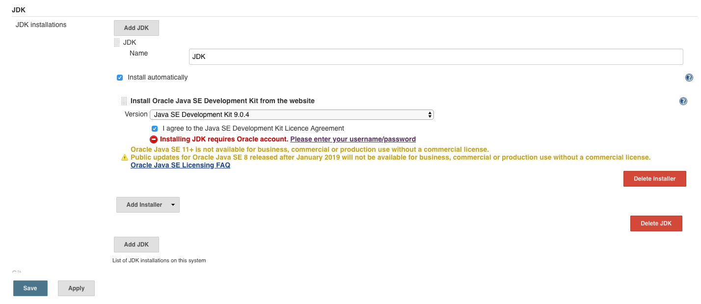
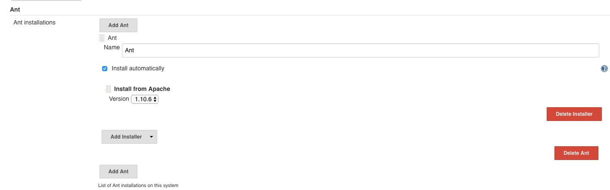
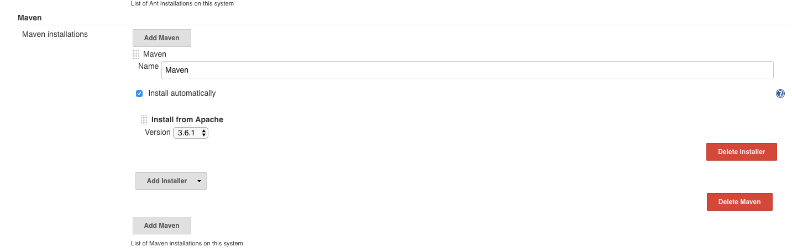
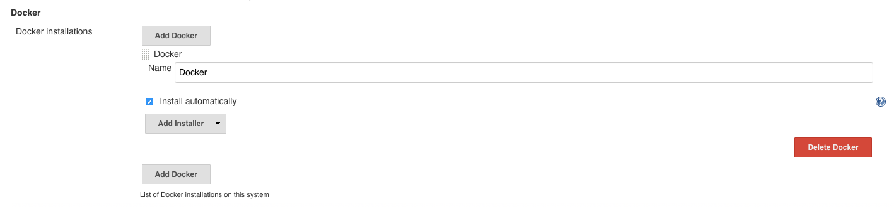

# Jenkins CI Setup

## Pre-requisite
* AWS Account 
* Oracle Account

## Setup Jenkins before creating project

1. Launch internet browser, navigate to the <bitnami jenkins Public DNS>. Login using the credential retrieve from the credential file

 

 

2. Go to Manage Jenkins then Global Tool configuration -> Configure JDK. Input name as 'JDK', prepare with your Oracle credential to login so that the installer can download JDK From Oracle website, tick agree with the T&E. Click Save

 

 

3. Go to Manage Jenkins then Global Tool configuration -> Install & Configure Ant. 

 

 

4. Install & Configure Maven under the Global Tool configuration

 

 

5. Install & Configure Docker under the Global Tool configuration

 

 

## Create a Ant Project Job 

1. Configure a new project as development
2. Configure a new project as staging
3. Configure as production
4. All from different branches
5. Introduce pull request to merge from one branch to another
6. Demo the build are propogated from one jenkins task to another