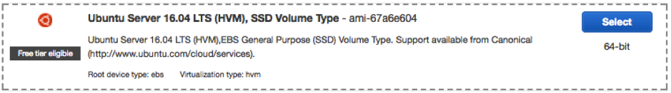

# Infrastructure as Code 

# Setting up EC2 instances for puppet

## Creating EC2 Key pair

1.	Login to AWS consle and open the Amazon EC2 console.
2.	In the top navigation bar, choose the region in the dropdown region selector.
•	Region: Singapore (ap-south-east-1)
3.	In the left navigation pane, under Network and Security, click Key Pairs.
4.	Create Key Pair.
<br>

<br>


The private key file, which is named yourname_puppet.pem, will be downloaded on your machine. 
(You will need the private key file later to access the instances that we will create and launch with this key pair. If the key pair is lost, you will not be able to connect to the Amazon EC2 instances.)

## Creating Security Group
1.	In the left navigation pane, under Network and Security, click Security Groups.
2.	Create Security Group.
 
<br>

<br>

## Creating EC2 Instances

1.	In the left navigation pane, under Instances, click Instances.
2.	Launch Instance.
3.	Select Ubuntu Server 18.04 LTS (HVM), SSD Volume Type image.
 
<br>

<br>

4.	Choose an instance Type. Ensure you are on free tier.

<br>

<br> 

5. On Configure Instance Details (Step 3), make sure the Instance Details are specified as shown.

<br>

<br> 
 
6.	Leave Step 4 and 5 as default.
7.	Select the security group you have created earlier for your instances.
 
<br>

<br> 

8.	Proceed to Review and Launch your instance.

9.	Select the key pair you have created earlier and launch your instance.
 
<br>

<br> 

10.	After your instances have been created and running, name your instances.

<br>

<br> 
 
You will need the public DNS and the private key (PEM) file that have been downloaded to SSH into these instances.
 

Setting Up Puppet on EC2 Instances

SSH into Puppet Master

```
ssh -i <key pair>.pem ubuntu@ec2-<ip>.<region>.compute.amazonaws.com
ssh -i <key pair>.pem ubuntu@<public dns>
```

SSH in Puppet Agent

```
ssh -i <key pair>.pem ubuntu@ec2-<ip>.<region>.compute.amazonaws.com
ssh -i <key pair>.pem ubuntu@<public dns>
```

Assign a hostname for the Puppet Master EC2 instance

```
sudo hostname <public dns>
```


Assign a hostname for the Puppet Agent EC2 instance

```
sudo hostname <public dns>
```


Resolve domain names without using Domain Name System

Find the IP address for the Puppet Master EC2 Instance
```
ifconfig
```


Find the IP address for the Puppet Aget EC2 Instance
```
ifconfig
```


 

On Puppet Master EC2 Instance, perform the following steps:
a.	Login as root
b.	Add a Puppet Agent host entry
c.	Update the system
d.	Install puppet master

```
sudo su -

echo 172.31.28.1 ip-172-31-28-1.ap-southeast-1.compute.internal >> /etc/hosts

apt-get update

apt-get install puppetmaster
```

On Puppet Agent EC2 Instance, perform the following steps:
a.	Login as root
b.	Add a Puppet Master host entry
c.	Update the system
d.	Install puppet

```
sudo su -

echo 172.31.28.4 ip-172-31-28-4.ap-southeast-1.compute.internal >> /etc/hosts

apt-get update

apt-get install puppet
```
Configure Puppet Agent to be able to communicate with Puppet Master through the Puppet's configuration file puppet.conf located under the /etc/puppet directory on the Puppet Agent Linux operating system.

Add a server entry to the end of the [main] configuration section of the puppet.conf file

```
server = ip-172-31-28-4.ap-southeast-1.compute.internal
```


Testing your puppet environment

Puppet uses SSL certificates to authenticate communication between master and agent nodes. The Puppet master acts as a certificate authority (CA). Our master generates its own certificates which is used to sign agent certificate requests.
By default, the Puppet client runs as a daemon, and the puppet agent command forks off the Puppet daemon into the background and exits immediately. The first time Puppet runs on an agent node, it will send a certificate signing request to the Puppet master. Before the master will be able to communicate and control the agent node, it must sign that particular agent node's certificate. 
Puppet Agent request for cert from Puppet Master

```
puppet agent --no-daemonize --onetime --verbose
puppet agent --test
```

Checking the list of certificates and cert requests on Puppet Master

```
puppet cert list -all
```

Puppet Master sign cert request from Puppet Agent

```
puppet cert sign ec2-13-229-118-197.ap-southeast-1.compute.amazonaws.com
```
Puppet manifests are made up of a number of major components:
1.	Resources: Individual configuration items
2.	Files: Physical files you can serve out to your agents
3.	Templates: Template files that you can use to populate files
4.	Nodes: Specifies the configuration of each agent
5.	Classes: Collections of resources
6.	Definitions: Composite collections of resources

Create a site.pp file on the Puppet Master node that tells Puppet where and what configuration to load for our clients in the etc/puppet/ manifests directory.
```
node default {
  file { ‘/tmp/hello’ :
    content => "hello world!!!"
  }
}
```

On the Puppet Agent node, sync with Puppet Master node.
```
puppet agent --server ec2-13-228-28-198.ap-southeast-1.compute.amazonaws.com
```