# S-DOEA - Workshop 4 - Infrastructure as Code Workshop (Puppet)

## Pre-requisite
* AWS Account 
* Jupyter Notebbok Password will be provided during class
* Access to this url : https://nusiss.ngrok.io/ or http://ec2-13-239-1-27.ap-southeast-2.compute.amazonaws.com:8888/login
* AWS Region: Sydney (ap-southeast-2)

## Notes
* Please do not include the $ sign as part of the command.

# Setting up EC2 instances for puppet

## Creating EC2 Key pair

1.	Login to AWS consle and open the Amazon EC2 console.
2.	In the top navigation bar, choose the region in the dropdown region selector.
    *  Region: Sydney (ap-southeast-2	a)
3.	In the left navigation pane, under Network and Security, click Key Pairs.
4.	Create Key Pair.
<br>
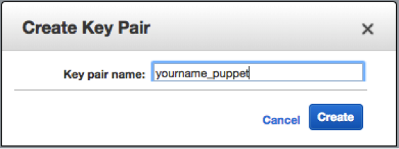
<br>


The private key file, which is named yourname_puppet.pem, will be downloaded on your machine. 
(You will need the private key file later to access the instances that we will create and launch with this key pair. If the key pair is lost, you will not be able to connect to the Amazon EC2 instances.)

## Creating Security Group
1.	On the left navigation pane, under Network and Security, click Security Groups.
2.	Create Security Group for this workshop. Name the security group name with the following naming convention ```ddmmyy_workshop4_<your initial>```. The latest AWS screen will have 6 entries (screen capture was captured using their old console UI) . Lastly, make sure the source of all 3 entries are set to anywhere.
 
<br>
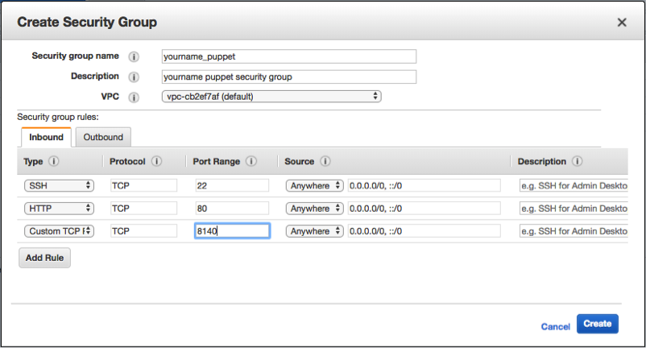
<br>

## Creating EC2 Instances

1.	In the left navigation pane, under Instances, click Instances.
2.	Launch Instance.
3.	Select Ubuntu Server 18.04 LTS (HVM), SSD Volume Type image. Make sure both instance is created with 20GB disk space.
 
<br>
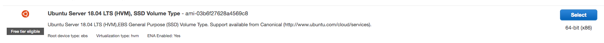
<br>

4.	Choose an instance Type. Ensure you are on free tier.

<br>
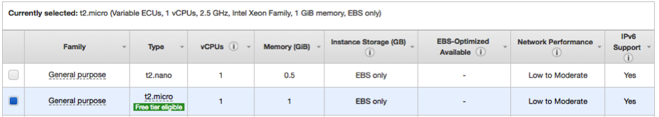
<br> 

5. On Configure Instance Details (Step 3), make sure the Instance Details are specified as shown.

<br>
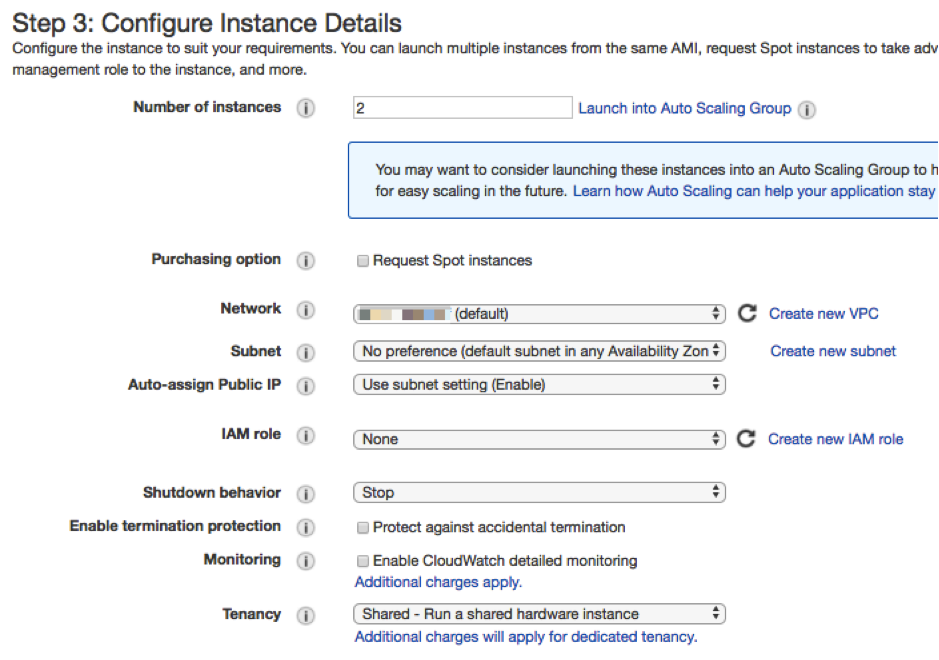
<br> 
 
6.	Leave 5 as default. Important*: Step 4 allocate 20GB for both instance
7.	Select the security group you have created earlier for your instances. Add two custom rules to the security group port 80 (HTTP) and 8140 (TCP). Port 8140 is used for the master and slave synchronization.
 
<br>
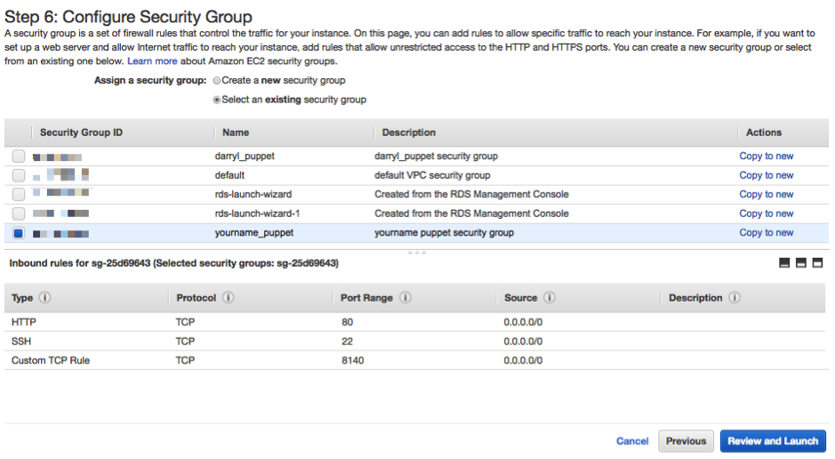
<br> 

8.	Proceed to Review and Launch your instance.

9.	Select the key pair you have created earlier and launch your instance.
 
<br>
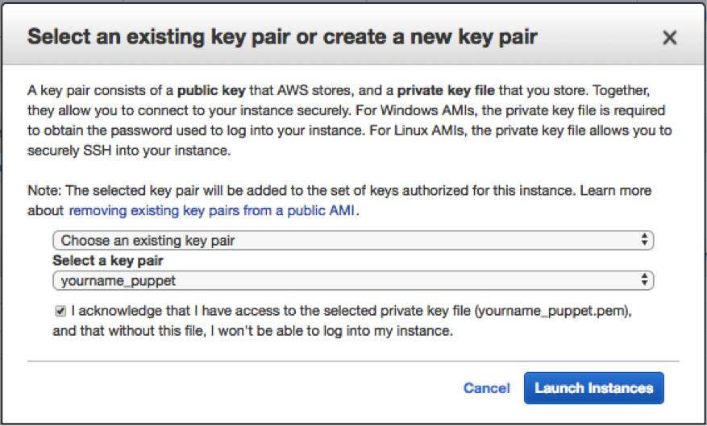
<br> 

10.	After your instances have been created and running, name your instances according to the naming convention <initial name> puppet master and slave.

<br>
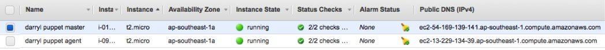
<br> 

11. Access the Jupyter notebook URL via https://nusiss.ngrok.io . Upload the pem to the root directory of the jupyter notebook.

<br>
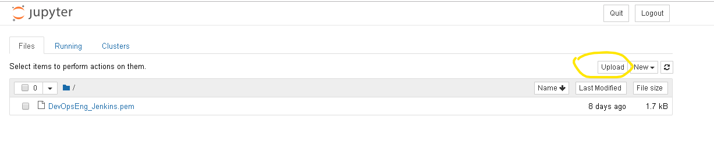
<br> 

<br>
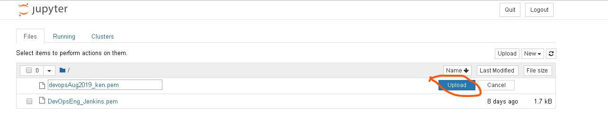
<br> 


You will need the public DNS and the private key (PEM) file that have been downloaded to SSH into the respective instances.
 

Setting Up Puppet on EC2 Instances (Additional instructions will be provided during the class)


<br>
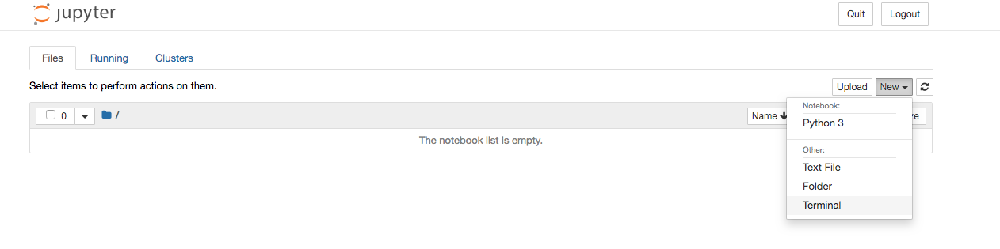
<br> 

12. SSH into Puppet <b>Master</b> server via Jupyter Notebook Terminal

```
$ cd ..
$ cd Notebooks
$ chmod 400 <your key pair>.pem 
$ ssh -i <key pair>.pem ubuntu@<ec2 puppet master server public dns>
```

13. SSH into Puppet <b>Agent/Slave</b> server via Jupyter Notebook Terminal

```
$ cd ..
$ cd Notebooks
$ ssh -i <key pair>.pem ubuntu@<ec2 puppet slave server public dns>
```


14. Assign a hostname for the Puppet Master EC2 instance

### Master
```
$ sudo hostname <public dns>
```

Resolve domain names without using Domain Name System

Verify the IP address for the Puppet Master EC2 Instance, check against the AWS EC2 dashboard

```
$ ifconfig
```


15. Assign a hostname for the Puppet Agent EC2 instance

### Agent/Slave
```
$ sudo hostname <public dns>
```


Resolve domain names without using Domain Name System

Verify the IP address for the Puppet Agent EC2 Instance, check against the AWS EC2 dashboard
```
$ ifconfig
```


16. On Puppet Master EC2 Instance, perform the following steps:
* Login as root
* Add a Puppet Master private host entry
* Update the system's package manager
* Install puppet master

### Master

Obtain the private ip and dns from the AWS EC2 dashboard. (Master)

```
$ sudo su -

$ echo <private ip> <private dns> >> /etc/hosts

$ apt-get update

$ apt-get install puppetmaster -y
```

Kindly perform the command below to label the master server prompt
```
$ nano ~/.bashrc
```
Search the following line 
```
PS1='${debian_chroot:+($debian_chroot)}\u@\h:\w\$ '
```
Change the existing line to below  
```
PS1='${debian_chroot:+($debian_chroot)}\u@\h:\w\ master $ '
```

Exit the editor press Ctrl + x then answer yes and press enter

```
$ source ~/.bashrc
```

17. On Puppet Agent EC2 Instance, perform the following steps:
* Login as root
*	Add a Puppet Master/Private host entry
* Update the system's package manager
* Install puppet

### Agent/Slave

Obtain the private ip and dns from the AWS EC2 dashboard (Agent/Slave)

```
$ sudo su -

$ echo <private ip> <private dns> >> /etc/hosts
$ echo <master private ip> <master private dns> >> /etc/hosts
$ echo <master public ip> <master public dns> >> /etc/hosts
$ apt-get update

$ apt-get install puppet -y
```

Kindly perform the command below to label the slave server prompt

Refresh the environment profile as below:-

```
$ nano ~/.bashrc
```
Search the following line 
```
PS1='${debian_chroot:+($debian_chroot)}\u@\h:\w\$ '
```
Change the existing line to below  
```
PS1='${debian_chroot:+($debian_chroot)}\u@\h:\w\ slave $ '
```
Exit the editor press Ctrl + x then answer yes and press ENTER key

Refresh the environment profile as below:-
```
$ source ~/.bashrc
```

### Agent/Slave

18. Configure Puppet Agent to be able to communicate with Puppet Master through the Puppet's configuration file puppet.conf located under the /etc/puppet directory on the Puppet Agent Linux operating system.

Add a server entry to the end of the [main] configuration section of the puppet.conf file. Important take note this must the public DNS server name if not the issue certification service won't work.


Edit the /etc/puppet/puppet.conf using nano, in order to exit and save -> press Ctrl + X then follow by Y if any changes are made to the file.

```
$ nano /etc/puppet/puppet.conf
```
Add server and agent/runInterval attributes as the addition to the current values.

```
[main]
ssldir = /var/lib/puppet/ssl
server = <master public dns>

[master]
vardir = /var/lib/puppet
cadir  = /var/lib/puppet/ssl/ca
dns_alt_names = puppet

[agent]
runinterval = 5m
```


Testing your puppet environment

Puppet uses SSL certificates to authenticate communication between master and agent nodes. The Puppet master acts as a certificate authority (CA). Our master generates its own certificates which is used to sign agent certificate requests.
By default, the Puppet client runs as a daemon, and the puppet agent command forks off the Puppet daemon into the background and exits immediately. The first time Puppet runs on an agent node, it will send a certificate signing request to the Puppet master. Before the master will be able to communicate and control the agent node, it must sign that particular agent node's certificate. 
Puppet Agent request for cert from Puppet Master


### Agent/Slave

19. Start the pupper service and also check the status of the service after issuing the start command

```
$ service puppet start
```
```
$ service puppet status
```
In order to exit the status press q

```
$ puppet agent --enable
```

### Master

20. Start the pupper service and also check the status of the service after issuing the start command

```
$ service puppetmaster start
$ service puppetmaster status
```

In order to exit the status press q


### Agent/Slave
21. Checking the list of certificates and cert requests on Puppet Master

```
$ puppet agent --no-daemonize --onetime --verbose
$ puppet agent --test -d
```


### Master

22. Puppet Master sign cert request from Puppet Agent/Slave

```
$ puppet cert list -all
$ puppet cert sign --all
```

### PuppetFile Development Structure 

Puppet manifests are made up of a number of major components:
1.	Resources: Individual configuration items
2.	Files: Physical files you can serve out to your agents
3.	Templates: Template files that you can use to populate files
4.	Nodes: Specifies the configuration of each agent
5.	Classes: Collections of resources
6.	Definitions: Composite collections of resources


### Master 
23. Create a pp file and modules on the Puppet Master node that tells Puppet where and what configuration to load for our clients in the etc/puppet/code manifests directory.


```
$ cd /etc/puppet/code

$ mkdir environments

$ cd environments

$ mkdir production

$ cd production

$ mkdir modules

$ mkdir manifests

$ cd manifests
```


### Master 
24. Create a site.pp file that navigate to the custom module 

```
$ nano site.pp
```

Enter the codes to the site pp file

```
node "default" {
  include modulea
}
```

To save press Ctrl + x and answer yes to save


### Master 
25. Create puppet module directory structure. This directory structure has to be that way so the pupper master able to sync the codes execution to the agent.

```
$ cd ../modules

$ mkdir modulea

$ cd  modulea

$ mkdir files 

$ mkdir manifests

$ cd files 

$ touch test.txt

$ cd .. 

$ cd manifests

```


### Master 

26. Create a module class init.pp file. Paste the below codes into the init.pp
What this code does is install a linux utility htop and also the docker engine on the slave server.

```
$ nano init.pp

```

```
class modulea {
file { '/home/ubuntu':
        ensure => directory,
        owner => 'ubuntu',
        group => 'ubuntu',
}

package { 'htop':
    ensure => installed,
}

exec { "apt-update":
  command => "/usr/bin/apt-get update"
}

exec { "install-dep":
  command => "/usr/bin/apt-get --yes install apt-transport-https ca-certificates curl software-properties-common"
}

exec { "curl-docker":
  command => "/usr/bin/curl -fsSL https://download.docker.com/linux/ubuntu/gpg | sudo apt-key add -"
}

exec { "add-docker-dep":
  command => "/usr/bin/add-apt-repository 'deb [arch=amd64] https://download.docker.com/linux/ubuntu bionic stable'"
}

Exec["apt-update"] -> Package <| |>
Exec["install-dep"] -> Package <| |>
Exec["curl-docker"] -> Package <| |>
Exec["add-docker-dep"] -> Package <| |>
Exec["apt-update"] -> Package <| |>

package { 'docker-ce':
    ensure => installed,
}


file { "/home/ubuntu/test.txt":
        mode => "0644",
        owner => 'ubuntu',
        group => 'ubuntu',
        source => "puppet:///modules/modulea/test.txt",
    }
}

```
To save press Ctrl + x and answer yes to save

On the Puppet Agent node, sync with Puppet Master node.

Checkout the entire solution of the above master IAC codes on this link - https://github.com/kenken64/devops-iac

### Agent/Slave

27. Manually sync from with the master

```
$ puppet agent --test -d 
```

### Capture Result save it to the LumiNUS Workshop 4 submission folder

28. Check whether the docker is installed 

```
$ docker --version
```

29. Check whether the htop is installed 

```
htop
```
Press Q to quit

30. Verify whether the ```test.txt``` being copy from the master to the slave server 

```
ls -lrt /home/ubuntu/test.txt
```

## Troubleshooting

Unable to sign certificate from the slave
```
Error: Could not request certificate: The certificate retrieved from the master does not match the agent's private key. Did you forget to run as root?
Certificate fingerprint: E0:F6:92:CE:96:A5:D1:9C:4B:DB:0D:66:31:FF:04:C1:04:A2:65:67:BD:21:52:BF:CD:D0:F8:DD:E0:7F:47:65
To fix this, remove the certificate from both the master and the agent and then start a puppet run, which will automatically regenerate a certificate.
On the master:
  puppet cert clean ec2-63-33-70-42.eu-west-1.compute.amazonaws.com
On the agent:
  1a. On most platforms: find /var/lib/puppet/ssl -name ec2-63-33-70-42.eu-west-1.compute.amazonaws.com.pem -delete
  1b. On Windows: del "\var\lib\puppet\ssl\certs\ec2-63-33-70-42.eu-west-1.compute.amazonaws.com.pem" /f
  2. puppet agent -t
```

## References
* https://www.digitalocean.com/community/tutorials/how-to-install-and-use-docker-on-ubuntu-18-04
* https://puppet.com/docs/puppet/6.7/configuration.html#runinterval
