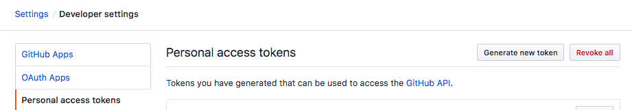
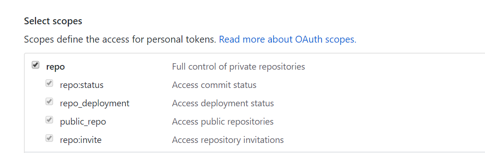
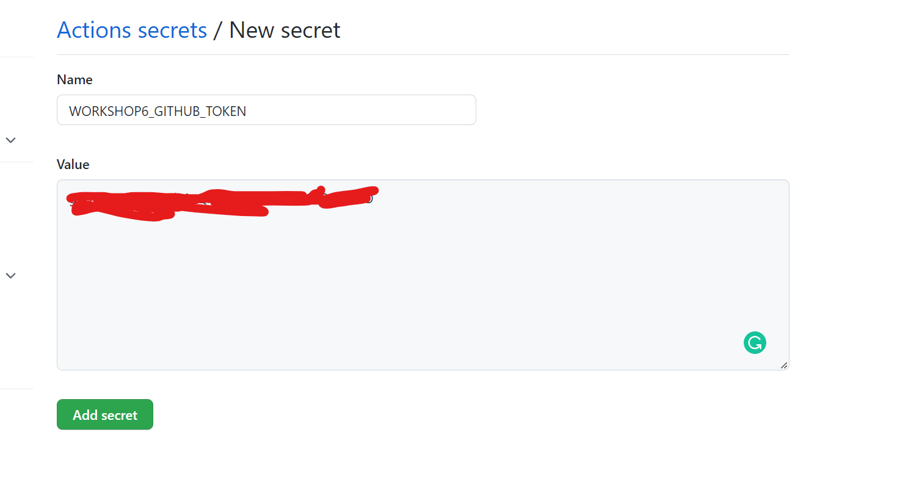
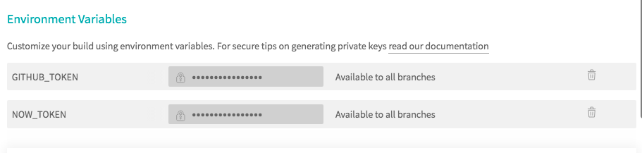

# S-DOEA - Workshop 6 - DevOps in the Cloud

## Objective

The objective of this workshops is to learn how to setup and deploy frontend app using Github with Github Actions

## Pre-requisite

- Github Account

## Workshop

In this workshop you will setup a CD/CI to automatically build and publish your Frontend application to Github Pages using Github Actions.

1. Fork the source codes from the following URL https://github.com/kenken64/bitcoin-order-app to your own Github account.

```
$ git clone https://github.com/<replace this with your github userid>/bitcoin-order-app
```

2. Checkout the development branch

```
 $ git checkout development
```

3. Generate the personal access token from Github platform, select the repo , workflow scope and save the token to somewhere on your editor
   
   <br>
   

   
4. Navigate to the bitcoin app repository on the Github platform

- Configure a WORKSHOP6_GITHUB_TOKEN secret environment variable for the Bitcoin app repo. The value shown on the screenshots is generated from the Github personal token generation page (Step 3). Remember to Click on the Add secret button.
  
  
  

5. Under the working directory of the bitcoin app create the following directory

```
.github/workflows/
```

6. Under the above newly created directory which is likely to be hidden on the windows explorer create a file as below, not on the linux or mac system.

```
.github/workflows/build.yml
```

7. Add the following codes into the build.yml file (Cloned githubrepo ). Do not replace or remove the value `$WORKSHOP6_GITHUB_TOKEN` and `GITHUB_TOKEN`. Please take note yaml file are case sensitive and indentation sensitive.

Features:

- Install all relevant dependencies
- Perform a build on the frontend
- Execute all test cases for the frotnend app
- Deploy to the cloud provider

```
name: Bitcoin order App
on:
  push:
    branches:
      - development

jobs:
  ci:
    runs-on: ubuntu-latest

    strategy:
      matrix:
        node-version: [16.x]

    steps:
      - uses: actions/checkout@v2
      - uses: browser-actions/setup-chrome@latest
      - name: Use Node.js ${{ matrix.node-version }}
        uses: actions/setup-node@v1
        with:
          node-version: ${{ matrix.node-version }}

      - name: Cache node modules
        id: cache-nodemodules
        uses: actions/cache@v2
        env:
          cache-name: cache-node-modules
        with:
          # caching node_modules
          path: node_modules
          key: ${{ runner.os }}-build-${{ env.cache-name }}-${{ hashFiles('**/package-lock.json') }}
          restore-keys: |
            ${{ runner.os }}-build-${{ env.cache-name }}-
            ${{ runner.os }}-build-
            ${{ runner.os }}-
      - name: Install Dependencies
        if: steps.cache-nodemodules.outputs.cache-hit != 'true'
        run: |
          npm ci
      - name: Build
        run: |
          npm run build --
      - name: Lint
        run: |
          npm run lint
      - name: Update types to latest
        run: |
          npm install --save-dev @types/node@latest
      - name: Test
        run: |
          npm run test
      - name: Conventional Changelog Action
        id: changelog
        uses: TriPSs/conventional-changelog-action@v3
        with:
          github-token: ${{ secrets.WORKSHOP6_GITHUB_TOKEN }}
          output-file: "false"

      - name: Create Release
        uses: actions/create-release@v1
        if: ${{ steps.changelog.outputs.skipped == 'false' }}
        env:
          GITHUB_TOKEN: ${{ secrets.WORKSHOP6_GITHUB_TOKEN }}
        with:
          tag_name: ${{ steps.changelog.outputs.tag }}
          release_name: ${{ steps.changelog.outputs.tag }}
          body: ${{ steps.changelog.outputs.clean_changelog }}
      - name: Deploy
        run: |
          npm run deploy

```

8. Github actions should build wherever there is a push to the development branch

```
$ git add .
$ git commit -m "add github actions"
$ git push origin development
```
9. After a successful build, the application should be published to
    GitHub pages


## Bonus - Workshop

Only attempt this if you have completed the above workshop.

- Tag the repo with the below command and push the changes 

```
git push origin <tag name>
```

- Delete the feature branch when you have successfully published the
  front end application. Replace both of the placeholder `<remote name>` and `<branch_name>`

```
- name: delete branch
  run: |
    git push <remote_name> :<branch_name>
```

- Perform static code analysis with modification of the rules

```
- name: lint
  run: |
    ng lint
```

- Perform vulnerability scanning on Angular libraries

```
- name: Audit 
  run: |
    npm audit fix

```

- Dockerized the app and push the docker image to dockerhub and AWS private docker registry

- Deploy the app to AWS's ElasticBeanStalk Docker v1
