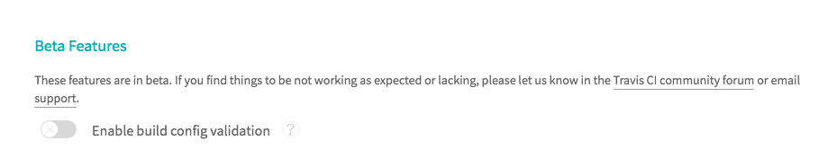

# S-DOEA - Workshop 6 - DevOps in the Cloud 

## Objective 
The objective of this workshops is to learn how to setup and deploy frontend app using Github with Travis

## Pre-requisite
* Travis account (https://travis-ci.org/)
* Github Account

## Workshop
In this workshop you will setup a CD/CI to automatically build and publish your Frontend application to Github Pages using Travis.

* Fork the source codes from the following URL https://github.com/kenken64/bitcoin-order-app to your own Github account.


* Checkout the development branch

* Generate the personal access token, select the repo scope and save the token to somewhere on your editor
  

* Select a deployable application from your repository, slide the sldier to enable the bitcoin-order-app from your github account

* On the Travis CI platform, navigate to the selected project's setting

* On the Travis CI platform, under settings of the project make sure the build validation is disabled



* Create an account in Travis and allow it to associate with your GitHub account
  - Configure a GITHUB_TOKEN secure environment variable for all branches the value is generated from  the Github personal token generation page. Click Add
  
  
  


* Add a .travis.yml file to you working repository, replace the email and github userid placeholder
  - Notify all your co-workers on the build
  - Install all relevant dependencies
  - Perform a build on the frontend
  - Deploy to the cloud provider

```
language: node_js
node_js:
  - node

dist: bionic
sudo: required

notifications:
  email:
    recipients:
      - <your email address>
    on_success: always
    on_failure: always
branches:
  only:
   - development
before_script:
  - npm install -g @angular/cli
  - npm install -g now
script:
  - ng build --prod --base-href https://<your github username>.github.io/bitcoin-order-app/
  
deploy:
  provider: pages
  skip_cleanup: true
  github_token: $GITHUB_TOKEN
  local_dir: dist/bitcoin
  edge: true
  on:
    branch: development

```
* Travis should build wherever there is a push to the release branch
* After a successful build, the application should be published to 
GitHub
* Send a notification to your email mailbox regardless whether the build is
successful or if it has failed

## Bonus - Workshop
Only attempt this if you have completed the above workshop.
* Delete the release branch when you have successfully published the
front end application.

```
after_success:
 - git push <remote_name> :<branch_name>
```
* Perform static code analysis 
```
ng lint
```
* Perform vulnebrality scanning 
```
npm audit fix
```

## Dockerized a sample web app, deploy to Elastic Bean Stalk (Optional)


1. Create a Dockerfile.dev under the React App (subsdevices)

```
FROM node:alpine

WORKDIR '/app'

COPY package.json .
RUN npm install

COPY . .

CMD ["npm", "run", "start"]
```

2. Build the docker image

```
sudo docker build -f Dockerfile.dev -t kenken64/react-app
```

3. Run the docker image as container with port forward and volume mounting

```
sudo docker run -p 3000:3000 -v /app/node_modules -v $(pwd):/app kenken64/react-app
```

4. Download ngrok since the react app doesn't have SSL installed

```
chmod +x ngrok
./ngrok authtoken KuTKRosrawrDMAgX1ayq_7AAmsVSom4E6GtT18S1pn
./ngrok http 3000
```

5. Use web browser to access the generated ngrok address from the terminal

6. Create a docker-compose.yml

```
version: '3'
services:
    web:
      build:
        context: .
        dockerfile: Dockerfile.dev
      ports:
        - "3000:3000"
      volumes:
        - /app/node_modules
        - .:/app
```

7. Start the docker container using docker-compose

```
sudo docker-compose up --build
```

8. Implement test on separate container

```
sudo docker exec -it 87b898a5cc64 npm run test
```

- Add test service in the docker compose yml file

```
version: '3'
services:
    web:
      build:
        context: .
        dockerfile: Dockerfile.dev
      ports:
        - "3000:3000"
      volumes:
        - /app/node_modules
        - .:/app
    test:
      build:
        context: .
        dockerfile: Dockerfile.dev
      volumes:
          - /app/node_modules
          - .:/app
      command: ["npm", "run", "test"]
```

9. Start the docker container using docker-compose

```
sudo docker-compose up --build
```

10. Multi step build process, different base images

```
# builder phase
FROM node:alpine as builder

WORKDIR '/app'

COPY package.json .
RUN npm install
COPY . .
RUN npm run build

FROM nginx
EXPOSE 80
COPY --from=builder /app/build /usr/share/nginx/html
```

11. Build the multi phase container setup

```
sudo docker build .
```

12. Start the multi phase container setup and expose the port

```
sudo docker run -p 8080:80 936ca285e822
```

13. Use ngrok to tunnel due to we do not have domain name, take the generated domain name and test it on the web browser

```
./ngrok http 8080
```

14. Let's integrate with the travis CI with AWS elastic beanstalk, create a .travis.yml


```
sudo: required
services:
  - docker

before install:
  - docker build -t kenken64/subsdevices:v1 -f Dockerfile.dev .

script:
  - docker run kenken64/subsdevices:v1 npm run test -- --coverage
```

15. Login into travis CI dashboard and monitor the successful build

16. Login into AWS account and create a elastic beanstalk instance.
    Watch the below step by step walkthorugh youtube videos:-

| Video URL                    |                    Description                     |
| ---------------------------- | :------------------------------------------------: |
| https://youtu.be/L01gk757pq4 |           AWS - Create Elastic BeanStalk           |
| https://youtu.be/vJG-4J2cp0s |       AWS - Create Elastic BeanStalk Part 2        |
| https://youtu.be/vz2Y8LvcdHw | Configure IAM for Travis CI with Elastic Beanstalk |
| https://youtu.be/XUfBsttJnbA |         Configure env variable @ Travis CI         |

- Make sure the AWS region is always set to <b>Singapore</b>
- Deployment type is choosen as Docker
- Source code is Sample application given in this tutorial
- The configuration and setup takes a few minutes to finish.

17. Amend the .travis.yml with additional deployment

```
sudo: required
services:
  - docker

before install:
  - docker build -t kenken64/subsdevices:v1 -f Dockerfile.dev .

script:
  - docker run kenken64/subsdevices:v1 npm run test -- --coverage

deploy:
  provider: elasticbeanstalk
  region: "ap-southeast-1"
  app: "docker-subdevices"
  env: "DockerSubdevices-env"
  bucket_name: "elasticbeanstalk-ap-southeast-1-200097394821"
  bucket_path: "docker-subdevices"
  on:
    branch: master
  access_key_id: $AWS_ACCESS_KEY
  secret_access_key:
    secure: "$AWS_SECRET_KEY"
```

18. Git add, commit and push to the github repo that is configure with travis CI


<br>

<br>


