# S-DOEA - Workshop 7 - End to end DevOps Engineering and Automation


## Ansible


The objective of this workshop is to automate the installation of Code-Server on a server

### Workshop
Provision a Ubuntu server for this exercise. You can use Terraform or manually
provision an instance on DigitalOcean’s console.
Once you have provisioned, note the IP address, root user and SSH keys used.
Use these information to create an inventory file, inventory.yaml.
Write a playbook that will use the inventory.yaml file to configure the
server. The playbook should perform the following tasks

• Update the /lib/systemd/system/code-server.service file
with the code server password; change the following line


```
Environment=PASSWORD=__PLACEHOLDER__
```
with the password, assuming that the password is mypassword

```
Environment=PASSWORD=”mypassword”
```

• Update the /etc/nginx/sites-available/code-server.conf
file with the domain code-<ipv4_address>.nip.io; change the line
with server_name to

```
server_name code-<ipv4_address>.nip.io;

```
• Use systemd module to restart nginx and code-server services. You
must also perform a daemon reload viz. set daemon_reload to yes.


### Test
Test your deployment by browsing to http://```<ip-address>```

### Submission
When you have completed this workshop, commit your work to the repository.
The instructor will clone your repository at the end

### Setup

1. Access your Digital Ocean account.


2. Create a Ubuntu Droplet 

<br>
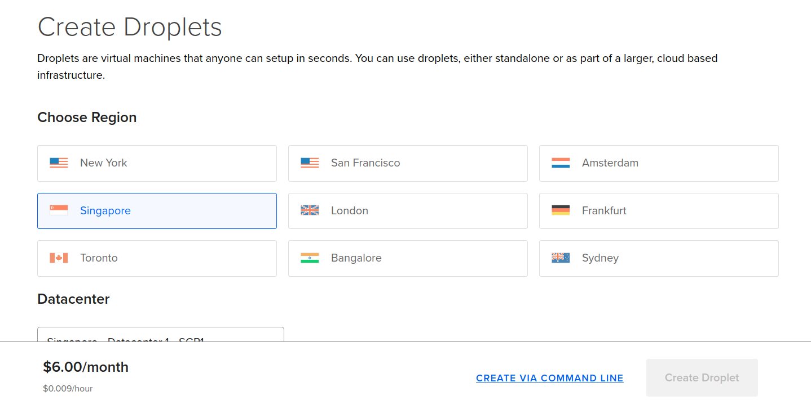
<br>

 * Select Singapore as region
 * Select Ubuntu as the server Image v20.04 x64

<br>
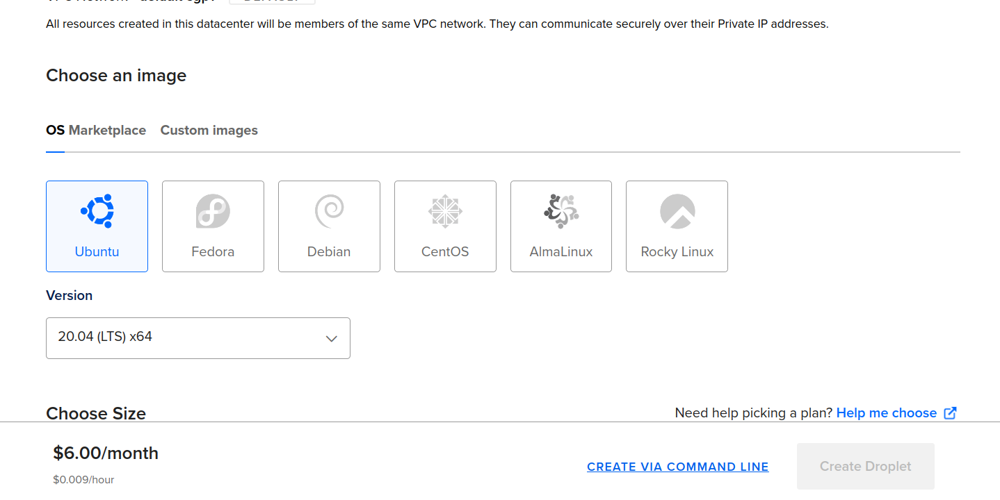
<br>

* Select cost saving server type (6 USD)

<br>
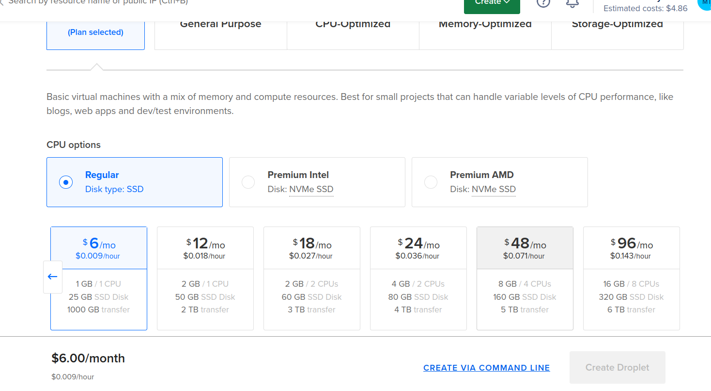
<br>

* Choose the SSH authentication method and generate a fresh SSH key pair. Click the "New SSH Key" button, then follow the instructions provided on the right-hand side. Paste the contents of the "cat" command into the Digital Ocean text area.

<br>
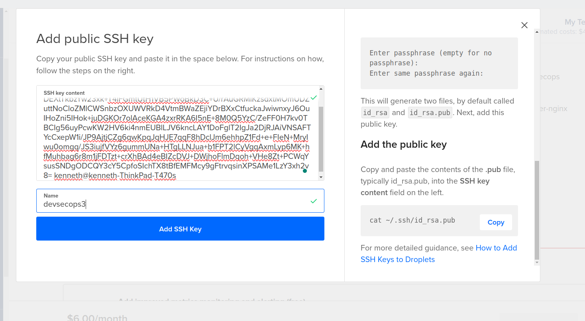
<br>

* Finalize the droplet

<br>
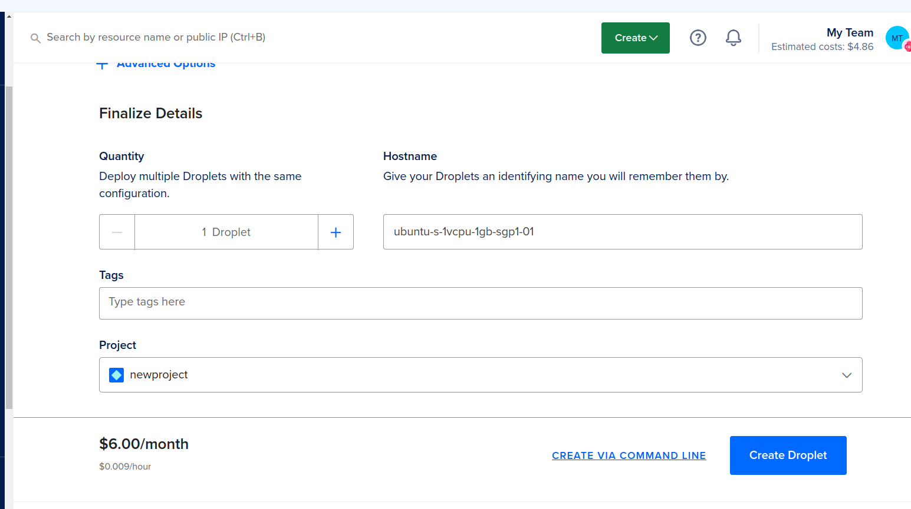
<br>

3. Access the newly created ubuntu server

```
ssh root@<public ip address>
```

<br>
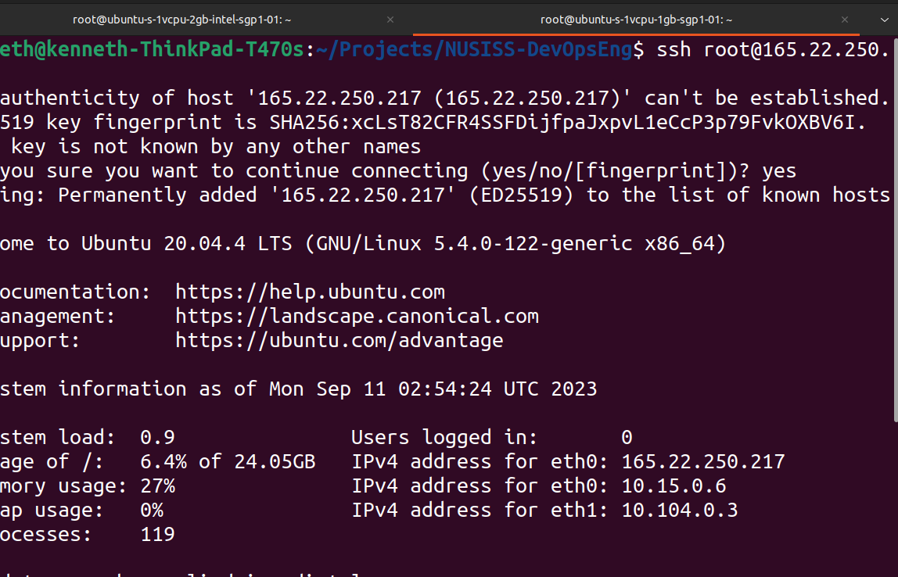
<br>

4. Generate the PKI key pair on the logon server 

```
ssh-keygen
```

<br>
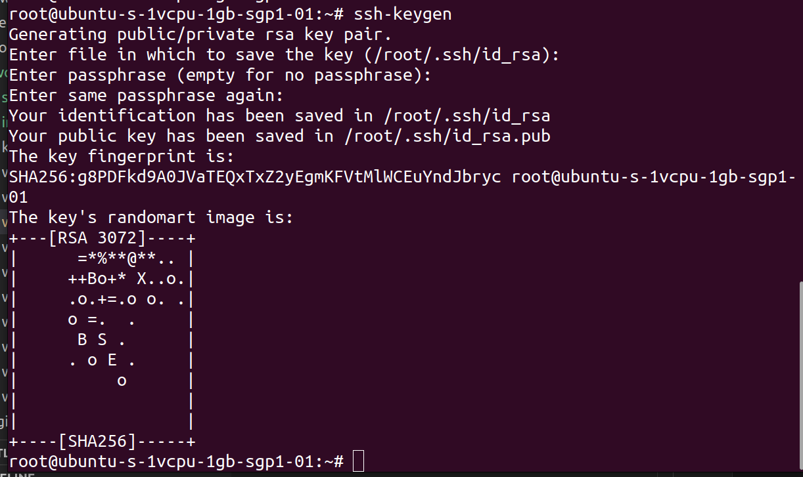
<br>

5. Add the public key content to the Digital Ocean account security section, name it as www-1

<br>
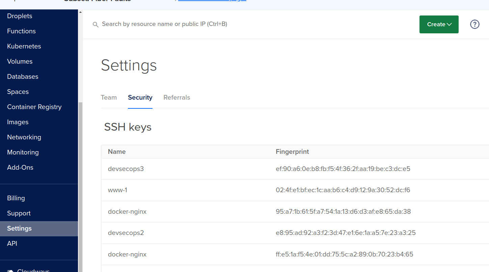
<br>

<br>
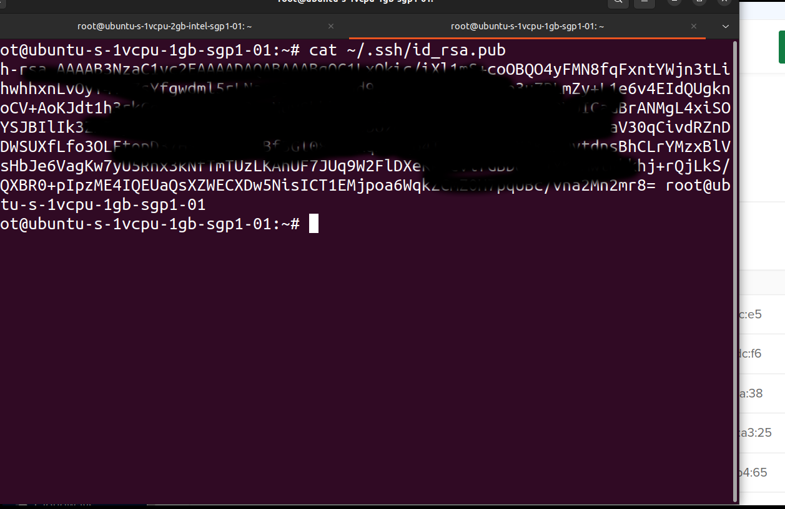
<br>

<br>
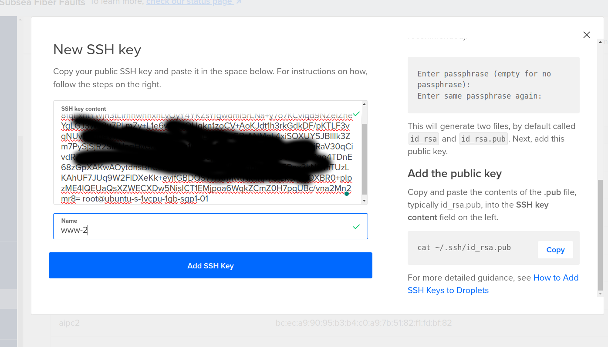
<br>

6. Install terraform IAC tool on the ubuntu server

```
wget -O- https://apt.releases.hashicorp.com/gpg | sudo gpg --dearmor -o /usr/share/keyrings/hashicorp-archive-keyring.gpg
```

```
echo "deb [signed-by=/usr/share/keyrings/hashicorp-archive-keyring.gpg] https://apt.releases.hashicorp.com $(lsb_release -cs) main" | sudo tee /etc/apt/sources.list.d/hashicorp.list
```

```
sudo apt update && sudo apt install terraform
```


7. Check the terraform version

```
terraform --version
```
<br>
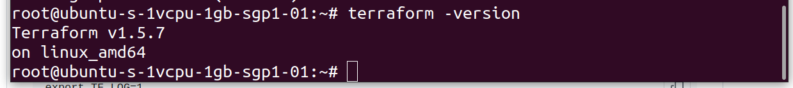
<br>

8. Install Ansible on the Ubuntu instance

```
sudo apt-add-repository ppa:ansible/ansible

sudo apt update

sudo apt install ansible-core
```

<br>

<br>

9. Check the ansible version

```
ansible --version
```

### Implementation
a. Create a directory called workshop02 in your course repository.

b. Read Step 1 and Step 2 of the following blog
https://www.digitalocean.com/community/tutorials/how-to-set-up-the-
code-server-cloud-ide-platform-on-ubuntu-20-04.

c. Change directory into the workshop02 folder

d. Create an ansible template file for server configuration. code-server.conf.j2

```
server {
    listen 80;
    listen [::]:80;

    server_name {{codeserver_domain}} {{ansible_host}};

    location / {
        proxy_pass http://127.0.0.1:8080/;
        proxy_set_header Upgrade $http_upgrade;
        proxy_set_header Connection upgrade;
        proxy_set_header Accept-Encoding gzip;
    }
}
```
e. Create an ansible template file code-server.service.j2

```
[Unit]
Description=code-server
After=nginx.service

[Service]
Type=simple
Environment=PASSWORD={{codeserver_password}}
ExecStart=/usr/bin/code-server --bind-addr 127.0.0.1:8080 --user-data-dir /var/lib/code-server --auth password
Restart=always

[Install]
WantedBy=multi-user.target
```
f. Create a terraform template file inventory.yaml.tftpl

```
all:
    vars:
        ansible_connection: ssh
        ansible_user: root
        ansible_ssh_private_key: ${ssh_private_key}
    hosts:
        codeserver:
            ansible_host: ${codeserver_ip}
            codeserver_domain: ${codeserver_domain}
            codeserver_password : ${codeserver_password}
```

g. Create a provider terraform script provider.tf

```
terraform {
  required_providers {
    digitalocean = {
        source = "digitalocean/digitalocean"
        version = "2.26.0"
    }
    local = {
        source = "hashicorp/local"
        version = "2.4.0"
    }
  }
}

provider digitalocean {
    token = var.do_token
}

```

h. Create a variables terraform script variables.tf

```
variable do_token {
    type = string
    sensitive = true
}

variable do_region {
    type = string
    default = "sgp1"
}

variable do_image {
    type = string
    default = "ubuntu-20-04-x64"
}

variable do_size {
    type = string
    default = "s-1vcpu-1gb"
}

variable do_ssh_key {
    type = string
    default = "www-1"
}

variable ssh_private_key {
    type = string
}

variable codeserver_password {
    type = string
}

```

i. Create a resources terraform script resources.tf

```
#ssh key
data "digitalocean_ssh_key" "www-1" {
    name = var.do_ssh_key
}

resource "digitalocean_droplet" "codeserver" {
    name = "codeserver"
    image = var.do_image
    region = var.do_region
    size = var.do_size

    ssh_keys = [ data.digitalocean_ssh_key.www-1.id ]
}

resource "local_file" "root_at_codeserver" {
    filename = "root@${digitalocean_droplet.codeserver.ipv4_address}"
    content = ""
    file_permission = "0444"
}

resource "local_file" "inventory" {
    filename = "inventory.yaml"
    content = templatefile("inventory.yaml.tftpl",{
        codeserver_ip = digitalocean_droplet.codeserver.ipv4_address
        ssh_private_key = var.ssh_private_key
        codeserver_domain = "code-server-${digitalocean_droplet.codeserver.ipv4_address}.nip.io"
        codeserver_password = var.codeserver_password 
    })
    file_permission = "0444"
}

output codeserver_ip {
    value =  digitalocean_droplet.codeserver.ipv4_address
}

```

```
terraform plan -var "do_token=${DO_PAT}" -var "ssh_private_key=/root/.ssh/id_rsa" -var "codeserver_password=password123456"
```

```
terraform apply -auto-approve -var "do_token=${DO_PAT}" -var "ssh_private_key=/root/.ssh/id_rsa" -var "codeserver_password=password123456"
```

```
ansible-playbook playbook.yaml -i inventory.yaml
```


## Solution Repository URL

https://github.com/kenken64/aipc-jun2023/tree/main/workshop02


## Design and proposed CI CD pipeline for StoolViriiDetect Pte Ltd COVID19 - Internet of Things Project.

To detect covid19 cluster as early as possible, SG GovHighTech recently awarded StoolViriiDetect Pte Ltd the project to use their stool detection sensor solution in every residential area islandwide. The collected data should be sent to the Health Authority for analysis twice a day via a secure cloud channel. Kindly proposed an end to end CI CD pipeline for this project.

Things that the team should consider as below:-
* Public Web App and API with a geolocation-based map showing a possible cluster
* Private Web App with a map showing possible cluster and additional info
* Integrated with the trace together mobile app to notify users that a potential new cluster. (Near to realtime)
* Live update (firmware) to all the deployed sensors
* Name all the technological stacks in terms of DevOps and implementation of your proposal.
* The solution must be regional within the country. (Areas)

https://www.youtube.com/watch?v=XeFOpSNgSGk

https://www.youtube.com/watch?v=nN9d_bLE-vM&t=127s
