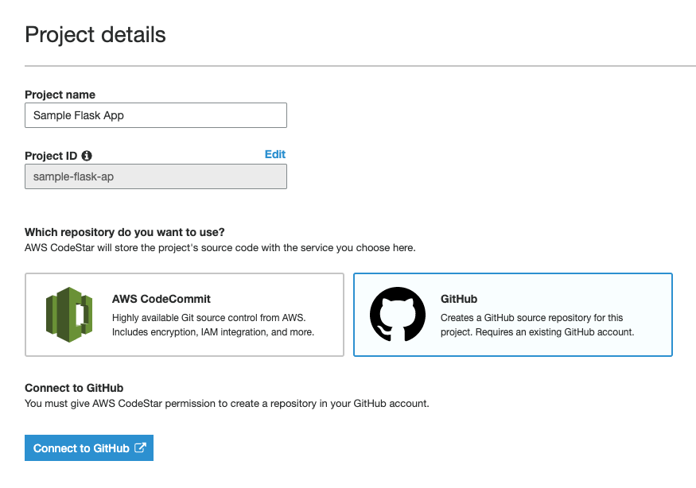
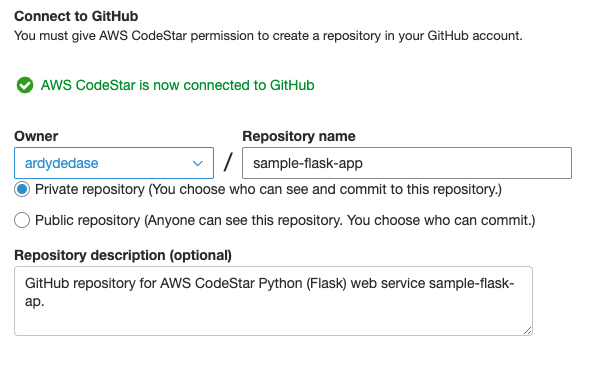
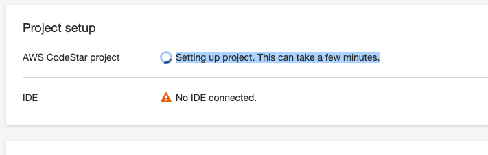

# S-DOEA - Workshop - End to end DevOps Engineering and Automation

## AWS Codestar with Python Flask Project

At the end of this tutorial, you will be able to push your code changes to Github and run it in an EC2 instance deployed AWS CodeBuild.

All of AWS services in this tutorial should be in the same region Singapore (ap-southeast-1).

## Pre-requisites
- Github Account
- AWS Account
- AWS EC2 Key Pair. [Follow this tutorial](https://docs.aws.amazon.com/AWSEC2/latest/UserGuide/ec2-key-pairs.html#having-ec2-create-your-key-pair) and take note of your Key Pair. *There is no need for us to ssh into a machine here so we can skip the `chmod` step in the guide.*

## Step by step guide - basic CodeStar setup

1. Open [AWS Codestar](https://console.aws.amazon.com/codestar/home).

1. Click "Create a new project".

1. Choose Python (Flask) Web server / Amazon EC2.

1. Enter your Project Details.

1. Choose GitHub as your repository.

1. Click "Connect to GitHub" button.

    

1. Enter your GitHub reporitory details.

    

1. After reviewing the project details, click "Create Project". This will automatically create the GitHub repository for you. You can visit GitHub afterwards to see your repository.

1. Choose the keypair that you have created in the Pre-Requisites as you Key Pair.

1. Click "Next" button, you will be redirected to the Project setup page. Try to refresh the page to see if the project setup has finished.

    

1. In the lower right side of the Project setup page, the application endpoint will show up when the deployment has finished loading. You can check the deployment status in the Continuous deployment section.

1. Click the Application Endpoint when it is ready and you should be able to see the JSON response of your Flask API.

1. Update your `helloworld/application.py` file to change your application's output using GitHub's web interface. Observe the deployment pipeline and refresh your Application Endpoint. You can change the following line under the `get()` method:

    ```
    return Response(json.dumps({'Output': 'Hello World from Codestar'}), mimetype='application/json', status=200)
    ```
