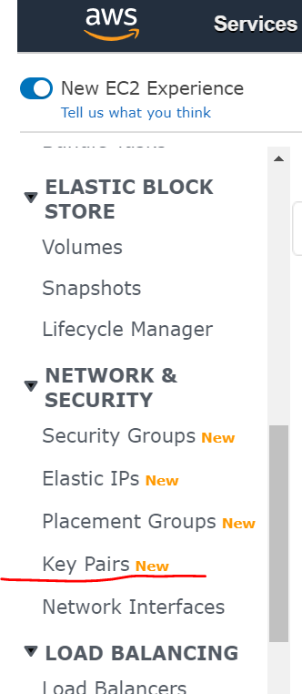
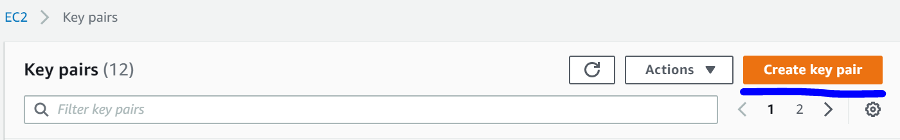
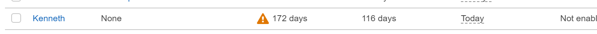
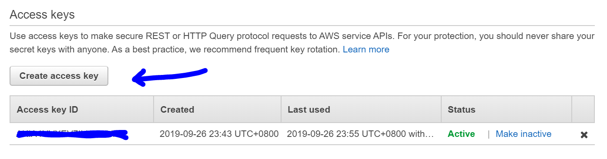
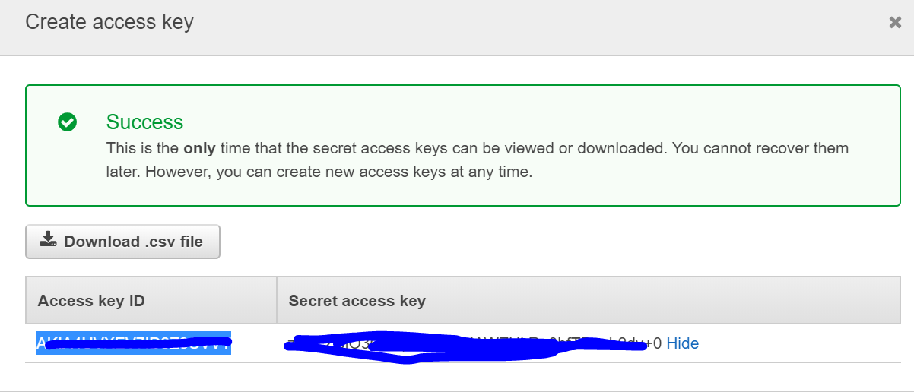

# S-DOEA - Workshop 8 - Scalability and Reliability DevOps Engineering and Automation

## Pre-requisite 

### Create a keypair
* Login into the AWS console and launch EC2 dashboard ```https://console.aws.amazon.com/ec2```
* Click on the KeyPair function under the Network and Security section. Left navigation

<br>

<br>

* Upon landing on the create screen, click on the Create Key Pair button

<br>

<br>

* Provide a name for your keypair ```eks-nusiss-<your initial>``` and click on Create.

* Download the pem file immediately

### Create API Access key/secret

* In order to create the API access key, look for the IAM service select the logon user then under the security credentials tab create access key.

<br>

<br>

<br>

<br>

<br>

<br>


### Install <b>AWSCLI</b> (Launch new ubuntu based free tier EC2 instance)

* Install the python based AWS command line interface tools on the newly created EC2 instance

```bash
pip install --user awscli
export PATH=$PATH:/home/$(whoami)/.local/bin
```

_--user_ is used to install the awscli under your home directory, not to interfere with any existing libraries/installations

* Create file _~/.aws/credentials_

```bash
[default]
aws_access_key_id=<copy from the previous screen>
aws_secret_access_key=<copy from the previous screen>
region=ap-southeast-1
output=json
```

### Verify setup was done correctly

```
aws --version
```

### Setup of eksctl

On the Linux instance, you can just execute:

```bash
curl --silent --location "https://github.com/weaveworks/eksctl/releases/download/latest_release/eksctl_$(uname -s)_amd64.tar.gz" | tar xz -C /tmp  

sudo mv /tmp/eksctl /usr/local/bin
```

This utility will use the same _credentials_ file as we explored for the AWS cli, located under '~/.aws/credentials'

### Test eksctl command
```eksctl version```


### Setup kubectl on Debian/Ubuntu:
  
```bash
  sudo apt-get update && sudo apt-get install -y apt-transport-https
```

```
curl -s https://packages.cloud.google.com/apt/doc/apt-key.gpg | sudo apt-key add -
```

```
  echo "deb https://apt.kubernetes.io/ kubernetes-xenial main" | sudo tee -a /etc/apt/sources.list.d/kubernetes.list
``` 

```
  sudo apt-get update
  sudo apt-get install -y kubectl
```
### Test kubectl

```kubectl version --short --client```

### Create EKS cluster 

```
apiVersion: eksctl.io/v1alpha5
kind: ClusterConfig

metadata:
  name: EKS-APP-cluster
  region: us-east-1

nodeGroups:
  - name: ng-1
    instanceType: t2.small
    desiredCapacity: 3
    ssh: # use existing EC2 key
      publicKeyName: k8_kenneth

```

### Check and retrieve nodes 

```
kubectl get nodes
```

### Note: DO NOT run this 

```
eksctl delete cluster --region=us-east-1 --name=EKS-APP-cluster

```

### Install helm for kubernetes (package manager)


```
cd 
mkdir helm && cd helm
curl https://raw.githubusercontent.com/helm/helm/master/scripts/get-helm-3 | bash
cd -

```

Add official stable helm repository

```
helm repo add stable https://kubernetes-charts.storage.googleapis.com/
```

### Enable EKS Cloudwatch logging 

```
apiVersion: eksctl.io/v1alpha5
kind: ClusterConfig
metadata:
  name: EKS-APP-cluster
  region: us-east-1
nodeGroups:
  - name: ng-1
    instanceType: t2.small
    desiredCapacity: 3
    ssh: # use existing EC2 key
      publicKeyName: k8_kenneth
cloudWatch:
  clusterLogging:
    enableTypes: ["api", "audit", "authenticator"]

```

```
eksctl utils update-cluster-logging --config-file 2.cloudwatch-logging-eks.yaml --approve
```

### Maintain nodegroup

```
eksctl create nodegroup --config-file=nodegroup-eks-app.yaml --include='ng-mixed'
```

### Scaling up the nodes on the EKS 
```
eksctl scale nodegroup --cluster=EKS-APP-cluster --nodes=5 --name=ng-1
```

### Enable CloudWatch metrics

```
curl https://raw.githubusercontent.com/aws-samples/amazon-cloudwatch-container-insights/master/k8s-yaml-templates/quickstart/cwagent-fluentd-quickstart.yaml | sed "s/{{cluster_name}}/EKS-APP-cluster/;s/{{region_name}}/us-east-1/" | kubectl apply -f -
```